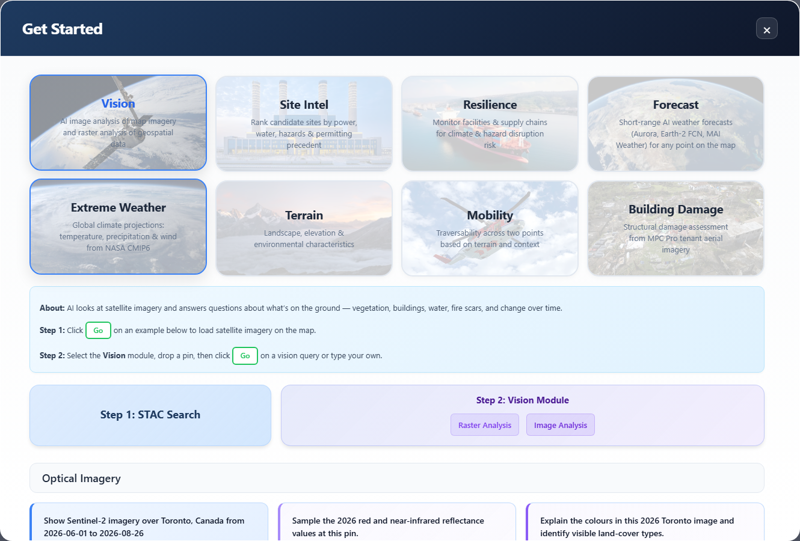
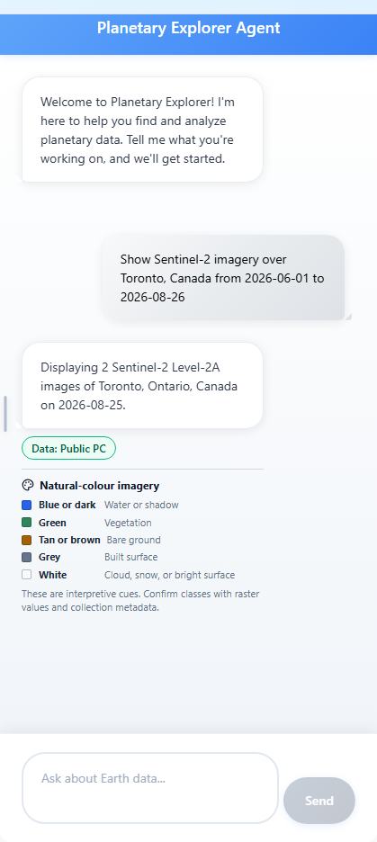
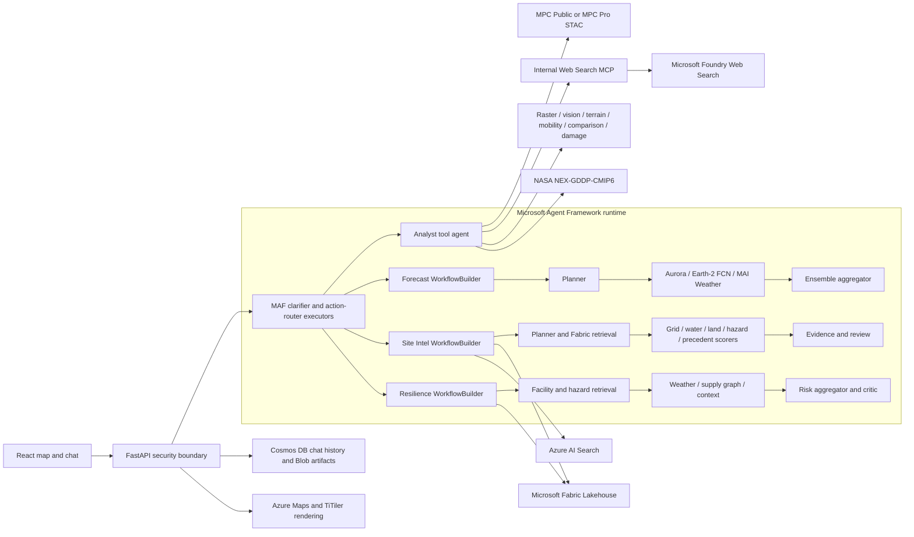

<div align="center">


[](https://codespaces.new/microsoft/planetary-explorer)

</div>

## 🌍 Welcome to Planetary Explorer!
Planetary Explorer, built on AI Foundry, demonstrates how organizations can use Microsoft Planetary Computer Pro to combine geospatial data with generative AI experiences. By enabling users to explore Earth science data through natural language, it makes complex geospatial workflows more accessible to analysts, operators, and decision makers—not just GIS specialists. This helps teams accelerate insight generation and support scenarios ranging from operational monitoring to risk management.

## 📋 Overview

Planetary Explorer turns natural-language questions into grounded geospatial answers. Its multi-agent system picks the right data, renders it on the map, and reasons over the result.

It fuses mutliple surfaces behind one chat:
- **Microsoft Planetary Computer** — 130+ public STAC collections & MPC Pro / GeoCatalog in your tenant for private collections
- **Microsoft Fabric Lakehouse** — delta tables and compute feed workflows
- **Azure AI Search** — documentation for grounding responses
- **Foundry LLMs, weather + geospatial models** — GPT, Aurora, NVIDIA Earth-2 FCN, and MAI Weather

Meet users where they already work:
- **React web app** — purpose-built map + chat experience
- **Microsoft Teams** — chat with Planetary Explorer agents in any channel
- **M365 Copilot** — declarative agent surfaces the same answers inside Word, Outlook, and Copilot Chat
- **VS Code / Claude Desktop** — every agent exposed as MCP tools for developers

Built on **Microsoft Agent Framework**, **Azure AI Agent Service**, and **Model Context Protocol** so analysts, operators, and decision-makers spend less time wrangling data and more time acting on insight.

**Watch Satya Nadella introduce NASA Earth Copilot, the inspiration behind Planetary Explorer, at Microsoft Ignite 2024**: [View Here](https://www.linkedin.com/posts/microsoft_msignite-activity-7265061510635241472-CAYx/?utm_source=share&utm_medium=member_desktop)

**Auto-Deploy Ready:** This repository includes fully automated deployment via **Bicep** and **GitHub Actions**. Follow the [Quick Start Guide](QUICK_DEPLOY.md) to deploy the complete architecture: infrastructure, backend, and frontend within one hour. Its modular architecture is designed for extensibility.

> **Planetary Explorer is a reusable geospatial AI pattern that can be adapted across different use cases. It is not a supported Microsoft product.**


## ✨ Features

- **Multi-Agent Architecture** — Microsoft Agent Framework prompt agents and `WorkflowBuilder` graphs plus Azure AI Agent Service tool agents.
- **Dual MPC Surface** — Chat over **MPC Public** *or* **MPC Pro / GeoCatalog** in your own tenant
- **Pluggable Connection Surfaces** — Bring your own **Microsoft Fabric** Lakehouse, **Azure AI Search** indexes, and **Foundry geospatial + weather models**.
- **MCP Server** — Expose every agent as Model Context Protocol tools for VS Code GitHub Copilot, Claude Desktop, and other MCP clients.
- **Multiple Client Surfaces** — One backend, your choice of UI: a purpose-built React web app, a **Microsoft Teams bot**, or an **M365 Copilot** declarative agent.
- **Copilot Studio & ArcGIS** — Custom connectors for Copilot Studio, plus optional Esri ArcGIS integration for enterprise GIS workflows.
- **Fully Private Deployment** — Optional VNet integration with private endpoints, private DNS zones, and Entra ID authentication for an enterprise-ready deployment out of the box.


## 🎯 Use Cases

| | | | | |
|:---:|:---:|:---:|:---:|:---:|
| **Science & Environment** | **Agriculture & Natural Resources** | **Energy & Infrastructure** | **Public Safety & Emergency Management** | **Defense / National Security** |
| Accelerates climate, air quality, land-surface, extreme weather scenarios, and environmental research | Assess drought conditions, soil moisture, and water quality for agriculture planning | Monitor energy grids, transmission corridors, and dam infrastructure, supporting site selection and permitting | Supports response to wildfires, floods, hurricanes, and other natural disasters | Monitor geospatial intelligence and support situational awareness for national security operations |


## 🛰️ What Planetary Explorer Does


Use the [Get Started playbook](documentation/get-started-playbook.md) for the
tested Setup and Analyze sequence, one recommended example from each of the 11
families, expected evidence, prerequisites, and interpretation limits.

Each **Setup** action starts a fresh map context. It replaces any previously
selected location, pin, module, loaded collection, and conversation routing
state before it runs the example. Place the example's new analysis pin only
after its Setup response and map layer finish loading.

The September 3, 2026 (UTC) reference release uses API revision
`ca-earthcopilot-api--getstarted-hardened-0903-0316` and frontend bundle
`index-jUC2ydNZ.js`. Its release-bound checks recorded 30 passed setups with
2 MPC Pro capability blocks, 24 passed analyses with 8 prerequisite gates, and
12 of 12 passed browser Image Analysis workflows. The Setup and browser
matrices began from conflicting prior locations and stale pins, proving that
every runnable example owns its requested location. Local release gates passed
597 backend tests with one skip, 160 frontend tests, 49 Python verifier tests,
8 browser-semantic tests, and 1 weather-adapter test. The unfiltered backend
run also recorded 644 passes, 1 skip, and 6 known baseline mismatches in two
excluded test files.

### Query Examples

<!-- markdownlint-disable MD013 MD033 MD060 -->

<details>
<summary><b>STAC Agent: chat-to-map (MPC Public + MPC Pro)</b></summary>

| Query |
|-------|
| Show Sentinel-2 imagery over Toronto, Canada from 2026-06-01 to 2026-08-26 |
| Show MODIS 10A1 daily snow cover at Quebec City, Canada, latitude 46.8139, longitude -71.2080, from 2025-02-01 to 2025-02-28 |
| Show Sentinel-1 RTC radar imagery over the Red River, Manitoba from 2026-03-01 to 2026-05-31 |

When MPC Pro is configured, use the **MPC Pro** toggle to route STAC queries to
your authorized tenant collections. The control remains disabled when no
private GeoCatalog is configured.

</details>

<details>
<summary><b>Raster Sampling + Contextual Agent</b></summary>

| Action | Query |
|--------|-------|
| Pin drop to chat | Sample the 2026 raster value at this Canadian location |
| Chat | How do I interpret the colours in this 2026 collection? |
| Chat | Explain each class in this Canadian land-cover raster and show its legend |

</details>

<details>
<summary><b>GEOINT Modules: Vision, Terrain, Mobility, Comparison, Building Damage</b></summary>

| Module | Query |
|--------|-------|
| **Vision** | Describe urban growth and vegetation patterns visible around Calgary in 2026. |
| **Terrain** | For 2026, is this Metro Vancouver location suitable for a construction permit? Analyze slope, flood exposure, and flat areas. |
| **Comparison** | Compare Alberta wildfire activity on 2026-08-24 and 2026-08-26 and explain the change over 48 hours. |
| **Foundation Change** | Use PlanAura to compare HLS L30 on 2026-07-17 and 2026-08-18 at a pinned Regina location. |
| **Foundation Change** | Load scene-stretched HLS S30 fire false colour, then analyze early-event change inside the official 2026 Thunder Bay 36 wildfire perimeter. |
| **Mobility** | Assess this 2026 emergency-supply route for water crossings, wildfire exposure, steep slopes, and ground-vehicle feasibility. |
| **Building Damage** | Using the 2026 before-and-after tenant imagery, assess potential building damage and distinguish destroyed, major-damage, and unaffected structures. |

Follow the [screenshot-backed Foundation Change walkthrough](documentation/geofm-foundation-change.md)
to verify PlanAura, set a Canadian HLS area, approve GPU work, and poll the
durable result. The [Thunder Bay 36 wildfire case study](documentation/geofm-thunder-bay-fire.md)
applies that workflow to an official Ontario fire perimeter.

</details>

<details>
<summary><b>Extreme Weather Agent: NASA NEX-GDDP-CMIP6</b></summary>

| Query |
|-------|
| What are the projected annual precipitation and peak daily rainfall values for Vancouver in 2026? |
| Show monthly projected precipitation for Toronto in 2026 and identify the wettest month. |
| What are the projected temperature and precipitation trends for Montreal during 2026 under SSP245 and SSP585? |

</details>

<details>
<summary><b>Forecast Agent: configured AI weather providers</b></summary>

| Query |
|-------|
| Give me a 120-hour (five-day) forecast over Lake Ontario using every available model and summarize ensemble spread. |
| Forecast 2m temperature and 10m wind across southern Saskatchewan for the next 72 hours. |
| Compare Aurora and Earth-2 FCN precipitation over Nova Scotia for the next 24 hours and explain model disagreement. |

</details>

<details>
<summary><b>Site Intel Agent: Fabric + MPC siting workflow</b></summary>

| Query |
|-------|
| For 2026, score our candidate data-centre sites near Calgary for power, water, competition, wildfire, flood, and heat exposure. |
| Which 2026 candidate parcels near Montreal clear slope, flood, heat, and grid-proximity thresholds? |
| Rank the top three 2026 sites near Edmonton with permitting precedent and grid proximity weighted highest. |

</details>

<details>
<summary><b>Resilience Agent: continuous monitoring on Fabric + MPC</b></summary>

| Query |
|-------|
| Over the next seven days, which Canadian facilities are most at risk and what is the supply-chain blast radius? |
| If our Vancouver distribution centre goes offline for 48 hours in 2026, which downstream Canadian facilities are exposed? |
| Show 2026 heat and wildfire risk for all Western Canada facilities this week, ranked by severity with a response playbook. |

</details>

### Examples

The screenshots below are generated by
[`scripts/verify_canadian_demo_browser.py`](scripts/verify_canadian_demo_browser.py)
against the running app.

The stricter release check in
[`scripts/verify_get_started_image_analysis.mjs`](scripts/verify_get_started_image_analysis.mjs)
exercises all 12 real Image Analysis buttons and verifies the requested layer,
pin, submitted PNG/JPEG bytes, and `describe_map_screenshot` evidence. Its
adversarial mode first loads a distant image and stale Vision pin, then proves
that each example replaces that state with its own location.

| Canadian 2026 workflow catalog | Toronto STAC response with chat legend |
|:---:|:---:|
|  |  |

<!-- markdownlint-enable MD013 MD033 MD060 -->

---

## 🏗️ Architecture

Planetary Explorer uses Microsoft Agent Framework for orchestration. There is
no Semantic Kernel runtime or dependency.



### MAF Workflow Inventory

<!-- markdownlint-disable MD013 MD060 -->

| Surface | MAF execution path | Terminal output |
|---------|--------------------|-----------------|
| STAC and contextual analysis | Clarifier and Action Router executors to Analyst tool agent | Grounded answer, STAC items, tiles, and chat legend |
| Forecast | Planner to provider fan-out to ensemble aggregator | Multi-model forecast dossier |
| Site Intel | Planner to Fabric retrieval to six scorers to evidence review | Ranked siting dossier |
| Resilience | Retrieval to weather, supply, and context fan-out to risk aggregator | Facility risk and blast-radius dossier |
| Smart resilience | Router to standard or investigative planner to critic | Reviewed response with tool trace |

Every workflow declares its terminal `output_from` executor. Forecast and Site
Intel fail closed with HTTP 503 when MAF is unavailable; neither silently falls
back to a non-MAF implementation.

### Core Services

| Layer | Responsibility |
|-------|----------------|
| React UI on Azure App Service | Natural-language input, MPC Public/Pro selector, map rendering, durable chat history, source chips, and response-bound colour legends |
| FastAPI on Azure Container Apps | MAF execution, STAC and GEOINT tools, request validation, MCP tracing, and response contracts |
| Azure AI Foundry and Agent Service | GPT deployments plus hosted multi-turn tool orchestration |
| Internal Web Search MCP | Authenticated read-only current-web grounding through Microsoft Foundry |
| Microsoft Planetary Computer | Public STAC plus tenant-governed MPC Pro collections |
| Microsoft Fabric | Site Intel and Resilience Delta tables |
| Azure AI Search | Permitting precedent and continuity-document grounding |
| Cosmos DB and Blob Storage | Owner-isolated chat sessions and downloadable private artifacts |
| Azure Maps and TiTiler | Geocoding, basemap display, and raster tile rendering |

### Security Hardening

| Control | Enforcement |
|---------|-------------|
| Authentication | Entra bearer validation fails closed; development bypass requires `DISABLE_AUTH=true` |
| Browser access | Credentialed CORS accepts only the configured frontend origin and required methods/headers |
| Host validation | `ALLOWED_HOSTS` defaults to Azure Container Apps hosts |
| Request limits | `MAX_REQUEST_BODY_BYTES` defaults to 32 MiB |
| Response policy | HSTS on HTTPS, request IDs, no-sniff, frame denial, referrer policy, permissions policy, API CSP, and no-store defaults |
| Error handling | Unhandled errors return a request ID without internal exception text |
| API discovery | OpenAPI and interactive docs are disabled unless `ENABLE_API_DOCS=true` |
| Private catalog | MPC Pro collection inventory requires authentication |
| Internal MCP authentication | Web Search MCP requires a shared key of at least 32 characters |
| Cloud credentials | Azure resources use managed identity and Key Vault references instead of embedded secrets |

<!-- markdownlint-enable MD013 MD060 -->

The bundled Site Intel and Resilience fallback records are explicitly marked
as synthetic Canadian 2026 demo data. Production deployments should ingest
authoritative tenant data into Fabric.

## ⚙️ Environment Setup

### Prerequisites

**Technical Background:**
- **Azure Subscription Management** - Resource groups, RBAC, cost management,
    service quotas
- **Azure Cloud Services** - Azure AI Foundry, Azure Maps, Container Apps, AI Search
- **Python Development** - Python 3.11, FastAPI, async programming, package management
- **React/TypeScript** - React 18, TypeScript, Vite, modern JavaScript
- **AI/ML Concepts** - LLMs, agent tool calling, multi-agent systems, RAG
- **Microsoft Agent Framework & MCP** - MAF `WorkflowBuilder` graphs, Model
    Context Protocol clients/servers
- **Microsoft Fabric / Delta Lake** - Lakehouse workspaces, Delta tables, SQL
    endpoint access
- **Geospatial Data** - STAC standards, satellite imagery, raster processing (GDAL/Rasterio)
- **Docker & Containers** - Docker builds, Azure Container Apps, VNet integration
- **Infrastructure as Code** - Bicep templates, Azure CLI, resource deployment

### Quick Start with VS Code Agent Mode

You can deploy this application using **Agent mode in Visual Studio Code** or
**GitHub Codespaces**:

[](https://codespaces.new/microsoft/planetary-explorer)

## 🚀 Deployment

Full, step-by-step deployment instructions cover GitHub Actions and local
one-command deployment, what gets provisioned, opt-in flags (`-EnableMpcPro`,
`-EnableFabric`, `-EnableWeatherModels`, `-EnablePrivateEndpoints`),
multi-environment setup, and Copilot Studio, MCP, and ArcGIS integrations:

[**QUICK_DEPLOY.md →**](QUICK_DEPLOY.md)

```powershell
# Quickest path: clone your fork and run the one-command local deploy
git clone https://github.com/YOUR-USERNAME/Planetary-Explorer.git
cd Planetary-Explorer
.\deploy-infrastructure.ps1
```

## 📄 License

MIT License - see [LICENSE.txt](LICENSE.txt) for details.

## ™️ Trademarks

This project may contain trademarks or logos for projects, products, or
services. Authorized use of Microsoft trademarks or logos is subject to and
must follow [Microsoft's Trademark & Brand Guidelines](https://www.microsoft.com/en-us/legal/intellectualproperty/trademarks/usage/general).
Use of Microsoft trademarks or logos in modified versions of this project must
not cause confusion or imply Microsoft sponsorship. Any use of third-party
trademarks or logos is subject to those third parties' policies.

---

## 🙏 Acknowledgments

Planetary Explorer was developed by Melisa Bardhi and advised by Juan Carlos Lopez.

A big thank you to our collaborators:
- **Microsoft Planetary Computer**
- **NASA**
- **Microsoft Team**: Juan Carlos Lopez, Jocelynn Hartwig, Minh Nguyen & Matt Morrell.

*Built for the Earth science community with ❤️ and AI*
