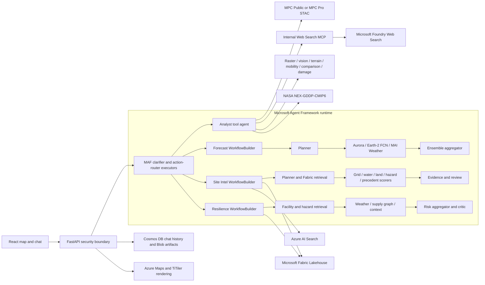

## 🌍 Welcome to Planetary Explorer!
Planetary Explorer, built on AI Foundry, demonstrates how organizations can use Microsoft Planetary Computer Pro to combine geospatial data with generative AI experiences. By enabling users to explore Earth science data through natural language, it makes complex geospatial workflows more accessible to analysts, operators, and decision makers—not just GIS specialists. This helps teams accelerate insight generation and support scenarios ranging from operational monitoring to risk management.

## 📋 Overview

Planetary Explorer turns natural-language questions into grounded geospatial answers. Its multi-agent system picks the right data, renders it on the map, and reasons over the result.

It connects these surfaces when their prerequisites are configured:
- **Microsoft Planetary Computer** — 130+ public STAC collections & MPC Pro / GeoCatalog in your tenant for private collections
- **Microsoft Fabric Lakehouse** — delta tables and compute feed workflows
- **Azure AI Search** — documentation for grounding responses
- **Foundry LLMs, weather + geospatial models** — GPT, Aurora, NVIDIA Earth-2 FCN, and MAI Weather

Meet users where they already work:
- **React web app** — purpose-built map + chat experience
- **Microsoft Teams / M365 Copilot**: optional tenant-specific manifests and connectors, not part of the baseline deployment
- **MCP clients**: separate service-specific integrations; the general MCP server folder contains experimental mock tools

Built on **Microsoft Agent Framework**, **Azure AI Agent Service**, and **Model Context Protocol** so analysts, operators, and decision-makers spend less time wrangling data and more time acting on insight.

**Watch Satya Nadella introduce NASA Earth Copilot, the inspiration behind Planetary Explorer, at Microsoft Ignite 2024**: [View Here](https://www.linkedin.com/posts/microsoft_msignite-activity-7265061510635241472-CAYx/?utm_source=share&utm_medium=member_desktop)

Start with the [deployment guide](documentation/deployment.md). It separates
resource provisioning, application publishing, existing-service references,
and live readiness checks. Deployment time depends on region, quota, identity
propagation and builds.

### Non-GPU Option

The API and web UI run on CPU hosts. Public imagery, raster sampling, image,
terrain, mobility and climate workflows use hosted model APIs and data
services, not a local GPU. Forecast can use the optional CPU weather adapter
or existing scoring endpoints. Keep `DEPLOY_GEOFM=false` and
`GEOFM_ENABLED=false`; PlanAura Foundation Change is the separate GPU-only
capability. Hosted model calls and other Azure resources still incur charges.

> **Planetary Explorer is a reusable geospatial AI pattern that can be adapted across different use cases. It is not a supported Microsoft product.**

## ✨ Features

- **Multi-Agent Architecture** — Microsoft Agent Framework prompt agents and `WorkflowBuilder` graphs plus Azure AI Agent Service tool agents.
- **Dual MPC Surface** — Chat over **MPC Public** *or* **MPC Pro / GeoCatalog** in your own tenant
- **Pluggable Connection Surfaces** — Bring your own **Microsoft Fabric** Lakehouse, **Azure AI Search** indexes, and **Foundry geospatial + weather models**.
- **MCP integrations**: protected Web Search, GeoFM and private catalog sidecars; check each service's readiness and authentication requirements.
- **Multiple Client Surfaces** — One backend, your choice of UI: a purpose-built React web app, a **Microsoft Teams bot**, or an **M365 Copilot** declarative agent.
- **Copilot Studio & ArcGIS** — Custom connectors for Copilot Studio, plus optional Esri ArcGIS integration for enterprise GIS workflows.
- **Private networking option**: VNet integration, private endpoints and DNS require policy review, reachable build agents, identity grants and live verification.

## 🎯 Use Cases

| | | | | |
|:---:|:---:|:---:|:---:|:---:|
| **Science & Environment** | **Agriculture & Natural Resources** | **Energy & Infrastructure** | **Public Safety & Emergency Management** | **Defense / National Security** |
| Accelerates climate, air quality, land-surface, extreme weather scenarios, and environmental research | Assess drought conditions, soil moisture, and water quality for agriculture planning | Monitor energy grids, transmission corridors, and dam infrastructure, supporting site selection and permitting | Supports response to wildfires, floods, hurricanes, and other natural disasters | Monitor geospatial intelligence and support situational awareness for national security operations |

## 🛰️ What Planetary Explorer Does

Use the [application usage guide](documentation/get-started-playbook.md) for
controls, Canadian pins, Setup and Analyze workflows, CPU wildfire review,
GeoFM approval and polling, Web Search with Code Interpreter, prerequisites
and troubleshooting. It is the main reference for using the application.

Each **Setup** action starts a fresh map context. It replaces any previously
selected location, pin, module, loaded collection, and conversation routing
state before it runs the example. Place the example's new analysis pin only
after its Setup response and map layer finish loading.

The September 8, 2026 reference deployment used API commit `aaa0c53` and
frontend commit `6056728`. Release-bound checks passed 30 available setups,
24 enabled analyses, all 12 Image Analysis browser workflows, and desktop/
mobile map interactions. Two setups and eight analyses remained blocked by
MPC Pro, Fabric or sign-in prerequisites. GPU work was not submitted.
These dated results do not certify later local changes or every Canadian
point/date; rerun the playbook checks for each release.

### Query Examples

<!-- markdownlint-disable MD013 MD033 MD060 -->

Choose a worked workflow in the usage guide instead of copying a prompt without
its required setup:

| Goal | Workflow |
| --- | --- |
| Load imagery at a dropped point | [Canadian pins and nearest dates](documentation/get-started-playbook.md#use-a-different-canadian-point) |
| Read source pixels or describe the map | [Raster versus Image Analysis](documentation/get-started-playbook.md#use-the-common-map-workflow) |
| Review wildfire change without GPU inference | [CPU burn-index comparison](documentation/get-started-playbook.md#review-a-burn-scar-with-cpu-tools) |
| Run PlanAura on HLS imagery | [Foundation Change approval and results](documentation/get-started-playbook.md#run-foundation-change-with-geofm) |
| Research official guidance and calculate sample quality | [Web Search and Code Interpreter](documentation/get-started-playbook.md#use-web-search-and-code-interpreter) |
| Use terrain, mobility, climate, forecast or private-data modules | [Module examples and prerequisites](documentation/get-started-playbook.md#recommended-examples) |

Detailed evidence remains in the [Regina GeoFM walkthrough](documentation/geofm-foundation-change.md),
[Thunder Bay 36 case study](documentation/geofm-thunder-bay-fire.md), and
[September wildfire photos and results](documentation/wildfire-burn-scar-results.md).

### Examples

The screenshots below are generated by
[`scripts/verify_canadian_demo_browser.py`](scripts/verify_canadian_demo_browser.py)
against the running app.

The stricter release check in
[`scripts/verify_get_started_image_analysis.mjs`](scripts/verify_get_started_image_analysis.mjs)
exercises all 12 real Image Analysis buttons and verifies the requested layer,
pin, submitted PNG/JPEG bytes, and `describe_map_screenshot` evidence. Its
adversarial mode first loads a distant image and stale Vision pin, then proves
that each example replaces that state with its own location.

| Canadian 2026 workflow catalog | Toronto STAC response with chat legend |
|:---:|:---:|
|  |  |

<!-- markdownlint-enable MD013 MD033 MD060 -->

---

## 🏗️ Architecture

Planetary Explorer uses Microsoft Agent Framework for orchestration.

### MAF Workflow Inventory

<!-- markdownlint-disable MD013 MD060 -->

| Surface | MAF execution path | Terminal output |
|---------|--------------------|-----------------|
| STAC and contextual analysis | Clarifier and Action Router executors to Analyst tool agent | Grounded answer, STAC items, tiles, and chat legend |
| Forecast | Planner to provider fan-out to ensemble aggregator | Multi-model forecast dossier |
| Site Intel | Planner to Fabric retrieval to six scorers to evidence review | Ranked siting dossier |
| Resilience | Retrieval to weather, supply, and context fan-out to risk aggregator | Facility risk and blast-radius dossier |
| Smart resilience | Router to standard or investigative planner to critic | Reviewed response with tool trace |

Every workflow declares its terminal `output_from` executor. Forecast and Site
Intel fail closed with HTTP 503 when MAF is unavailable; neither silently falls
back to a non-MAF implementation.

### Core Services

| Layer | Responsibility |
|-------|----------------|
| React UI on Azure App Service | Natural-language input, MPC Public/Pro selector, map rendering, durable chat history, source chips, and response-bound colour legends |
| FastAPI on Azure Container Apps | MAF execution, STAC and GEOINT tools, request validation, MCP tracing, and response contracts |
| Azure AI Foundry and Agent Service | GPT deployments plus hosted multi-turn tool orchestration |
| Internal Web Search MCP | Authenticated read-only current-web grounding through Microsoft Foundry |
| Microsoft Planetary Computer | Public STAC plus tenant-governed MPC Pro collections |
| Microsoft Fabric | Site Intel and Resilience Delta tables |
| Azure AI Search | Permitting precedent and continuity-document grounding |
| Cosmos DB and Blob Storage | Owner-isolated chat sessions and downloadable private artifacts |
| Azure Maps and TiTiler | Geocoding, basemap display, and raster tile rendering |

### Security Hardening

| Control | Enforcement |
|---------|-------------|
| Authentication | Entra bearer validation fails closed; development bypass requires `DISABLE_AUTH=true` |
| Browser access | Credentialed CORS accepts only the configured frontend origin and required methods/headers |
| Host validation | `ALLOWED_HOSTS` defaults to Azure Container Apps hosts |
| Request limits | `MAX_REQUEST_BODY_BYTES` defaults to 32 MiB |
| Response policy | HSTS on HTTPS, request IDs, no-sniff, frame denial, referrer policy, permissions policy, API CSP, and no-store defaults |
| Error handling | Unhandled errors return a request ID without internal exception text |
| API discovery | OpenAPI and interactive docs are disabled unless `ENABLE_API_DOCS=true` |
| Private catalog | MPC Pro collection inventory requires authentication |
| Internal MCP authentication | Web Search MCP requires a shared key of at least 32 characters |
| Cloud credentials | Azure resources use managed identity and Key Vault references instead of embedded secrets |

<!-- markdownlint-enable MD013 MD060 -->

The bundled Site Intel and Resilience fallback records are explicitly marked
as synthetic Canadian 2026 demo data. Production deployments should ingest
authoritative tenant data into Fabric.

## ⚙️ Environment Setup

### Prerequisites

**Technical Background:**
- **Azure Subscription Management** - Resource groups, RBAC, cost management,
    service quotas
- **Azure Cloud Services** - Azure AI Foundry, Azure Maps, Container Apps, AI Search
- **Python Development** - Python 3.11, FastAPI, async programming, package management
- **React/TypeScript** - React 18, TypeScript, Vite, modern JavaScript
- **AI/ML Concepts** - LLMs, agent tool calling, multi-agent systems, RAG
- **Microsoft Agent Framework & MCP** - MAF `WorkflowBuilder` graphs, Model
    Context Protocol clients/servers
- **Microsoft Fabric / Delta Lake** - Lakehouse workspaces, Delta tables, SQL
    endpoint access
- **Geospatial Data** - STAC standards, satellite imagery, raster processing (GDAL/Rasterio)
- **Docker & Containers** - Docker builds, Azure Container Apps, VNet integration
- **Infrastructure as Code** - Bicep templates, Azure CLI, resource deployment

### Quick Start with VS Code Agent Mode

You can deploy this application using **Agent mode in Visual Studio Code** or
**GitHub Codespaces**:

## 🚀 Deployment

Use [Quick Deploy](QUICK_DEPLOY.md) to choose local development, a new CPU
environment, or an application-only update. The [resource matrix](documentation/deployment.md#resources-and-responsibilities)
identifies which components are created, which can be adopted, and which need
existing endpoints, permissions, indexes or data. Choose authentication and
verify your fork, tenant, subscription and resource names before any writes.

## 📄 License

MIT License - see [LICENSE.txt](LICENSE.txt) for details.

## ™️ Trademarks

This project may contain trademarks or logos for projects, products, or
services. Authorized use of Microsoft trademarks or logos is subject to and
must follow [Microsoft's Trademark & Brand Guidelines](https://www.microsoft.com/en-us/legal/intellectualproperty/trademarks/usage/general).
Use of Microsoft trademarks or logos in modified versions of this project must
not cause confusion or imply Microsoft sponsorship. Any use of third-party
trademarks or logos is subject to those third parties' policies.

---

## 🙏 Acknowledgments

Planetary Explorer was developed by Melisa Bardhi and advised by Juan Carlos Lopez.

A big thank you to our collaborators:
- **Microsoft Planetary Computer**
- **NASA**
- **Microsoft Team**: Juan Carlos Lopez, Jocelynn Hartwig, Minh Nguyen & Matt Morrell.

*Built for the Earth science community with ❤️ and AI*
