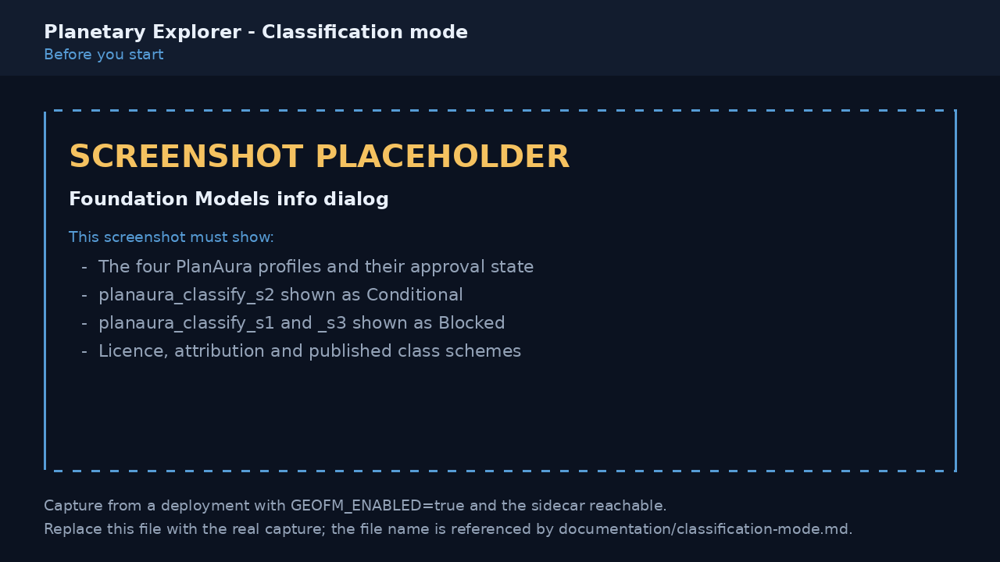
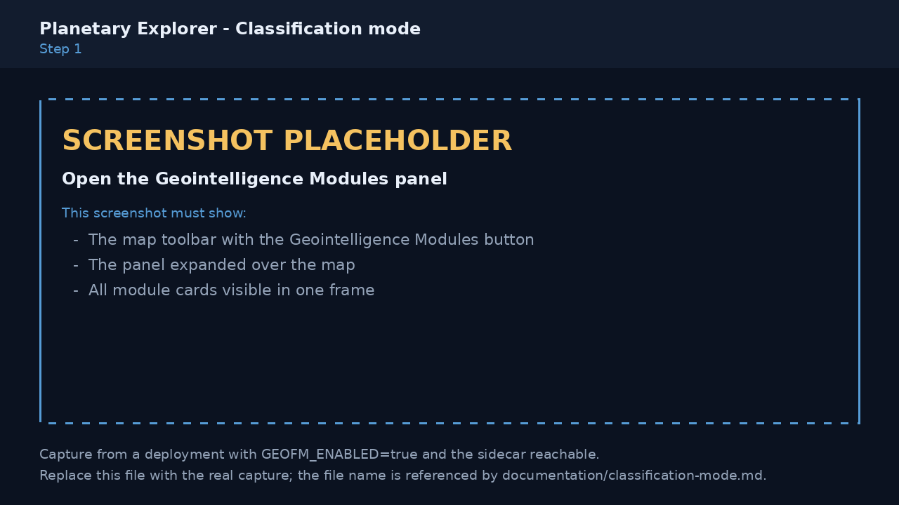
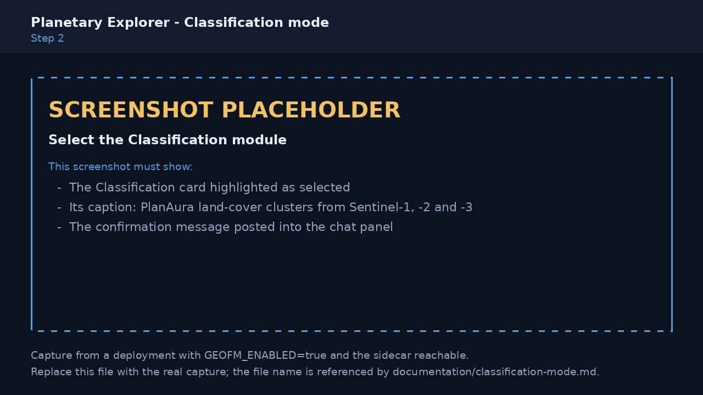
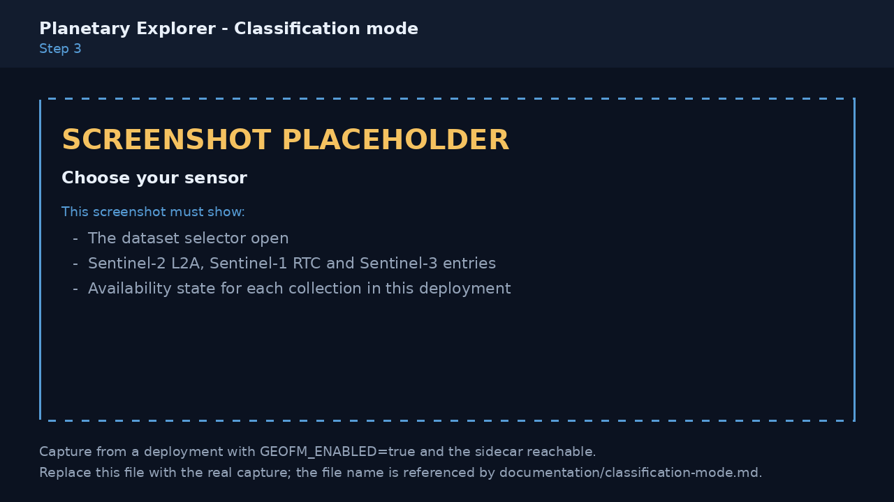
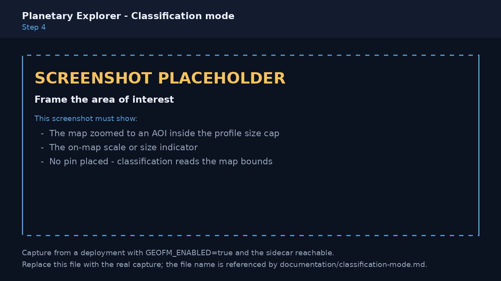
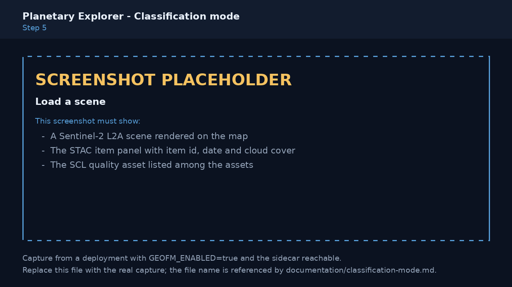
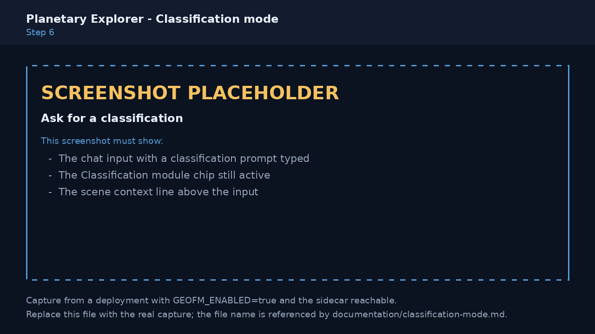
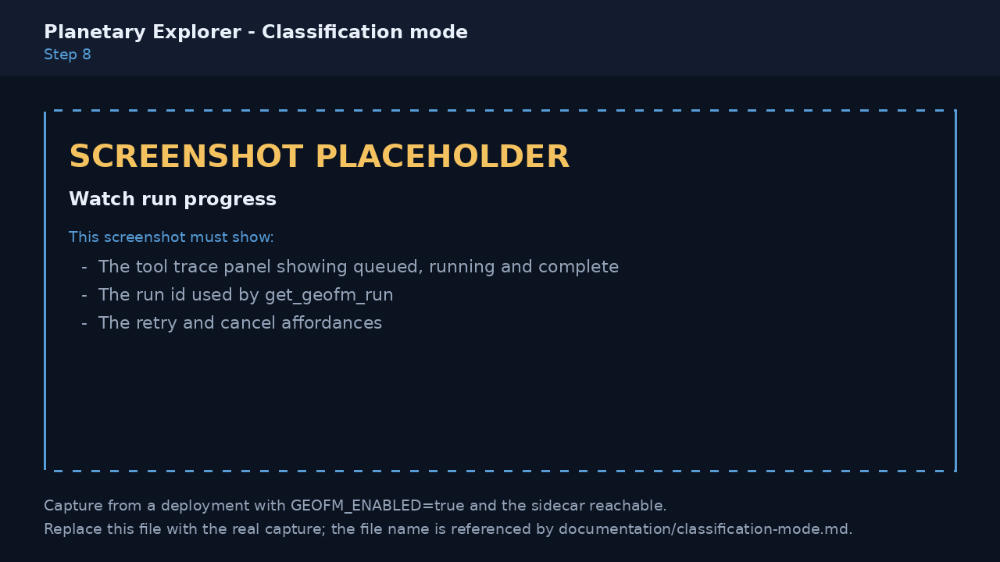
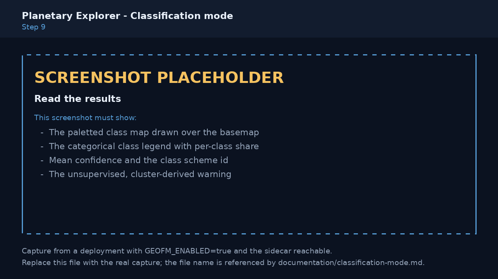
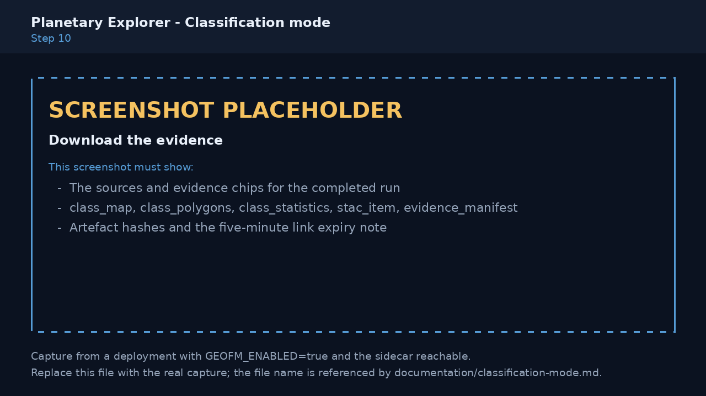

# Classification mode (PlanAura, Sentinel-1 / -2 / -3)

Classification is a Geointelligence Module that submits a loaded Sentinel scene to the
**PlanAura** geospatial foundation model and returns a land-cover class map, class
polygons, and per-class statistics as durable, hashed evidence.

> [!IMPORTANT]
> The screenshots in this guide are annotated placeholders. They must be re-captured
> from a deployment that has GeoFM enabled and the PlanAura sidecar reachable. Each
> placeholder lists exactly what its replacement has to show.

---

## 1. What this mode does — and what it does not

**What it does**

* Extracts PlanAura patch embeddings from a Sentinel scene inside your framed area of interest.
* Groups those embeddings into clusters, then names each cluster from co-computed
  spectral signatures (and SAR backscatter, on the fusion path).
* Returns a paletted class map, class polygons, per-class area and share, and a mean
  confidence per class — all as artefacts with SHA-256 hashes and a signed evidence manifest.

**What it does not do**

| Limit | Why it matters |
|---|---|
| **Unsupervised, not semantic.** | PlanAura-1.0 is a masked-reconstruction backbone: it produces embeddings, not labels. No approved supervised classifier head ships with this deployment, so every class name is a *cluster description* derived from spectral signature — not a validated land-cover product. Never quote a class as ground truth. |
| **Canadian training envelope.** | PlanAura was trained over Canada. AOIs outside that envelope return a non-suppressible warning and must be treated as indicative. |
| **June–September preference.** | The model's preferred season is months 6–9. Scenes outside it return a seasonal warning. |
| **Sentinel-3 is coarse.** | 300 m or coarser pixels support regional regime summaries only — never per-parcel or per-field statements. |
| **Sentinel-1 needs optical.** | SAR backscatter is a different physical measurement from reflectance. The SAR path fuses backscatter features with optical embeddings at the classifier head and **fails closed** without a co-located Sentinel-2 scene. |
| **No bare class names.** | Every result carries its per-class confidence and its class-scheme ID. If you see a class without both, treat the answer as unverified. |

### Sensor paths

| Profile | Collection | Approach | Ships as |
|---|---|---|---|
| `planaura_classify_s2` | `sentinel-2-l2a` | Primary optical path. Resampled to 30 m, `SCL` used as the quality asset. | **Conditional** |
| `planaura_classify_s1` | `sentinel-1-rtc` (+ co-located `sentinel-2-l2a`) | SAR/optical fusion. RTC only — terrain-corrected and calibrated. | **Blocked** until a validation report passes |
| `planaura_classify_s3` | `sentinel-3-olci-wfr-l2-netcdf`, `sentinel-3-slstr-wst-l2-netcdf` | Coarse regional regimes (water / land / thermal). | **Blocked** until a validation report passes |

Blocked profiles are rejected by the sidecar registry before any GPU work starts. In a
deployment where only Sentinel-2 is approved, the Sentinel-1 and Sentinel-3 options
render as unavailable.

---

## 2. Before you start

Confirm all of the following, then open the Foundation Models info dialog to verify what
your deployment actually offers.

* `GEOFM_ENABLED=true` and `GEOFM_MCP_URL` set on the API container.
* The PlanAura sidecar (MCP control plane **and** the GPU worker) is deployed and healthy.
* `GEOFM_ALLOW_CONDITIONAL=true` — `planaura_classify_s2` ships as `CONDITIONAL` and is
  refused without this gate.
* You accept that classification starts **billed serverless T4 GPU work**. Runs are capped
  per owner by `GEOFM_MAX_ACTIVE_RUNS_PER_OWNER` (default `3`).



---

## 3. Step 1 — Open the Modules panel

On the map toolbar, select **Geointelligence Modules**.



---

## 4. Step 2 — Select Classification

Select the **Classification** card. Like Foundation Change, this mode is chat-driven: it
does **not** enable pin mode, because the area of interest is read from the current map
bounds.

Selecting it posts a confirmation into chat that restates the sensor requirements, the
unsupervised nature of the result, and the fact that GPU work still needs approval.



---

## 5. Step 3 — Choose your sensor

| Your question | Use | Notes |
|---|---|---|
| "What land cover is here?" on a clear-sky day | **Sentinel-2 L2A** | The primary path. Needs bands B02, B03, B04, B8A, B11, B12 and the `SCL` quality asset. |
| Cloud, smoke, polar night, or all-weather monitoring | **Sentinel-1 RTC** + a co-located Sentinel-2 scene | Fusion path. `VV`, `VH`, and the `mask` asset. Fails closed without the optical scene. |
| Regional water, land, or thermal regimes; ocean and large-lake work | **Sentinel-3 OLCI / SLSTR** | Coarse path. Regional summaries only. |



---

## 6. Step 4 — Frame the area of interest

Zoom the map so the area you care about fills the view. The AOI is taken from the map
bounds — no pin is required.

Each profile has its own hard size cap, derived from `native_resolution_m × tile_size_pixels`
(PlanAura's fixed 512-pixel context window):

| Profile | Native resolution | Maximum AOI side |
|---|---|---|
| `planaura_classify_s2` | 30 m | **15.36 km** |
| `planaura_classify_s1` | 10 m | **5.12 km** |
| `planaura_classify_s3` | 300 m | **153.6 km** |

The cap is not a quota — it is the model's context window. A larger AOI would have to be
downsampled past the resolution the model was trained on, so the request is rejected
instead.



---

## 7. Step 5 — Load a scene

Ask for imagery as usual, or pick an item from the STAC results. The scene must fully
cover your AOI and carry the required bands plus its quality asset.



---

## 8. Step 6 — Ask for a classification

Type your question into chat. Three worked examples:

```text
Classify the land cover in this view.
```

```text
What surface types are present in this Sentinel-2 scene? Show the class map and the area of each class.
```

```text
Classify this area from the Sentinel-1 RTC scene fused with the Sentinel-2 scene I loaded.
```

The agent resolves the profile and class scheme from the loaded collection, selects the
best scene (recency, cloud cover, coverage), and calls `classify_with_geofm`. Defaults:
minimum confidence `0.55`, at most `6` classes.



---

## 9. Step 7 — Approve the GPU run

`classify_with_geofm` is a **submit** operation, so it pauses for approval through the
standard MCP confirmation flow. The card shows the resolved profile, class scheme, and
item IDs. Nothing is billed until you approve.


---

## 10. Step 8 — Watch progress

Runs are durable: they keep going after the browser or the agent turn disconnects. The
tool trace shows `queued → running → succeeded`. Use `get_geofm_run` to poll,
`retry_geofm_run` after a transient failure, and `cancel_geofm_run` to stop work you no
longer need (cancelling also frees a slot against your concurrency cap).



---

## 11. Step 9 — Read the results

A completed run paints a paletted class map over the basemap and renders a categorical
legend showing, per class: its colour, its share of the AOI, and its mean confidence. The
legend also names the class scheme and repeats the unsupervised warning.

The three published class schemes are:

| Scheme ID | Classes |
|---|---|
| `planaura_unsupervised_v1` | water, dense_vegetation, sparse_vegetation, bare_or_built, snow_or_ice, burned_or_disturbed |
| `planaura_sar_surface_v1` | open_water, smooth_bare, rough_vegetated, volume_scattering_forest, double_bounce_built |
| `planaura_coarse_regime_v1` | water_regime, vegetated_land_regime, bare_land_regime, warm_thermal_regime, cool_thermal_regime |



---

## 12. Step 10 — Download the evidence

Every completed run publishes five artefacts:

| Artefact | Contents |
|---|---|
| `class_map` | Paletted Cloud-Optimized GeoTIFF of the class raster |
| `class_polygons` | GeoJSON class polygons clipped to the AOI |
| `class_statistics` | Per-class pixel count, area, share, and mean confidence |
| `stac_item` | A STAC item describing the derived product |
| `evidence_manifest` | Source item IDs and hashes, checkpoint hash, classifier-head hash, class-scheme ID, and the run recipe |

Artefact links are **five-minute, read-only user-delegation SAS URLs** scoped to the
`geofm` blob container. If a link has expired, re-poll the run to mint a fresh one.

Raw pixels, band arrays, embedding tables, feature stacks, and logits are rejected from
MCP payloads by contract — they exist only as blob artefacts.



---

## 13. Interpreting confidence and warnings

**Confidence** is a cluster-assignment margin: how much closer a pixel sits to its
assigned cluster centre than to the next-nearest one. High confidence means the pixel is
unambiguously in *that cluster*; it does **not** mean the cluster's name is correct.
Pixels below the minimum confidence are withheld rather than guessed.

| Warning | Meaning | When not to trust the result |
|---|---|---|
| *Unsupervised, cluster-derived* | Always present. Names come from spectral signature, not a trained semantic model. | Whenever the answer is used as an authoritative land-cover statement. |
| *AOI is outside PlanAura's Canada training envelope* | The model is generalising beyond its training distribution. | For any decision that depends on class accuracy, unless corroborated with ground reference. |
| *Scene is outside the preferred June–September season* | Snow, low sun angle, and senescent vegetation shift spectral signatures. | For winter or shoulder-season vegetation and bare-ground distinctions. |
| *Sentinel-3 pixels are 300 m or coarser* | Each pixel mixes many surface types. | For anything at parcel, field, or building scale. |
| *Sentinel-1 results fuse SAR backscatter with optical embeddings* | Backscatter responds to roughness, moisture, and geometry — not colour. | When the optical scene is much older than the SAR scene, or the surface changed between them. |

These warnings are mandatory and cannot be suppressed.

---

## 14. Troubleshooting

| Message | Cause | Fix |
|---|---|---|
| `Classification supports only …` | The loaded collection has no classification profile. | Load a Sentinel-1 RTC, Sentinel-2 L2A, or Sentinel-3 OLCI/SLSTR scene. |
| `Model profile '…' is blocked.` | The profile ships `BLOCKED` pending its validation report. | Use `planaura_classify_s2`, or wait for the profile to be approved in your deployment. |
| `Model profile '…' requires explicit deployment approval.` | Profile is `CONDITIONAL` but `GEOFM_ALLOW_CONDITIONAL` is not enabled. | Enable the gate after the GPU smoke test passes. |
| `AOI must fit inside the … km square context.` | The map bounds exceed the profile's context window. | Zoom in until the AOI is inside the cap in Step 4. |
| `unsupported_collection:<item>` | The item's collection is not in the profile's supported list. | Load a scene from a supported collection, or switch profile. |
| `missing_assets:<item>:<assets>` | The item lacks a required band or its quality asset (`SCL`, `mask`, `wqsf`). | Choose a different item — the listed assets are mandatory for quality masking. |
| `unsupported_resolution:<item>` | A band's native grid is not one the profile can resample from. | Choose a standard product; custom-resampled items are refused. |
| `primary_scene_required` | No scene from the profile's own collection was supplied. | Load the primary optical or SAR scene, not only the fusion partner. |
| `different_collections` | Scenes from more than one primary collection were supplied. | Classify one collection at a time. |
| `fusion_scene_required` | Sentinel-1 requested without a co-located Sentinel-2 scene. | Load a Sentinel-2 scene covering the same footprint. |
| `insufficient_footprint_overlap:<item>` | The fusion scene covers less than 95 % of the primary footprint. | Choose a fusion scene over the same tile. |
| `Too many active GeoFM runs (n).` | You hit `GEOFM_MAX_ACTIVE_RUNS_PER_OWNER`. | Wait for a run to finish, or cancel one with `cancel_geofm_run`. |
| `GeoFM is not enabled in this Planetary Explorer environment.` | `GEOFM_ENABLED` or `GEOFM_MCP_URL` is unset. | Deploy the sidecar and set both values. |

Error text returned to you is sanitised: signed URLs and internal paths are never
surfaced to the model or the UI. For the unredacted cause, read the worker logs.

---

## 15. Attribution and licence

Classification products are derived works. Carry all three attributions:

* **PlanAura model and derived classification products** — © His Majesty the King in
  Right of Canada, as represented by the Minister of Natural Resources. Contains
  information licensed under the
  [Open Government Licence – Canada 2.0](https://open.canada.ca/en/open-government-licence-canada).
* **Sentinel-1, -2, and -3 imagery** — Contains modified Copernicus Sentinel data,
  processed by ESA and made available through the Microsoft Planetary Computer.
* **Class schemes** — `planaura_unsupervised_v1`, `planaura_sar_surface_v1`, and
  `planaura_coarse_regime_v1` are derived at run time from PlanAura embeddings and
  Sentinel observations, and are published under the Open Government Licence – Canada 2.0.

---

## Related

* [GeoFM sidecar README](../planetary-explorer/geofm-sidecar/README.md) — architecture,
  pinned model artefacts, deployment gates.
* [Quick deployment guide](../QUICK_DEPLOY.md) — deploying Planetary Explorer.
