## Purpose and expected result

Investigate where water spread during an event, what changed after it receded,
and which observations need further checking. Use Planetary Explorer to find
imagery, inspect source evidence, and screen terrain. Use a geographic
information system (GIS) for mapped areas or distances that the application
does not measure.

The intended reader is an analyst, planner, researcher, or student with access
to the application. The core visual workflow does not require coding. The
optional measurement workflow requires QGIS and georeferenced source data.

At completion, produce:

- A study-area definition and event timeline
- A scene log with actual acquisition dates and source identifiers
- Before, event-period, and recovery observations of the same area
- A map of candidate inundation and possible erosion or deposition
- A short findings report that separates observations from interpretations

> [!WARNING]
> This is a retrospective screening workflow, not a flood forecast, evacuation
> tool, engineering design, or determination that land is safe to develop.
> Follow official warnings and closures. Do not enter flooded or unstable areas
> to validate a satellite interpretation.

The interface steps and capability limits follow the repository's
[application usage guide](get-started-playbook.md). The Sumas Prairie imagery,
Vision description, and radar sampling below were exercised in the live
application on September 20, 2026. The screenshots are actual browser captures,
not mock-ups. This verifies application operations, not a flood classification,
erosion distance, or storm-surge height.

## Verified walkthrough and remaining limits

Use Steps 1-6 for the screenshot-backed imagery and point-analysis exercise.
Step 7 demonstrates a working elevation layer. Its numerical terrain
screening failed on September 20, 2026 and passed a direct API check on
September 30, 2026, after terrain fixes. Steps 9-10 remain optional methods,
not completed measurement or storm-surge demonstrations.

| Operation                      | Captured result                                        | What is verified                                      |
| ------------------------------ | ------------------------------------------------------ | ----------------------------------------------------- |
| Optical baseline               | Sentinel-2, September 2, 2021                           | Correct scene, visible imagery, successful raster tiles |
| Matched radar baseline         | Sentinel-1B, October 23, 2021, descending orbit 13       | Scene and orbit match for the event comparison         |
| Event-period radar             | Sentinel-1B, November 28, 2021, descending orbit 13      | Scene loads; not a claim that it is the flood peak      |
| Event-period optical           | Sentinel-2, November 16, 2021                           | Loads, but cloud obscures the area; reject for mapping |
| Recovery optical               | Sentinel-2, June 26, 2022                               | Correct scene and visible imagery                     |
| Later optical                  | Sentinel-2, September 27, 2022                          | Correct scene and visible imagery                     |
| Image Analysis                 | `describe_map_screenshot` received a real map screenshot | Tool execution and visible response                   |
| Radar point sample             | November 28 item; VV -20.97 dB, VH -19.86 dB             | Structured values match the displayed scene and pin    |
| Elevation display              | Copernicus DEM item dated April 22, 2021                | Layer loads; this is static surface elevation          |
| Numerical terrain screening    | September 30 API check; three tools returned results at 100% coverage | Measured screening values; not a flood map or permit decision |
| QGIS areas and bank displacement | QGIS was not installed on the capture machine          | Instructions only; no executed GIS result or screenshot |
| Coastal surge measurements     | No named storm/gauge/shoreline analysis executed        | Optional method, not a verified coastal case           |

The application captures use a 1600 by 1000 viewport. Successful imagery runs
checked real raster-tile responses and a material pixel difference with the
layer on versus off. The map also contains a basemap and labels: imagery colour
does not automatically describe every visible part of the viewport. Keep your
interpretation inside the verified imagery coverage, and use source rasters
for measurements.

For this run, explicit-coordinate searches reported a search box of
`[-122.1000, 49.0500, -122.0800, 49.0700]`. That is narrower than the study AOI
below. These captures do not demonstrate a classified flood extent across
the full AOI.

## Understand the physical process

Flooding puts water onto land that is normally dry. Moving water can erode
soil and sediment, transport that material, and deposit it where flow slows.
After the water recedes, channels, banks, bars, beaches, or dunes may have
changed. Geomorphology is the study of those landforms and the processes that
shape them.

The sequence to investigate is:

```text
Rainfall, snowmelt, high river flow, or coastal storm forcing
    -> water levels rise and water spreads
    -> currents and waves may erode, transport, or deposit sediment
    -> water recedes
    -> some changes disappear; others persist
```

Not every wet area is a new flood, and not every colour change is a landform
change. Permanent water, seasonal wetlands, crop cycles, snow, shadows,
construction, and different water levels can all produce misleading comparisons.

| Term              | Meaning for this workflow                                                          |
| ----------------- | ---------------------------------------------------------------------------------- |
| River flooding    | A river or its connected drainage system inundates normally dry land               |
| Surface flooding  | Rainwater accumulates or flows across land without necessarily overflowing a river |
| Storm surge       | A storm-related rise above the predicted astronomical tide                         |
| Storm tide        | Astronomical tide plus storm surge; waves add further effects                      |
| Inundation extent | The area interpreted as covered by water at a particular observation time          |
| Erosion           | Removal of bank, beach, dune, or other surface material                            |
| Deposition        | Accumulation of transported material, such as a new sediment bar                   |
| Channel migration | A persistent shift of a river channel, not merely a change in water width          |
| Overwash          | Water and sediment carried across a beach or barrier into land behind it           |

The [NOAA storm-surge overview](https://www.nhc.noaa.gov/surge/) explains why
surge, tide, waves, and freshwater flow must be distinguished. A satellite
image alone cannot establish how much flooding each process caused.

## Know what each part of the workflow can do

| Task                                        | Where to do it                        | Limit to retain in the report                               |
| ------------------------------------------- | ------------------------------------- | ----------------------------------------------------------- |
| Find and display optical or radar imagery   | Planetary Explorer                    | The selected scene may not coincide with the event peak     |
| Describe visible patterns                   | Image Analysis, when available        | A screenshot description is not a water mask or measurement |
| Read values at a pin                        | Raster Analysis                       | A point value does not establish conditions over an area    |
| Screen elevation, slope, and water history  | Terrain workflow                      | Static terrain and historical water are not event forecasts |
| Confirm event dates and gauge observations  | Official external sources             | Check station coverage, time zone, units, and quality flags |
| Calculate inundated hectares or bank shifts | External GIS with source rasters      | Requires explicit masks, boundaries, scale, and uncertainty |
| Estimate water depth or sediment volume     | Survey and hydraulic/coastal analysis | Not established by the imagery workflow                     |

Do not substitute a vegetation or burn-index result for a flood-area
calculation. General image change, including a foundation-model change
polygon, is not automatically flood, erosion, or deposition.

## Before you begin

1. Obtain the application URL from your operator. Use the
   [deployment guide](deployment.md) if access or source services are missing.
2. Confirm that public Planetary Computer imagery loads. Leave **MPC Pro** off
   unless you have an authorized private catalog and intend to use it.
3. Review [map controls](get-started-playbook.md#know-the-controls) if this is
   your first session. You will use chat, **Map layers**, and the pin controls.
4. Prepare somewhere to record the scene log and capture screenshots. Do not
   rely on chat memory as the only evidence record. Signed-in saved history is
   optional; see [chat history](chat-memory.md).
5. Identify an official event report and a relevant river or tide station.
   Station data may need to be downloaded outside the application.
6. For area or distance measurements, install a supported QGIS release and
   obtain the exact source rasters. A basemap screenshot is not a substitute.

Image Analysis requires a supported rendered-map capture. The no-key fallback
map does not provide the Azure-canvas screenshot path. If it is unavailable,
continue with source imagery, manual inspection, and raster evidence; do not
report that an image-analysis tool ran.

## Step 1 - Define the question and study area

Start with a question that observations can answer:

```text
Where did surface water expand during the November 2021 flooding in
Sumas Prairie, British Columbia, and which channel or sediment changes
remain visible in later imagery?
```

Use this small training area first. It is a study window, not an official
flood perimeter or an assertion that every location inside it flooded.

| Setting                  | Training value                                                 |
| ------------------------ | -------------------------------------------------------------- |
| Place                    | Sumas Prairie, near Abbotsford, British Columbia               |
| Centre latitude          | 49.0600                                                        |
| Centre longitude         | -122.0900                                                      |
| Study bounding box       | [-122.1100, 49.0500, -122.0700, 49.0700]                       |
| Bounding-box order       | West longitude, south latitude, east longitude, north latitude |
| Pre-event search window  | 2021-09-01 to 2021-10-31                                       |
| Event search window      | 2021-11-15 to 2021-11-30                                       |
| Recovery search window   | 2022-06-01 to 2022-06-30                                       |
| Persistence check window | 2022-08-01 to 2022-09-30                                       |

These are candidate search windows. Confirm their suitability against the
event timeline and the actual scenes returned. In particular, a November
scene is not automatically a peak-flood observation. Summer recovery imagery
also has different vegetation from autumn imagery.

For the radar baseline, use October 23, 2021 as shown in Step 4. The original
broad September-October search selected October 30 on relative orbit 115,
which does not match the captured event scene's relative orbit 13.

The centre pin is for navigation and inspection. The bounding box is the
fixed area of interest (AOI) for any later mapping. Point imagery normally
uses a one-mile-radius extent; a pin sample, the map viewport, and a Terrain
tool's analysis window are different spatial supports. Record which one
each result describes.

For a different location, replace the place, both coordinates, bounding box,
and all date windows together. Do not retain the Sumas dates for another event.

## Step 2 - Establish the event timeline

1. Read the relevant official event report. For this training case, start with
   [Canada's 2021 weather review](https://www.canada.ca/en/environment-climate-change/services/top-ten-weather-stories/2021.html).
2. Use [Water Survey of Canada](https://wateroffice.ec.gc.ca/) to identify
   available river-level or discharge observations. Record the station ID and
   why the station represents the study area. The nearest station may be on a
   different watercourse or affected by different controls.
3. Record the onset, reported peak, and recession dates, with source links.
   Keep reported impacts separate from measured gauge observations.
4. Record whether gauge timestamps are UTC, local standard time, or local
   daylight time. Convert to a common time basis before pairing them with
   satellite acquisition timestamps.
5. Mark missing or provisional data. If no representative gauge exists, say
   that the timing or magnitude cannot be independently established there.

Use Web Search only when the deployment enables it. Otherwise open the
official sites directly. A search snippet or generated summary is not a
substitute for reading the source and checking its dates.

Expected output: an event timeline that lets you label each selected scene
as pre-event, event-period, or recovery without guessing from its appearance.

## Step 3 - Create a scene and observation log

Record one entry for every scene you actually use, including rejected scenes.
The requested date range and the acquired image date must remain separate.

```text
Case ID:
Observation ID and phase:
Requested location and date range:
Actual pin coordinates and AOI:
Collection and exact item ID:
Acquisition timestamp and time zone:
Source link and processing version, where available:
Bands, radar polarization, units, and display stretch:
Pixel size and coordinate reference system:
Radar orbit direction and relative orbit, where available:
Cloud, shadow, snow, ice, or radar-quality concerns:
Valid coverage within the study area:
Gauge or tide value at acquisition, with station and datum:
Screenshot or local raster reference:
Observation stated without interpretation:
Possible interpretation and competing explanation:
Accepted or rejected, with reason:
```

Do not invent missing metadata or record a requested day as an acquisition.
Do not place temporary signed asset URLs or access tokens in a public report.
Retain the collection, item ID, and a stable source reference instead.

### Find metadata and revisit an accepted scene

Start with the source and tool evidence attached to the imagery response.
The prose answer alone is not an authoritative scene record. When an item ID
is available, inspect that exact item in the public STAC catalog (SpatioTemporal
Asset Catalog). Replace the two placeholders in this address:

```text
https://planetarycomputer.microsoft.com/api/stac/v1/collections/{collection}/items/{item_id}
```

In the returned JSON, check `collection`, `id`, `properties.datetime`, and
the scene `geometry`. Radar metadata can include `sar:polarizations`,
`sat:orbit_state`, and `sat:relative_orbit`. Asset metadata can include band,
resolution, projection, scale, and offset information; missing fields remain
unknown. Open the relevant `assets` entry to identify the actual raster, not
the thumbnail. Private-catalog items use their authorized catalog instead.

If the interface does not expose the item identity, ask the operator for the
selected STAC item from that request. Do not reconstruct an identity by guessing
from the date. If it cannot be obtained, label the view qualitative and stop
any measurement that requires an exact reproducible scene.

To try to revisit a scene in the application, repeat the original
collection-and-coordinate imagery prompt using `on YYYY-MM-DD` with the
recorded acquisition date. Confirm that the returned item ID matches. The
same day can contain more than one item; an exact-day search is not an
exact-item guarantee. When the application cannot select the same item or a
compatible radar pair, use the recorded items' source assets in GIS instead.

## Step 4 - Load and record the pre-event baseline

### Load optical imagery

Send this as a standalone imagery request:

```text
Show collection sentinel-2-l2a natural-colour imagery at latitude 49.0600,
longitude -122.0900, in Sumas Prairie, British Columbia, Canada,
from 2021-09-01 to 2021-10-31.
```

1. Wait for the response and map to finish drawing.
2. Confirm the location, collection, and actual acquisition date in the
   available source evidence. Reject a scene outside the baseline window.
3. Open **Map layers**. Confirm the requested imagery is enabled, then toggle
   it off and on to distinguish the satellite layer from the basemap.
4. Inspect the study area for cloud, cloud shadow, snow, and missing pixels.
   A low whole-scene cloud percentage does not prove the local area is clear.
5. Record the bands and display settings. Use the same settings for later
   visual comparisons. Natural-colour Sentinel-2 normally uses B04/B03/B02;
   verify the actual layer rather than inferring its bands from its colours.
6. Capture the view with its date and source details, and complete the log.

The live request selected September 2, 2021, not October 31. Its 12 raster-tile
responses returned HTTP 200, and the imagery materially changed the map when
toggled. The date in the response is the acquisition to record.

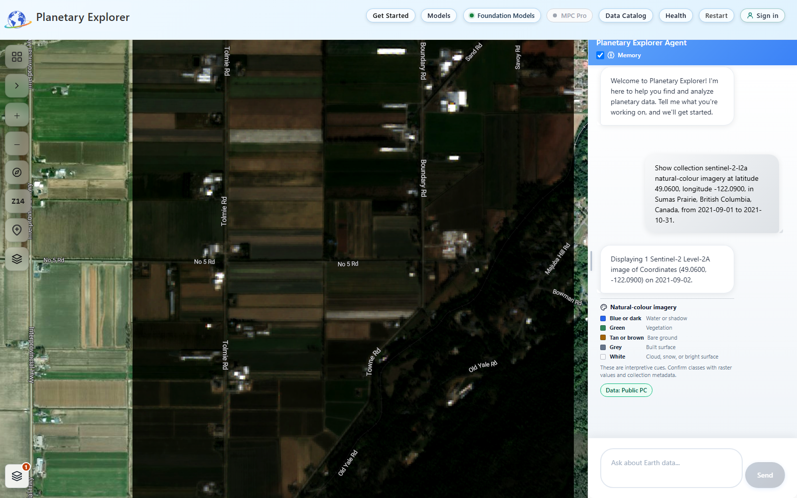

Figure 1. A successful baseline load. The dated satellite layer differs from
the surrounding basemap. The [capture record](images/flooding-sumas/baseline-optical/verification.json)
contains the exact item, query, raster-tile responses, and screenshot hashes.

If using Image Analysis, select the four-square map control, choose
**Vision Analysis**, place a pin in the loaded study area, and confirm
**Pin Placed**. Follow the
[common map workflow](get-started-playbook.md#use-the-common-map-workflow).
Ask for an observation of the current image, not a comparison to an image
the tool has not received:

```text
Describe the visible water, channels, exposed ground, and vegetation in the
currently displayed Sumas Prairie image. State obscured or uncertain areas.
Do not infer flood depth, sediment volume, or changes from another date.
```

Check that the answer has **Vision** tool evidence. Record ordinary channels,
ponds, and wetlands so they are not later counted as new floodwater.

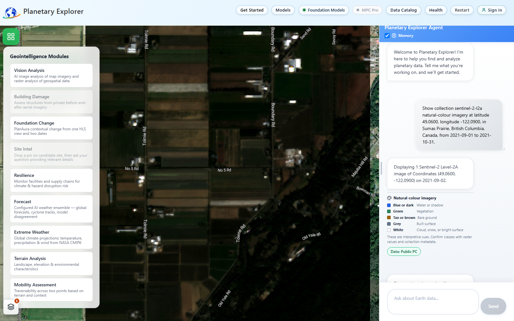

Figure 2. Choose **Vision Analysis** from the four-square map control. Private
or unrelated disabled modules are not required for this exercise.

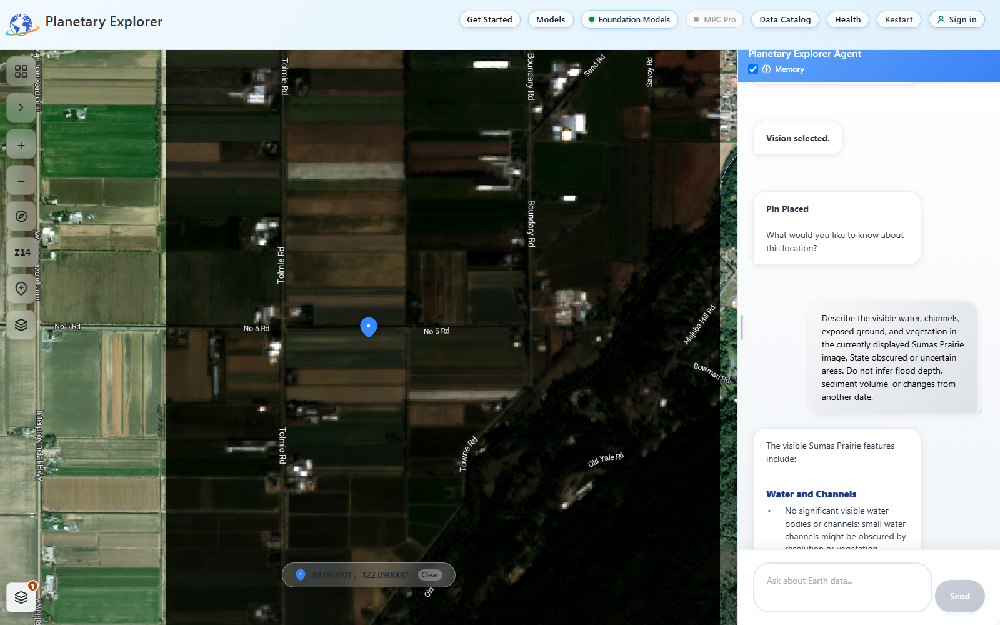

Figure 3. The pin and its confirmation remain visible in this capture taken
after the description prompt was submitted. Confirm your pin before sending
that prompt. The captured coordinates were `49.060001, -122.090000`, which
round to the documented location.


Figure 4. The live response and **Tool: Vision** badge. The request contained
an actual map screenshot and the response reported `describe_map_screenshot`.
This is interpretation of the displayed view, not a quantitative water mask.
The [Vision capture record](images/flooding-sumas/baseline-optical-vision/verification.json)
retains the request metadata and response.

### Add a radar baseline

```text
Show collection sentinel-1-rtc radar imagery at latitude 49.0600,
longitude -122.0900, in Sumas Prairie, British Columbia, Canada,
from 2021-10-23 to 2021-10-23.
```

This revised prompt was executed successfully. It selects a Sentinel-1B scene
on descending relative orbit 13, matching the event scene used below. Both
items list VV and VH polarizations. This fixes the orbit mismatch in the
original broad-date search; it does not by itself validate a flood mask.

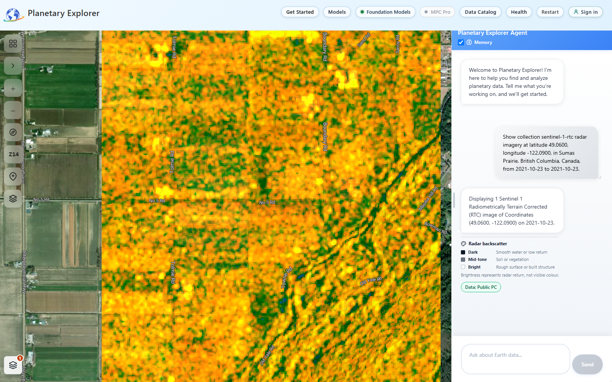

Figure 5. The matched radar baseline. Compare the [baseline metadata](images/flooding-sumas/baseline-radar-matched/verification.json)
with the [event metadata](images/flooding-sumas/event-radar/verification.json),
not only their colours. The [original unmatched run](images/flooding-sumas/baseline-radar/verification.json)
is retained as evidence of why the prompt changed.

Record its exact item, polarization, units, orbit direction, and relative
orbit where available. Radar is useful when optical views are cloudy, but
the event comparison should use compatible processing, polarization, and
viewing geometry. Do not compare raw colour brightness across different
display stretches.

If metadata needed to establish compatibility is unavailable, retain the
view as qualitative context and use the exact catalog items in external GIS
before making a quantitative radar-change claim.

## Step 5 - Inspect event-period water

Load the event window separately:

```text
Show collection sentinel-1-rtc radar imagery at latitude 49.0600,
longitude -122.0900, in Sumas Prairie, British Columbia, Canada,
from 2021-11-15 to 2021-11-30.
```

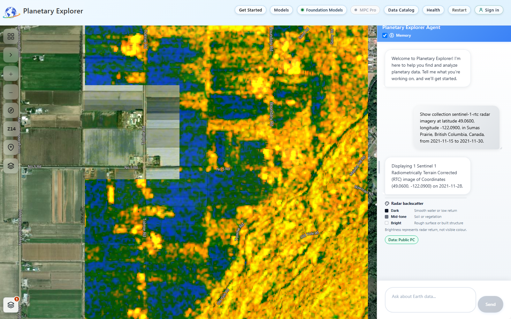

Figure 6. The selected event-period scene. Larger blue or low-return patches
are candidates to investigate, not a validated inundation perimeter. The
satellite, descending direction, and relative orbit 13 match Figure 5.

1. Log the actual timestamp and compare it with the event timeline. Label it
   an event-period observation unless independent evidence places it at the
   local peak.
2. Check compatibility with the radar baseline. A changed orbit or
   polarization is not an equivalent before-and-after measurement.
3. Compare the same ground locations using the recorded baseline and current
   image. Look for new connected water-like areas outside ordinary channels.
4. Check roads, buildings, steep slopes, agricultural fields, and vegetated
   wetlands for alternative explanations. Smooth dry surfaces and radar
   shadows can be dark; flooded vegetation or built areas can be bright.
5. Inspect an optical event scene if one is usable, and compare with local
   reports or official flood mapping. Do not force an optical interpretation
   through cloud.

```text
Show collection sentinel-2-l2a natural-colour imagery at latitude 49.0600,
longitude -122.0900, in Sumas Prairie, British Columbia, Canada,
from 2021-11-15 to 2021-11-30.
```

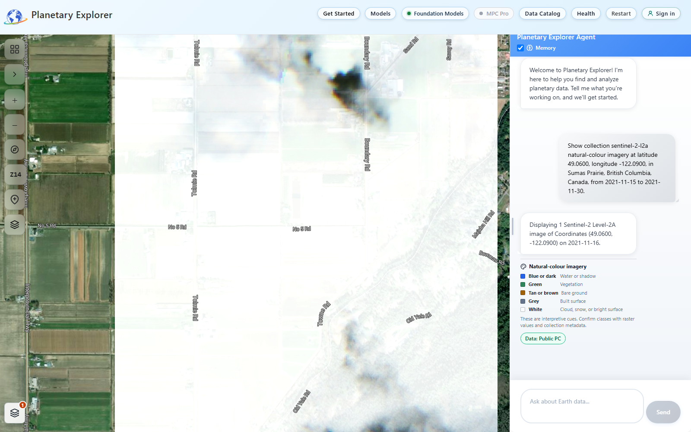

Figure 7. A successful load but an unusable optical observation for mapping
most of this view. The white area is not proof of floodwater. Record cloud
and obscured ground as unknown, and continue with the radar branch. The
[optical event capture](images/flooding-sumas/event-optical/verification.json)
is retained rather than replaced with an unrelated clear image.

Optional point evidence: select **Raster Analysis** through the documented
Vision workflow and ask for the selected event-period Sentinel-1 VV and VH
values at the pin. Accept the sample only if its collection, item, date,
coordinates, and units match the intended observation. If the sampler chooses
a different scene, it does not measure the displayed event image.

To reproduce the captured sample, reload the event radar image, select
**Vision Analysis**, and place the pin again. Submit this exact prompt in chat:

```text
Sample VV and VH radar backscatter at this Sumas Prairie pin for 2021-11-28.
Report the actual collection, item, acquisition date, and units.
```

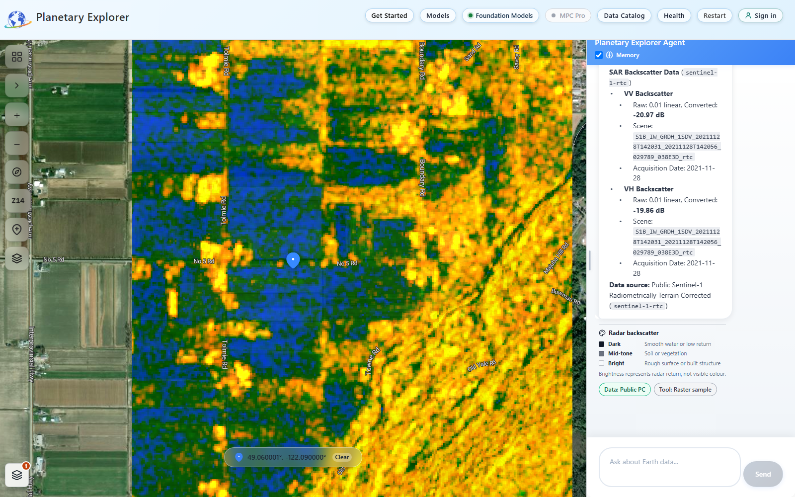

Figure 8. The response used `sample_raster_value`. Its structured values,
sampled item ID, and date agree with the loaded event scene. Both linear
values are rounded to `0.01` in the display; do not recalculate precise dB
values from those rounded numbers. These point values do not measure flood
area or depth. See the [sampling record](images/flooding-sumas/event-radar-raster/verification.json).

Record candidates as "possible event-period inundation" until corroborated.
One dark radar pixel, a model description, or a historical water-occurrence
value is insufficient to classify an entire field as flooded.

Expected output: an annotated observation map with candidate water areas,
ordinary water, and areas that remain unknown. A missing scene is not evidence
that flooding did not occur.

## Step 6 - Revisit after water has receded

Load the recovery window:

```text
Show collection sentinel-2-l2a natural-colour imagery at latitude 49.0600,
longitude -122.0900, in Sumas Prairie, British Columbia, Canada,
from 2022-06-01 to 2022-06-30.
```

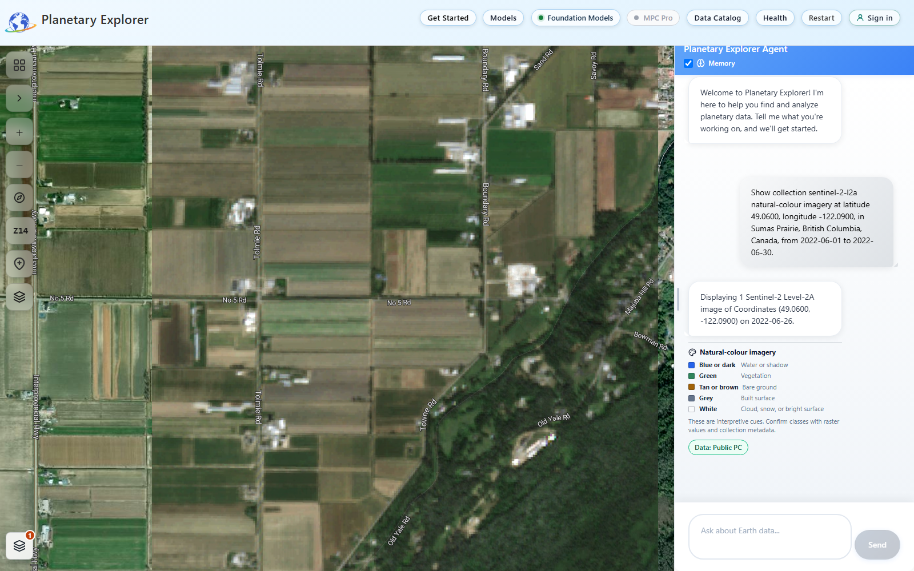

Figure 9. The recovery request selected June 26, 2022. Compare the same ground
features within verified imagery coverage; a different field colour is not
automatically sediment deposition.

Then load the persistence window as another separate request:

```text
Show collection sentinel-2-l2a natural-colour imagery at latitude 49.0600,
longitude -122.0900, in Sumas Prairie, British Columbia, Canada,
from 2022-08-01 to 2022-09-30.
```

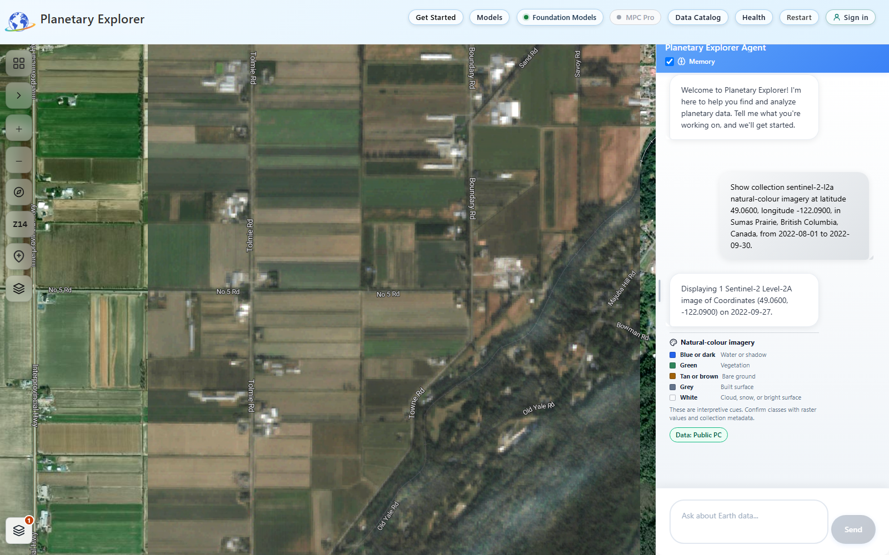

Figure 10. The later request selected September 27, 2022. The
[recovery record](images/flooding-sumas/recovery/verification.json) and
[later record](images/flooding-sumas/persistence/verification.json) retain the
different acquisitions. These successful loads do not establish a measured
bank displacement or attribute a persistent change to the November event.

For each selected scene, repeat the location, rendering, quality, and log
checks. Compare banks, channels, bars, and exposed deposits against the
baseline, using stable roads or structures to detect image misalignment.

Treat a feature as a possible persistent change only when it remains visible
in more than one usable post-event observation. Check that differences are not
explained by water stage, crop cycles, dredging, repairs, or later events.
Later persistence supports the observation, but does not by itself prove that
the November event caused it.

If a bank has moved less than you can reliably resolve, report "not resolved
at this imagery scale." Do not estimate a metre-scale retreat from a 10 m or
20 m pixel by zooming in. Sentinel-2 bands have different native resolutions;
see the [mission reference](https://dataspace.copernicus.eu/explore-data/data-collections/sentinel-data/sentinel-2).

## Step 7 - Add terrain and historical-water context

> [!IMPORTANT]
> Elevation display passed the live test. Numerical terrain screening failed
> the September 20, 2026 evidence checks and passed a direct API check on
> September 30, 2026. Treat this step as optional context, not a numerical
> dependency of the imagery walkthrough.

Load the terrain source without asking it to represent a dated flood:

```text
Show collection cop-dem-glo-30 elevation at latitude 49.0600,
longitude -122.0900, in Sumas Prairie, British Columbia, Canada.
```

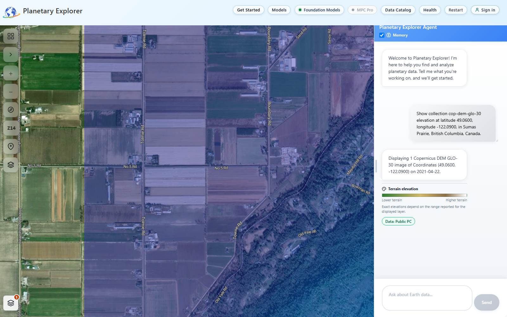

Figure 11. The static DEM loads at the study location. Its date is not the
date of the flood, and this view is not an erosion or water-depth map.

Select the four-square map control, choose **Terrain Analysis**, and place the study
pin again. Confirm its coordinates before asking:

```text
Analyze slope, flat areas, and historical surface-water occurrence around
this Sumas Prairie pin. Report the source and analysis extent for each
result. Treat this as terrain screening, not a November 2021 flood map,
flood probability, water-depth estimate, or permitting decision.
```

Check the actual tool evidence. If the deployment cannot run a requested
tool, mark that part unavailable instead of accepting an unsupported narrative.

### Verified terrain screening

On September 30, 2026, this prompt and pin were sent directly to the
endpoint that **Terrain Analysis** calls, on release
`ca-earthcopilot-api--hardening-0929e`. The browser flow was not re-captured.
All three tools returned structured results in 14.3 seconds:

| Tool                 | Returned values                                                  | Source and coverage                                                   |
| -------------------- | ---------------------------------------------------------------- | --------------------------------------------------------------------- |
| `get_slope_analysis` | Mean 9.0°, maximum 58.7°; 60.9% flat, 13.7% moderate, 25.4% steep | `Copernicus_DSM_COG_10_N49_00_W123_00_DEM`; 100%; 30.9 m by 20.3 m cells |
| `find_flat_areas`    | 60.9% of cells at or below 5°                                    | Same DEM window                                                       |
| `analyze_flood_risk` | Mean occurrence 0.5%, maximum 96%; 0.9% of cells ever water, 0.7% above 25%; `HIGH` | JRC `130W_50Nv1_3_2020`; 100%; 1984-03-01 to 2020-12-31 |

Each tool read the window `[-122.1587, 49.0150, -122.0213, 49.1051]`, about
10 km across, not the Step 1 study AOI. Cell spacing is north-south by
east-west. The `HIGH` category comes from permanent or near-permanent water
reaching 96 percent occurrence; only 0.7 percent of the window exceeded 25
percent. The period ends in 2020, so these values say nothing about the
November 2021 event. The Copernicus DEM is a surface model, so vegetation and
structures can add to the steep share. The answer also repeated the tools'
construction and landing wording; ignore it for this exercise. See the
[API check record](images/flooding-sumas/terrain-screening/api-verification-2026-09-30.json).

### Earlier terrain limitation

On September 20, 2026, the specialist Terrain Analysis route returned a
response and named
`get_slope_analysis`, `find_flat_areas`, and `analyze_flood_risk` in its
`tool_calls`. However, all three `result` fields were `null`. Its prose also
called historical water occurrence "annual flood occurrence," which is not
the meaning of the underlying dataset. Do not adopt that wording or treat
the prose alone as independently checked measurements.

A separate explicit-tool request using the general-purpose pin reached the
analyst service but timed out after 60 seconds without completed tools. It
is not a verified workaround and is not part of the recommended sequence.

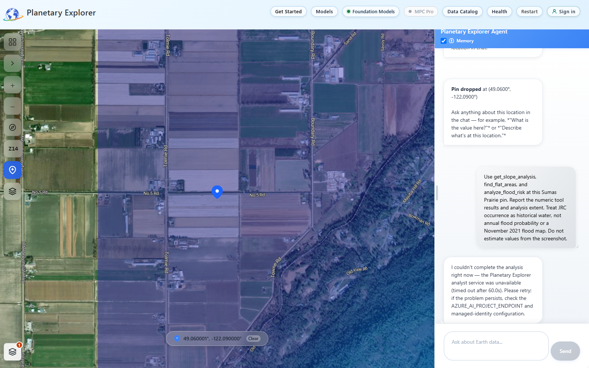

Figure 12. An observed blocker, not a successful terrain calculation. The
[specialist response](images/flooding-sumas/terrain-screening/verification.json)
and [timeout response](images/flooding-sumas/terrain-data-complete/verification.json)
are retained as history. The September 30 check above supersedes this blocker
for the Terrain Analysis endpoint. A replay of the general-chat request that
day finished in 23 seconds without a timeout, but it ran a general terrain
summary and a single water sample instead of the three named tools, over an
8 km radius. Keep using **Terrain Analysis** for this step; see the
[replay record](images/flooding-sumas/terrain-data-complete/api-replay-2026-09-30.json).

### Interpret the flood-screening fields correctly

The current [flood-screening implementation](../planetary-explorer/container-app/geoint/terrain_tools.py#L442)
uses JRC Global Surface Water occurrence, not event-specific hydraulic
modelling. Its field names can sound stronger than their calculations justify.

| Returned field                    | What the current calculation represents                               |
| --------------------------------- | --------------------------------------------------------------------- |
| `mean_water_occurrence_percent`   | Mean historical occurrence value across valid sampled pixels          |
| `area_ever_flooded_percent`       | Share of valid sampled pixels with occurrence greater than zero       |
| `area_frequently_flooded_percent` | Share of valid sampled pixels with occurrence greater than 25 percent |
| `flood_risk_level`                | A heuristic category derived from occurrence thresholds               |
| `permitting_status`               | A software screening label, not approval or a regulatory finding      |

Permanent rivers and lakes can contribute to these values. For example,
"30 percent frequently flooded" does not mean a 30 percent annual flood
probability, nor that 30 percent flooded during the study event. The
category becomes `HIGH` when any valid pixel exceeds 50 percent occurrence
or more than 10 percent of the window exceeds 25 percent occurrence. One
permanent pond or channel inside the window is therefore enough for `HIGH`.

The tool defaults to a 5 km radius parameter and converts it to a
bounding-box window. It reads every source tile that intersects the window and
reports `source_item_ids`, `analysis_bbox`, `coverage_percent`, and
`valid_pixel_count`. The window is not an exact circular buffer, parcel, or
your study AOI. Do not compare its percentages with an AOI flood-area
percentage as if the denominators were identical. Check `temporal_coverage`:
the Planetary Computer JRC items observe 1984-03-01 to 2020-12-31, so they
contain no November 2021 observations. Earlier releases labelled this source
1984-2021.

Copernicus DEM is a static surface-elevation reference. It may include
vegetation and structures and does not reliably resolve every culvert, ditch,
levee crest, or drainage control. Low ground is not proof of hydraulic
connection, and a single DEM cannot measure event erosion or deposition.

## Step 8 - Classify the geomorphic observations

Use this decision table for the observations you have assembled.

| Observation across comparable dates                 | Candidate interpretation                            | Check before accepting it                                |
| --------------------------------------------------- | --------------------------------------------------- | -------------------------------------------------------- |
| Water expands, then returns to its earlier boundary | Temporary inundation                                | Similar water stage and reliable baseline                |
| A bank edge retreats and stays in the new position  | Possible bank erosion                               | Registration, water level, repairs, independent imagery  |
| A new exposed bar remains after recession           | Possible sediment deposition                        | Lower water revealing an old bar, vegetation, dredging   |
| A channel occupies a new persistent route           | Possible channel migration                          | Drainage works, seasonal channels, later flood events    |
| A coastal barrier has a new landward sediment fan   | Possible overwash deposition                        | Pre-existing sand, beach works, high-resolution evidence |
| Only water colour changes                           | Suspended sediment or another water-property change | Not proof of deposited sediment or its volume            |
| Only crops or vegetation change                     | Land-cover or stress response                       | Season, harvest, salinity, management, other damage      |

For every mapped candidate, write one observation sentence and one
interpretation sentence. For example:

```text
Observation: A light-toned feature is visible beside the channel in both
recovery scenes and is not resolved in the accepted baseline scene.

Interpretation: This is a candidate sediment deposit. Different water
levels and agricultural disturbance have not yet been excluded.
```

This is illustrative wording, not a reported finding for Sumas Prairie.
"No persistent change resolved" is a valid result when supported by usable
observations. "Cannot determine because the baseline is cloudy" is different.

## Step 9 - Measure areas and distances in external GIS

> [!NOTE]
> This optional extension was not executed: QGIS was not installed on the
> capture machine. No screenshots or numerical results in this guide prove
> these GIS operations. Complete and independently check them in your GIS
> environment before reporting hectares or bank displacement.

Skip this step if you only need a qualitative screening report. Do not add
numeric areas or retreat distances to that report without a measurement.
The following manual QGIS workflow does not depend on an automatic flood-mask
export from Planetary Explorer.

1. Obtain the exact accepted source GeoTIFFs through their catalog item links
   or ask your operator to retrieve them. Record collection and item IDs.
   Use source data, not JPEG previews, coloured map tiles, or screenshots.
2. In QGIS, add the rasters with **Layer > Add Layer > Add Raster Layer**.
   Set the project to a suitable metric coordinate reference system (CRS).
   For this small Sumas example, WGS 84 / UTM zone 10N (`EPSG:32610`) is
   appropriate. Use a locally appropriate CRS for another study area.
3. Create a polygon layer in a GeoPackage and digitize the fixed study AOI
   from Step 1. Check its extent against the recorded coordinates. Reproject
   data when needed; assigning a different CRS without transforming it is
   not reprojection.
4. Check alignment on unchanged features. Keep comparable band combinations,
   scale, and display ranges. If differences in registration are comparable
   to the apparent bank movement, stop the distance measurement.
5. Create separate polygon layers for valid baseline coverage and valid
   event coverage. Exclude clouds, shadows, snow, missing data, and ambiguous
   areas. Use **Intersection** in the Processing Toolbox to create a
   common-valid-coverage layer, then intersect it with the AOI.
6. Create polygon layers for interpreted baseline water and event-period
   water. Trace boundaries only where the source evidence supports them.
   Retain a field for confidence and interpretation notes. Dissolve overlapping
   water polygons within each date before area calculation.
7. Run **Difference**, using event-period water as the input and baseline
   water as the overlay. Intersect that result with common valid coverage.
   Review the remaining polygons individually; they are candidate new water,
   not automatically a validated flood mask.
8. Check independent observations and label accepted, rejected, and ambiguous
   candidates. Keep unknown coverage separate from dry land. Record your
   minimum mapping unit and a sensitivity check using plausible alternative
   boundaries or classification thresholds.
9. Calculate accepted polygon areas in the projected data. In Field Calculator,
   `area($geometry) / 10000` gives hectares for geometries stored in a
   metre-based CRS. Sum only non-overlapping accepted polygons. Record the
   total AOI area, common valid area, and the unknown area separately.
10. For bank or shoreline change, digitize the same physical boundary or proxy
    at each comparable date. Create fixed transects approximately perpendicular
    to the bank or shore, measure intersections along each transect, and record
    signed displacement with your sign convention. Do not substitute nearest
    point-to-point distance or changing water width for bank retreat.
11. Repeat the recovery comparison using its own common valid coverage and
    matched water-stage checks. Retain the project, source identifiers, masks,
    digitized layers, processing settings, and measurement table.

Use the [QGIS user manual](https://docs.qgis.org/3.40/en/docs/user_manual/)
for the named tools; menu locations can vary by version.

### Calculate signed bank or shoreline displacement in QGIS

Use single-part line layers named `bank_before`, `bank_after`, and `transects`,
all stored in the same appropriate metre-based CRS. Use the same boundary
proxy for both bank layers. For a coastline, the names can still be used for
the selected shoreline proxy.

1. Give every transect a unique `transect_id`. Draw each line from stable land
   toward the water so all transects have the same direction convention.
2. Open the Processing Toolbox and run **Line intersections** with `transects`
   as the input and `bank_before` as the intersect layer. Name the output
   `before_points`. Repeat with `bank_after` to create `after_points`.
3. Check that each retained transect has exactly one defensible intersection
   in each output. Exclude or explicitly resolve ambiguous crossings; do not
   let a join silently choose one of several points.
4. In the `before_points` attribute table, use Field Calculator to create a
   decimal field named `before_m` with the expression below. In `after_points`,
   create `after_m` using the same expression. Each value is distance along
   its transect from the line's starting point, not distance from map origin.

   ```text
   line_locate_point(
      geometry(get_feature('transects', 'transect_id', "transect_id")),
      $geometry
   )
   ```

5. Run **Join attributes by field value** to join `after_m` from `after_points`
   onto `before_points`, matching `transect_id`. Use no field-name prefix, or
   adapt the next expression to the resulting field name. Reject missing
   matches.
6. Create a decimal `displacement_m` field with this expression:

   ```text
   "after_m" - "before_m"
   ```

With the land-to-water direction above, a positive result means waterward
boundary advance and a negative result means landward retreat. Reversing a
transect reverses the sign. Retain each transect's result and uncertainty;
do not interpret apparent movement as erosion until stage, tide, proxy, and
alignment effects have been addressed.

### Report denominators and uncertainty

For non-overlapping classified pixels on a uniform metric grid, the equivalent
area calculation is:

$$
A_{\mathrm{ha}} = \frac{N_{\mathrm{accepted}}\,A_{\mathrm{pixel,m^2}}}{10{,}000}
$$

For vector mapping, use the summed polygon areas instead. In either case,
calculate the observed fraction over the area that both dates actually cover:

$$
f_{\mathrm{observed}} =
\frac{A_{\mathrm{accepted\ new\ water}}}
{A_{\mathrm{common\ valid}}} \times 100\%
$$

Also report common valid area as a share of the full AOI. Do not extrapolate
the observed fraction across cloud or missing coverage without a separate,
justified method. No common valid coverage means no comparable area result.

Pixel size is not the whole positional uncertainty. Include registration,
boundary interpretation, tide or stage differences, and source quality.
Do not present a small displacement as resolved if it is comparable to these
uncertainties. An event displacement divided by elapsed years is an interval
average, not a demonstrated long-term erosion rate.

### Optional spectral water classification

For an optical classification, a GIS analyst can use NDWI or MNDWI as candidate
water indicators, then validate the mask independently:

$$
\mathrm{NDWI} = \frac{\rho_{\mathrm{green}}-\rho_{\mathrm{NIR}}}
{\rho_{\mathrm{green}}+\rho_{\mathrm{NIR}}}
\qquad
\mathrm{MNDWI} = \frac{\rho_{\mathrm{green}}-\rho_{\mathrm{SWIR1}}}
{\rho_{\mathrm{green}}+\rho_{\mathrm{SWIR1}}}
$$

For Sentinel-2, these normally use B03/B08 and B03/B11 respectively. Apply the
source product's scale and offset to obtain comparable reflectance. Mask
cloud, shadow, snow, invalid pixels, and zero denominators. Align the grids;
B11 is natively 20 m, so resampling it to 10 m does not create 10 m information.
Record resampling and quality-mask choices.

There is no universal threshold that establishes flooding everywhere. Check
candidate thresholds against representative water, dry land, built areas,
shadows, and vegetation. Threshold sensitivity is not an accuracy assessment;
accuracy requires independent reference observations. Radar classification
also needs its own calibrated method, not an optical water-index formula.

## Step 10 - Adapt the process to coastal storm surge

> [!NOTE]
> The Sumas example is inland flooding, not a storm-surge validation. This
> coastal extension has no completed storm-specific gauge comparison or
> shoreline measurement. Its requirements must be satisfied separately.

For a coastal case, repeat Steps 1-9 with a named storm, a coastal AOI, and
event-specific dates. Add the checks below before interpreting inundation or
shoreline movement.

1. Select a reach containing the beach or bank, any dune or barrier, and the
   low-lying land behind it. Record whether it is open coast, an estuary,
   lagoon, or engineered shoreline.
2. Establish storm timing from an official report. Use the
   [Canadian tide and water-level station directory](https://tides.gc.ca/en/stations)
   or [NOAA Tides and Currents](https://tidesandcurrents.noaa.gov/) to find
   observations and astronomical predictions for a representative station.
3. Confirm that observations actually exist for the event. A predictions-only
   station cannot establish the observed storm water level. Retain quality
   flags, station datum, units, and time convention.
4. Match observed and predicted levels at the same timestamps and vertical
   datum. Observed minus predicted level is a non-tidal residual, often used
   as a surge estimate. Other processes can contribute; it is not a direct
   measurement of inland flood depth.
5. Match each satellite acquisition to the water level near that time. If
   there is no peak-time image, report only the inundation or aftermath visible
   at acquisition. A dry post-storm image does not exclude earlier surge.
6. Compare shoreline proxies consistently and preferably at similar tide
   levels and wave conditions. Define whether you are tracing a waterline,
   vegetation edge, dune toe, or cliff top. Do not mix these boundaries.
7. Inspect for persistent barrier breaches, overwash fans, dune retreat, or
   exposed sediment. Check later imagery and independent high-resolution
   aerial or field evidence where available.
8. Before relating gauge levels to land elevation, reconcile their vertical
   datums. Chart datum, mean sea level, and a DEM's vertical reference are not
   automatically interchangeable. Record the official transformation used;
   without one, do not calculate depth by subtraction.
9. Treat a map of "land below a selected elevation" only as a static
   low-elevation screen. It ignores hydraulic connectivity, defences, drainage,
   wave run-up, duration, and other processes. Depth and hazard design require
   appropriate hydraulic or coastal modelling and qualified review.

Use the following as a research brief after replacing the placeholders. It
does not create a storm-surge modelling capability in the application:

```text
Study [coastal reach and coordinates] around [storm and event dates].
Separate visible inundation, water-level observations, and possible
persistent shoreline change. Record acquisition times, tide station,
vertical datum, and shoreline proxy. Do not infer surge height, wave
run-up, flood depth, or sediment volume from satellite colours.
```

## Step 11 - Assemble the findings and handoff

Prepare a map panel for each accepted phase with the same extent and a clear
legend. Include acquisition date, collection/item reference, scale, north
direction, and unknown coverage. Keep candidate areas visually distinct from
corroborated observations. Use a GIS layout when quantitative boundaries are
part of the result.

Complete this report template using only recorded evidence:

```text
Title and analyst/date:
Question and decision this analysis supports:
Study area, AOI, coordinate reference system, and event window:
Official event timeline and gauge/tide sources:
Scenes used, actual acquisition dates, and rejected scenes:
Method, source versions, masks, thresholds, and comparison controls:

Observed inundation:
  What is visible, at which acquisition time, and where?
  What independent evidence corroborates it?
  What remains obscured or ambiguous?

Geomorphic observations:
  Which banks, channels, beaches, dunes, or deposits appear changed?
  Does each change persist in later comparable observations?
  Which alternative explanations remain?

Measurements, if performed:
  Accepted new-water area, common valid area, and full AOI area:
  Coverage percentage and unknown area:
  Displacement by transect, boundary proxy, units, and uncertainty:
  Independent validation and sensitivity results:

Limitations and confidence for each finding:
Conclusion, including findings that could not be determined:
Recommended next investigation and responsible reviewer:
Evidence locations and stable source references:
```

Use confidence statements with reasons, not a single unexplained score.
Confidence should be lower when timing is poor, a scene is obscured, orbit or
tide controls are missing, or a proposed change is close to the resolution
limit. Absence of evidence is not confirmation of safety.

### Completion checklist

- [ ] The question, AOI, and event dates are explicit.
- [ ] Every used scene has an actual acquisition timestamp and item ID.
- [ ] Satellite imagery is distinguishable from the basemap.
- [ ] Unknown coverage is not classified as dry land.
- [ ] Baseline, event, and recovery comparisons use compatible evidence.
- [ ] Permanent water is separated from candidate new inundation.
- [ ] Historical occurrence is not described as annual probability or event area.
- [ ] Persistent change is checked against stage, tide, season, and alignment.
- [ ] Any measurements retain their method, units, denominator, and uncertainty.
- [ ] Coastal comparisons document tide timing, datum, and shoreline proxy.
- [ ] Unsupported depth, volume, attribution, or safety claims are removed.
- [ ] A reviewer can locate the evidence and reproduce the comparison.

## Troubleshooting and stop conditions

| Problem                                 | Action                                                                 |
| --------------------------------------- | ---------------------------------------------------------------------- |
| No scene on the requested date          | Log the gap; explicitly choose another date within the same phase      |
| A nearest-date result crosses the event | Reject it for that phase; do not silently relabel the acquisition      |
| A scene exists but the layer is blank   | Check actual rendering and coverage; a catalog hit is not imagery      |
| Cloud, snow, or shadow hides the AOI    | Try a suitable radar scene or report the area as unknown               |
| Radar geometry differs between dates    | Find a compatible pair externally or retain only qualitative context   |
| The sampler uses another item/date      | Reject it as evidence for the intended scene; retain the discrepancy   |
| Image Analysis is unavailable           | Use supported source inspection; do not claim a Vision result          |
| The chat describes an earlier image     | Reload the explicit location/date, confirm the layer, and re-pin       |
| The flood-risk result looks implausible | Check permanent water and the sampled extent; retain it as screening   |
| A post-event waterline moved            | Check stage/tide and the same boundary proxy before calling it erosion |
| Metadata or common coverage is missing  | Stop the affected quantitative comparison and state the limitation     |
| No independent corroboration exists     | Report a candidate interpretation, not a confirmed event impact        |

Nearest-date imagery searches can use a 14-day window on either side of a
requested date. Around a short event, that can select the wrong phase. Prefer
explicit phase windows and inspect every selected timestamp. Never widen a
search silently or treat no-data as zero flood extent.

## References and related workflows

- [Planetary Explorer application usage guide](get-started-playbook.md)
- [Red River radar example](get-started-playbook.md#inspect-red-river-radar-backscatter)
- [Terrain screening example](get-started-playbook.md#screen-terrain-in-metro-vancouver)
- [Chat history and memory](chat-memory.md)
- [NOAA storm-surge overview](https://www.nhc.noaa.gov/surge/)
- [JRC Global Surface Water methodology and definitions](https://global-surface-water.appspot.com/faq)
- [Sentinel-2 mission and band-resolution reference](https://dataspace.copernicus.eu/explore-data/data-collections/sentinel-data/sentinel-2)
- [Water Survey of Canada](https://wateroffice.ec.gc.ca/)
- [Canadian tide and water-level stations](https://tides.gc.ca/en/stations)
- [NOAA Tides and Currents](https://tidesandcurrents.noaa.gov/)
- [Canada's 2021 weather review](https://www.canada.ca/en/environment-climate-change/services/top-ten-weather-stories/2021.html)
- [QGIS user manual](https://docs.qgis.org/3.40/en/docs/user_manual/)

The JRC FAQ includes definitions from the original release. Use it for the
meaning of occurrence, not to infer the version or temporal coverage of a
different catalog item. Record the actual source metadata for your analysis.

## Live capture provenance

The application screenshots were captured on September 20, 2026 from
[the deployed application](https://app-earthcopilot-e1bb5a9c.azurewebsites.net).
The downloaded frontend bundle was `index-BHgg9cCg.js`, with SHA-256
`af5a63f539c932be3eadd1d773395ee40f5f4d9b870fcc8dee62eee7e6e09444`.
No application code, cloud configuration, or GPU service was changed for the
captures. This is a black-box workflow check, not an Azure release certification.

| Phase             | Exact collection and item                                                                                   |
| ----------------- | ----------------------------------------------------------------------------------------------------------- |
| Optical baseline  | `sentinel-2-l2a`: `S2A_MSIL2A_20210902T190911_R056_T10UEV_20210903T063632`                                      |
| Matched radar     | `sentinel-1-rtc`: `S1B_IW_GRDH_1SDV_20211023T142032_20211023T142057_029264_037E08_rtc`                         |
| Event radar       | `sentinel-1-rtc`: `S1B_IW_GRDH_1SDV_20211128T142031_20211128T142056_029789_038E3D_rtc`                         |
| Cloudy event      | `sentinel-2-l2a`: `S2B_MSIL2A_20211116T191649_R056_T10UEV_20211117T125718`                                      |
| Recovery          | `sentinel-2-l2a`: `S2A_MSIL2A_20220626T185931_R013_T10UEV_20220627T092943`                                      |
| Later observation | `sentinel-2-l2a`: `S2A_MSIL2A_20220927T191151_R056_T10UEV_20220928T131404`                                      |
| Elevation         | `cop-dem-glo-30`: `Copernicus_DSM_COG_10_N49_00_W123_00_DEM`                                                   |

Each linked capture record includes the actual query, acquisition metadata,
tile response codes, layer-on/layer-off pixel differences, and screenshot
hashes. Analysis records also retain the returned tool evidence. An HTTP 200
response or a visible model answer was not sufficient to establish scientific
validity: the cloudy scene, orbit mismatch, missing terrain outputs, and
analyst timeout remain explicit limitations.
