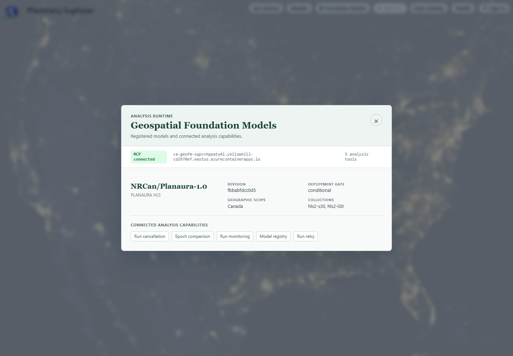
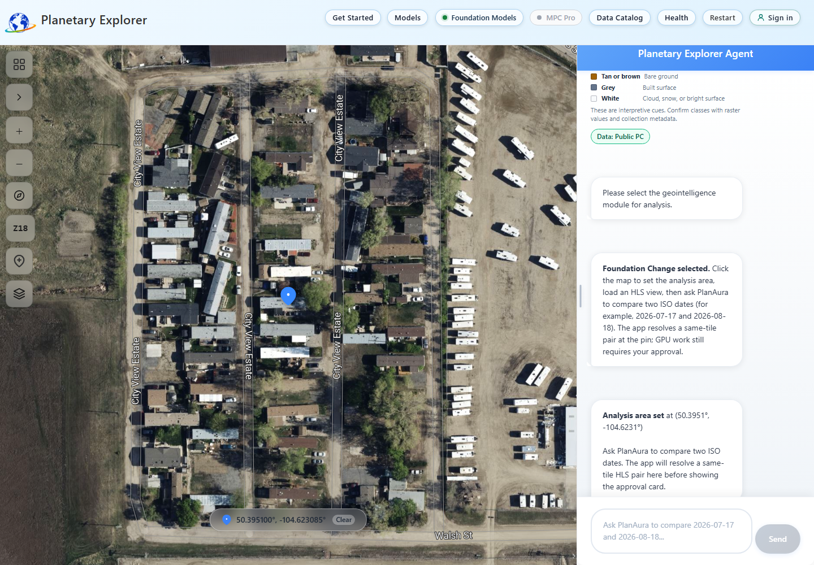
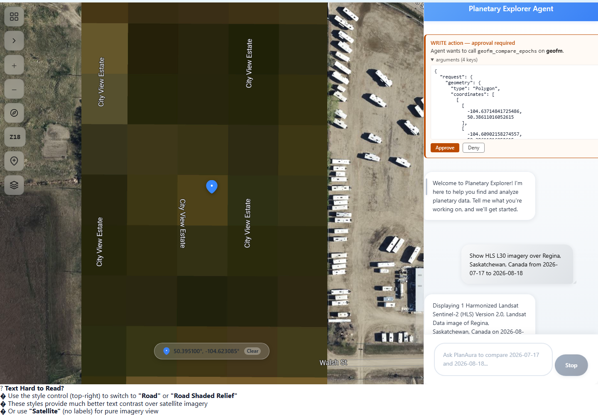
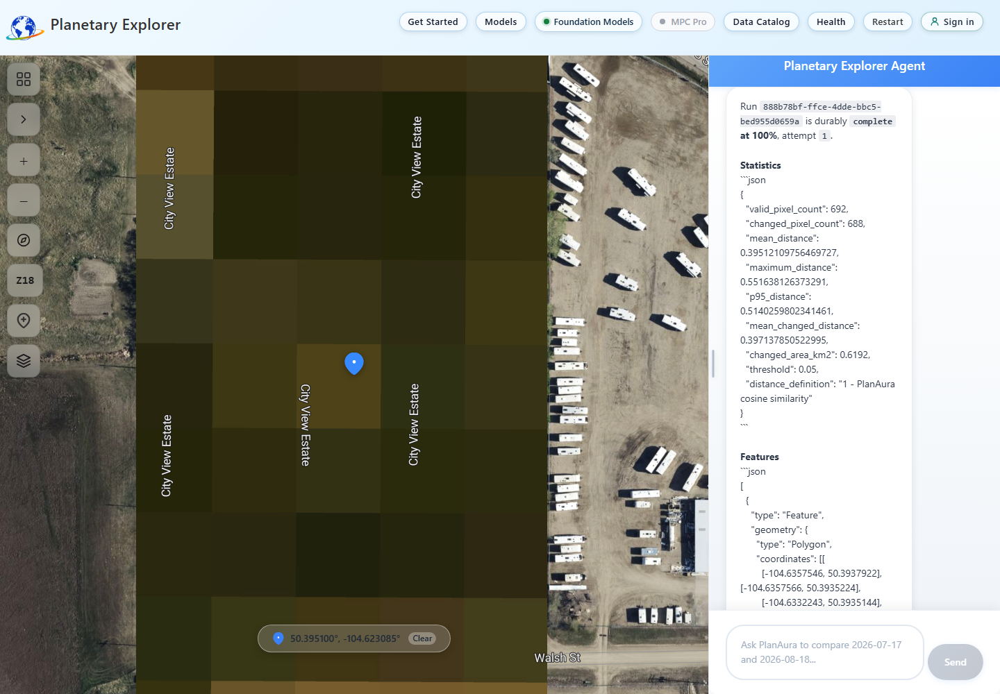
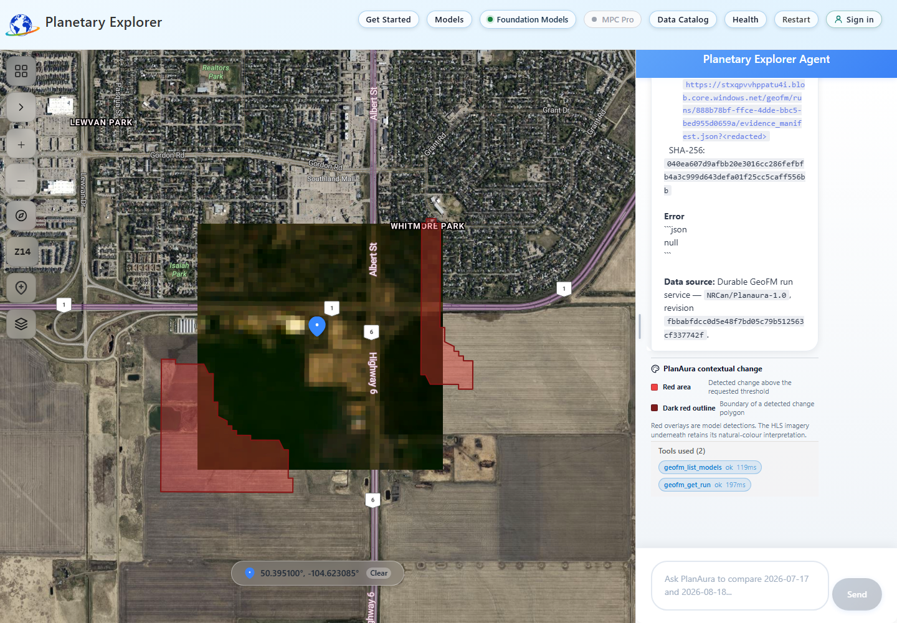

## Before you start

You need a Planetary Explorer deployment with GeoFM enabled and access to the
`hls2-l30` or `hls2-s30` collection. A comparison starts billed GPU work, so the
app always asks for approval before submitting it.

Keep the browser tab open until the queued response appears. Poll the run from
the same browser session because run status and artifacts are owner-bound.

The screenshots below were captured from the deployed application using the
completed Regina run `888b78bf-ffce-4dde-bbc5-bed955d0659a`; they are not mock
UI states.

## Verify the model connection

1. Open Planetary Explorer.
2. Select **Foundation Models** in the header.
3. Confirm the panel shows **MCP connected**, `NRCan/Planaura-1.0`, and **Epoch
   comparison**.
4. Close the panel.



If the panel reports that MCP is unavailable, an operator must enable and deploy
GeoFM before you continue. See the [GeoFM operator guide](../planetary-explorer/geofm-sidecar/README.md).

## Set the HLS view and analysis area

1. Enter this query on the landing page:

   ```text
   Show HLS L30 imagery over Regina, Saskatchewan, Canada from 2026-07-17 to 2026-08-18
   ```

2. Wait for the HLS layer and chat response. Confirm the response identifies
   Regina and one displayed HLS image. Do not continue if the map shows a
   different place or country-wide coverage.
3. Select the four-square **Geointelligence Modules** control on the map.
4. Select **Foundation Change**.
5. Click the HLS map at the location to compare.
6. Confirm chat reports **Analysis area set** with a latitude near `50` and a
   longitude near `-104` for Regina.



The pin defines a bounded area around the selected location. You do not need to
load two scenes into the map. Planetary Explorer resolves one same-tile HLS item
for each date through the active Public or MPC Pro catalog.

## Submit and approve the comparison

1. Enter this prompt in chat:

   ```text
   Use PlanAura to compare HLS L30 on 2026-07-17 and 2026-08-18 at the pinned Regina area. Use threshold 0.05 and return up to 10 change features.
   ```

2. Review the approval-required **WRITE action** card.
3. Expand **arguments** when you need to inspect the exact geometry, HLS item
   identifiers, threshold, and feature limit.
   For this Regina example, both item identifiers must contain `.T13UER.` and
   the geometry coordinates must remain near `50`, `-104`.
4. Select **Approve** to start billed GPU work, or **Deny** to stop without
   submitting the run.



After approval, chat returns a run ID, selected HLS dates and item identifiers,
threshold, feature limit, and queued status. Keep the run ID for polling.

## Poll and read the result

When the run is queued or running, enter the following prompt in the same chat.
Replace `<run-id>` with the returned value.

```text
Check Foundation Change run <run-id> now with get_geofm_run. Report its durable status, statistics, features, artifacts, and error exactly.
```

Repeat after a short wait until the status is complete. The same-session status
response identifies the run, durable status, progress, statistics, features,
artifacts, and error value.



A completed response includes validated statistics, up to the requested number
of change polygons, and evidence artifacts. The app draws returned polygons on
the map and displays the matching chat legend.



## Interpret the colours

* Translucent red areas are PlanAura detections above the requested distance
  threshold
* Dark red outlines show the boundaries of returned change polygons
* The HLS image below the overlay remains natural-colour imagery

A completed run with no red polygons is valid. It means no returned area crossed
the selected threshold. Model detections require review against source imagery
and other evidence before operational use.

## Troubleshoot the workflow

| Symptom | Action |
|---------|--------|
| Foundation Models is not connected | Ask an operator to verify the GeoFM MCP and model deployment |
| No approval card appears | Confirm an HLS view is loaded, Foundation Change is selected, a pin is set, and both dates use ISO `YYYY-MM-DD` format |
| No same-tile scenes are found | Choose dates with HLS coverage at the pin or switch between HLS L30 and S30 |
| The response warns that the area is outside Canada | Deny the request, reload a country-qualified Canadian place, inspect the map, and set the pin again |
| The run stays queued or running | Wait for the scale-to-zero worker to start, then poll again in the same chat |
| Polling reports that the run is not found | Return to the browser session that submitted the run; run access is owner-bound |
| The run fails | Read the returned error. Retry only after correcting the cause because retry starts another billed attempt |
