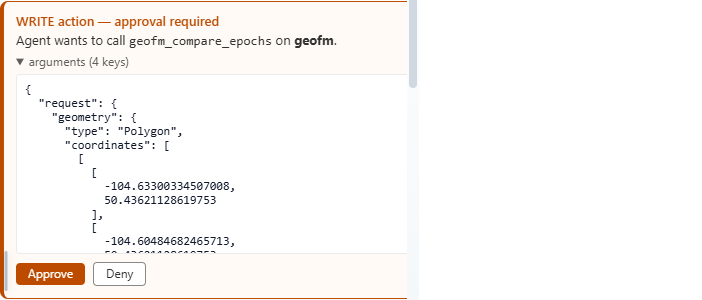

## Before you start

For shared controls, prerequisites and the end-to-end procedure, start with
[Foundation Change in the application usage guide](get-started-playbook.md#run-foundation-change-with-geofm).
The screenshots here retain the dated Regina case-study evidence.

You need a Planetary Explorer deployment with GeoFM enabled and access to the
`hls2-l30` or `hls2-s30` collection. A comparison starts billed GPU work, so the
app always asks for approval before submitting it.

Keep the browser tab open until the queued response appears. Poll the run from
the same browser session because run status and artifacts are owner-bound.

The screenshots in the step-by-step sections retain the historical completed
Regina run `888b78bf-ffce-4dde-bbc5-bed955d0659a`; they are not mock UI states.
The [September 9 verification](#september-9-verification) is a separate live run
with its own screenshots and measurements.

For a wildfire-specific example grounded in Ontario's official 2026 perimeter,
see [Analyze the Thunder Bay 36 wildfire with PlanAura](geofm-thunder-bay-fire.md).

## Verify the model connection

1. Open Planetary Explorer.
2. Select **Foundation Models** in the header.
3. Confirm the panel shows **MCP connected**, `NRCan/Planaura-1.0`, and **Epoch
   comparison**.
4. Close the panel.


If the panel reports that MCP is unavailable, an operator must enable and deploy
GeoFM before you continue. See the [GeoFM operator guide](../planetary-explorer/geofm-sidecar/README.md).

## Set the HLS view and analysis area

1. Enter this query on the landing page:

   ```text
   Show collection hls2-l30 imagery at latitude 50.4452 and longitude -104.6189 in Regina, Saskatchewan, Canada on 2026-08-18.
   ```

2. Wait for the HLS layer and chat response. Confirm the response identifies
   Regina and one displayed HLS image. Do not continue if the map shows a
   different place or country-wide coverage.
3. Select the four-square **Geointelligence Modules** control on the map.
4. Select **Foundation Change**.
5. Click the HLS map at the location to compare.
6. Confirm chat reports **Analysis area set** with a latitude near `50` and a
   longitude near `-104` for Regina.


The pin defines a bounded area around the selected location. You do not need to
load two scenes into the map. Planetary Explorer resolves one same-tile HLS item
for each date through the active Public or MPC Pro catalog. Before showing the
approval card, the app requires seasonally aligned dates and at least 70% valid
HLS quality-mask coverage across PlanAura's fixed context.

For wildfire review with Public HLS S30, include `fire false-colour` in the load
query. The app displays B12/B8A/B04 with one item-level 2nd-to-98th percentile
stretch per band while preserving PlanAura's six-band inference inputs. See the
[Thunder Bay 36 wildfire case study](geofm-thunder-bay-fire.md) for the exact
workflow and interpretation limits.

## Submit and approve the comparison

1. Enter this prompt in chat:

   ```text
   Use PlanAura to compare HLS L30 on 2026-07-17 and 2026-08-18 at the pinned Regina area. Use threshold 0.05 and return up to 10 change features.
   ```

2. Review the approval-required **WRITE action** card.
3. Expand **arguments** when you need to inspect the exact geometry, HLS item
   identifiers, threshold, and feature limit.
   For this Regina example, both item identifiers must contain `.T13UER.` and
   the geometry coordinates must remain near `50`, `-104`.
4. Select **Approve** to start billed GPU work, or **Deny** to stop without
   submitting the run.


After approval, chat returns a run ID, selected HLS dates and item identifiers,
threshold, feature limit, and queued status. Keep the run ID for polling.

Approval review has a 120-second default timeout separate from the analyst's
60-second active-work budget. Unanswered approvals expire without dispatch.
If approval expires, check whether a run ID was returned before requesting a
new submission. Do not use **Restart** to recover an already approved run.

## Poll and read the result

When the run is queued or running, enter the following prompt in the same chat.
Replace `<run-id>` with the returned value.

```text
Check Foundation Change run <run-id> now with get_geofm_run. Report its durable status, statistics, features, artifacts, and error exactly.
```

Repeat after a short wait until the status is complete. The same-session status
response identifies the run, durable status, progress, statistics, features,
artifacts, and error value.


A completed response includes validated statistics, up to the requested number
of change polygons, and evidence artifacts. The app draws returned polygons on
the map and displays the matching chat legend.


## Interpret the colours

* Translucent red areas are PlanAura detections above the requested distance
  threshold
* Dark red outlines show the boundaries of returned change polygons
* The HLS image below the overlay follows its own legend: natural colour in
   this Regina example, or fire false colour when that display was requested

A completed run with no red polygons is valid. It means no returned area crossed
the selected threshold. Model detections require review against source imagery
and other evidence before operational use.

## September 9 verification

The current deployed app submitted run `970a518c-6f9e-4726-8c30-1c61c150ce66`
after the exact geometry, HLS pair, threshold `0.05` and 10-feature limit were
reviewed. One attempt completed at 100% progress with no error. An earlier
approval expired before dispatch; it did not produce a GPU run. No GPU retry
was submitted.

| Result | Value |
| --- | --- |
| Actual pin | `50.445201, -104.618925` |
| Baseline item | `HLS.L30.T13UER.2026198T175230.v2.0` |
| Later item | `HLS.L30.T13UER.2026230T175247.v2.0` |
| Valid pixels | 306 |
| Pixels above threshold | 296 |
| Mean distance | 0.07094506919384003 |
| Maximum distance | 0.08619582653045654 |
| Raster-derived changed area | 0.2664 km2 |
| Returned polygons / artifacts | 1 / 4 |




The visible-overlay check toggled only PlanAura and measured 2.85% changed map
pixels at zoom 14. The HLS and overlay opacity controls remained at 85% and 70%.
All four artifacts were read from the existing private-network control service;
their bytes matched the returned SHA-256 hashes. The output STAC confirmed
model revision `fbbabfdcc0d5e48f7bd05c79b512563cf337742f` and checkpoint
`cc3041600ec62bc5452f243304ca446c8793e65baf13440cc21c4cf8ba7199eb`.
The [verification record](images/usage-guide/geofm-verification-0909.json)
contains the full artifact hashes and byte counts.

The test used the existing mini deployment for submission and GPT-4o for the
final chat display. Model quota delayed an intermediate summary after the
durable read succeeded; only that read was repeated. This is not a zero-latency
or unlimited-capacity guarantee. The final release check at 00:04 UTC on
September 10 confirmed that the worker had scaled back to zero replicas.

Direct downloads from the external test machine returned 403 because storage
has public networking disabled and private endpoints enabled. A signed link
does not bypass that policy. Use an authorized network or operator-approved
export path; the map polygon is included in the result and still renders.
The threshold and changed area describe model-detected contextual change,
not a calibrated burn class or an official perimeter.

## Troubleshoot the workflow

| Symptom | Action |
|---------|--------|
| Foundation Models is not connected | Ask an operator to verify the GeoFM MCP and model deployment |
| No approval card appears | Confirm an HLS view is loaded, Foundation Change is selected, a pin is set, and both dates use ISO `YYYY-MM-DD` format |
| No same-tile scenes are found | Choose dates with HLS coverage at the pin or switch between HLS L30 and S30 |
| Dates are not seasonally aligned | Choose acquisition dates whose calendar days are within 45 days; the years may differ |
| No pair meets the valid-context requirement | Choose clearer dates or move the pin; PlanAura requires at least 70% valid pixels across each fixed model context |
| Fire imagery is almost black | Include `fire false-colour` in a Public HLS S30 load query; verify the legend reports B12/B8A/B04 and a scene-level percentile stretch |
| The response warns that the area is outside Canada | Deny the request, reload a country-qualified Canadian place, inspect the map, and set the pin again |
| The run stays queued or running | Wait for the scale-to-zero worker to start, then poll again in the same chat |
| Chat polling hits language-model quota | Keep the existing run ID and poll it later from the same browser session; do not submit or retry the GPU run |
| Approval has expired | Check for a returned run ID first; a stale card is not evidence of submission, and approval does not bypass the bounded review window |
| Artifact downloads return 403 | Check link expiry and authorized private-network access; do not open storage publicly to bypass the policy |
| Polling reports that the run is not found | Return to the browser session that submitted the run; run access is owner-bound |
| The run fails | Read the returned error. Retry only after correcting the cause because retry starts another billed attempt |
