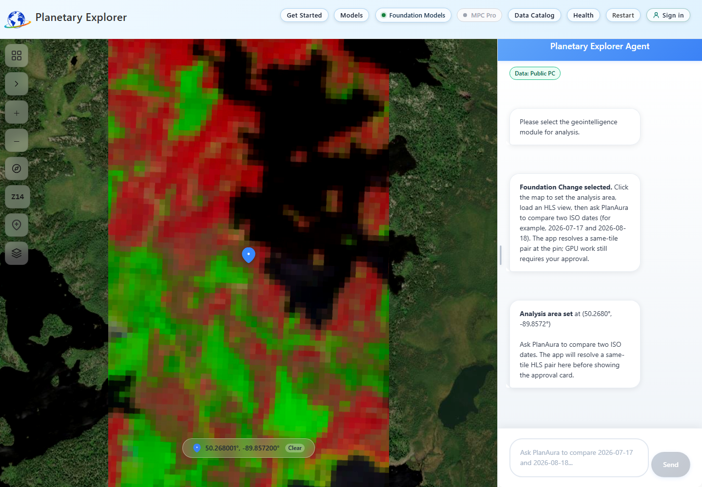
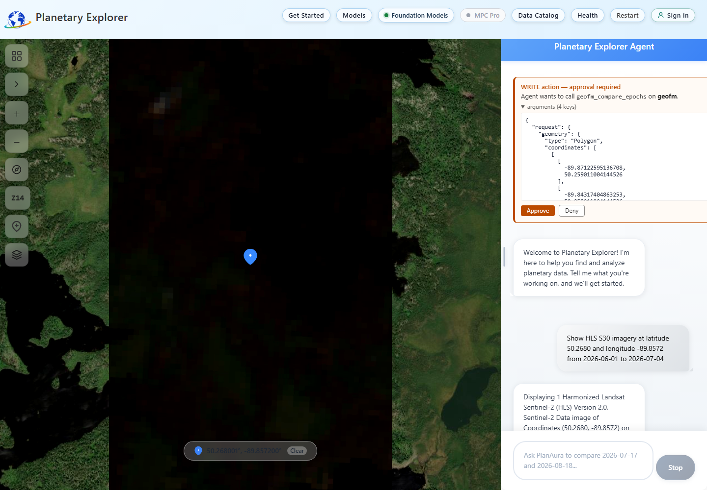
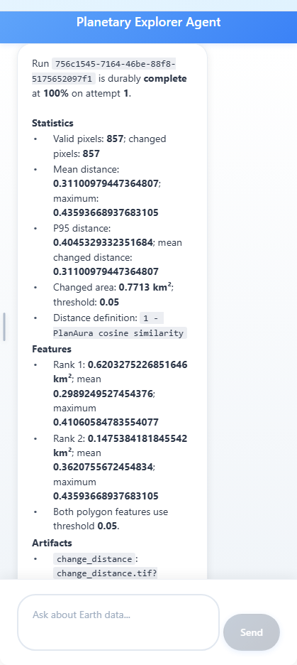
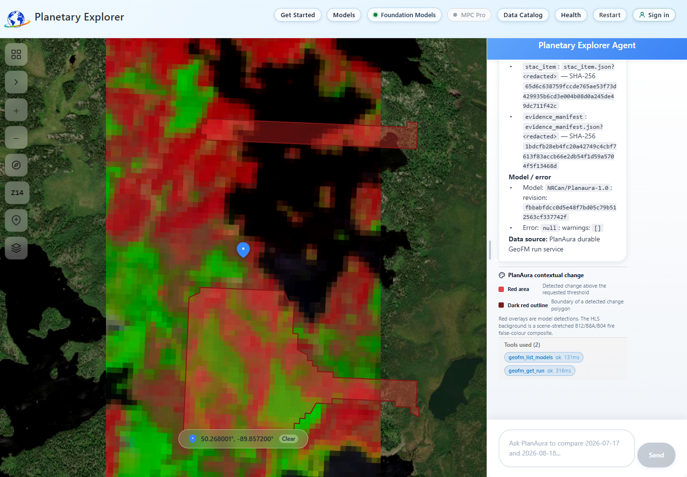

## Understand the example

This example examines a point inside the 2026 Thunder Bay 36 wildfire
(`THU036`) in Thunder Bay District, Ontario. It does not analyze the City of
Thunder Bay. On August 31, 2026, the [Ontario forest fire update][ontario-fire]
reported THU036 at 301,240 hectares and not under control.

The analysis point, `50.2680, -89.8572`, is 3.5 kilometres inside the
[official in-year fire perimeter][ontario-perimeter] published by Ontario. The
dates use a June 1 baseline and a July 4 observation. The later image predates
the July 16 report from [CBC News][cbc-fire] that several fires had merged into
THU036, so interpret it as early-event contextual change inside the final
perimeter, not as the final fire footprint. A public THU036 burn-severity layer
uses imagery as recent as August 17, 2026 for later comparison.

| Input             | Value                             |
| ----------------- | --------------------------------- |
| Collection        | `hls2-s30`                      |
| Baseline date     | `2026-06-01`                    |
| Later date        | `2026-07-04`                    |
| Analysis point    | `50.2680, -89.8572`             |
| Expected HLS tile | `T15UYR`                        |
| Display profile   | `B12/B8A/B04` fire false colour |
| Display stretch   | Per-band item percentiles 2 to 98 |
| GeoFM profile     | `NRCan/Planaura-1.0`            |

The public catalog resolves these exact source items:

* `HLS.S30.T15UYR.2026152T170711.v2.0`
* `HLS.S30.T15UYR.2026185T165839.v2.0`

An independent, quality-masked raster check over the local patch found median
NBR values of `0.384` and `-0.082`, respectively. The median
before-minus-after NBR change was `0.448`. The exact model context was 100.0%
valid for June 1 and 76.4% valid for July 4; 90.3% of the pinned AOI was valid
in both images. The pair also produced 857 predicted-valid PlanAura output
pixels inside the AOI before any GPU work was approved.

The screenshots in this guide were captured from the deployed application
using owner-bound run `756c1545-7164-46be-88f8-5175652097f1`. They are real
application states, not mockups. The run was approved and submitted once. The
updated approval screenshot was denied before submission, then the completed
run was rendered with read-only status tools, so no duplicate GPU run was
created.

## Understand the fire display

The fire profile changes the map display, not the PlanAura model input. The map
assigns HLS band B12 (shortwave infrared 2) to red, B8A (narrow near infrared)
to green, and B04 (visible red) to blue. Dry, burned, or heated surfaces can
appear red or rust, healthy vegetation often appears green, and water or
shadow appears dark.

Planetary Explorer requests the 2nd and 98th percentiles for each band from the
selected HLS item and uses those values for one consistent scene-wide stretch.
If item statistics are unavailable or invalid, the renderer uses bounded
static ranges instead of blocking the image. The selected profile and strategy
are returned in `translation_metadata.render_profile`, including the
application workload ID `wildfire-contextual-change`.

For the exact July 4 item, the deployed renderer used `3` to `3486` for B12,
`0` to `4950` for B8A, and `0` to `3320` for B04. At zoom 14, the fraction of
near-black pixels in the tile containing the analysis point fell from 99.3%
with the former natural-colour stretch to 22.0% with the fire profile.

The profile is designed for visual review. It does not classify active fire or
burn severity. The independent NBR check in this example uses B8A and B12 and
found a median before-minus-after change of `0.448` inside the quality-masked
local patch. Use that quantitative evidence alongside the false-colour image,
PlanAura polygons, official perimeter, and field observations.

> [!IMPORTANT]
> PlanAura detects contextual surface change. Its polygons are not an official
> fire perimeter or operational burn-severity product. Confirm findings against
> Ontario fire information, the published perimeter, source imagery, and field
> evidence.

## Verify GeoFM

Complete the connection check in [Run Foundation Change with PlanAura](geofm-foundation-change.md#verify-the-model-connection).
The **Foundation Models** panel must show **MCP connected**,
`NRCan/Planaura-1.0`, and **Epoch comparison**.

## Load the THU036 area

1. Enter this exact query on the Planetary Explorer landing page:

   ```text
   Show HLS S30 fire false-colour imagery at latitude 50.2680 and longitude -89.8572 on 2026-07-04
   ```
2. Wait for the HLS fire false-colour image to load.
3. Confirm the map is near `50.2680, -89.8572`, the response uses
   `2026-07-04`, and the displayed item is
   `HLS.S30.T15UYR.2026185T165839.v2.0`.
4. Confirm the legend says **HLS fire false colour** and identifies the
   `B12/B8A/B04` scene stretch.
5. Do not continue if the app resolves the City of Thunder Bay, another
   country, or a different HLS tile.
6. Open **Geointelligence Modules** and select **Foundation Change**.
7. Click near the centre of the loaded image.
8. Confirm chat reports **Analysis area set** near `50.2680, -89.8572`.



## Control the map layers

Select **Map layers** in the lower-left corner after imagery loads. The panel
lists only layers that are currently available:

* **HLS fire false colour** appears when the B12/B8A/B04 scene is loaded
* **PlanAura contextual change** appears after a completed run returns polygons

Use the eye control to show or hide a layer. Use its slider to adjust opacity
while comparing the source imagery and model overlay. These controls update the
map immediately; they do not search the catalog, submit a GeoFM run, or repeat
GPU work.

## Review and approve the comparison

1. Enter this prompt in chat:

   ```text
   Use PlanAura to compare HLS S30 on 2026-06-01 and 2026-07-04 at the pinned Thunder Bay 36 fire area. Use threshold 0.05 and return up to 10 change features.
   ```
2. Expand **arguments** on the approval-required **WRITE action** card.
3. Confirm the geometry encloses the pinned point near `50.2680, -89.8572`.
4. Confirm both item identifiers contain `.T15UYR.` and match the source items
   listed above.
5. Confirm `threshold` is `0.05` and `max_features` is `10`.
6. Select **Approve** once to start the billed GPU run. Select **Deny** if any
   value differs.

The app checks every required HLS band and the Fmask across the full 512-pixel
context before it presents the approval card. It also applies PlanAura's
16-pixel token mask and requires valid predicted output inside the pinned AOI.
If either check fails, choose clearer dates or another pin instead of approving
a run that cannot produce evidence.



## Poll the owner-bound run

Keep the same browser tab open. When chat returns the run ID, enter:

```text
Check Foundation Change run <run-id> now with get_geofm_run. Report its durable status, statistics, features, artifacts, and error exactly.
```

Repeat after a short wait until the status is complete. The status response
must show the same run ID, `100%` progress, returned statistics and features,
and a null error.

If chat polling is interrupted by language-model quota, do not approve another
comparison or retry the GPU run. Keep the run ID and poll it from the same
browser session after model capacity is available.



The captured run completed on its first attempt with these durable results:

| Output                 | Observed value                           |
| ---------------------- | ---------------------------------------- |
| Run ID                 | `756c1545-7164-46be-88f8-5175652097f1` |
| Status                 | `complete` at `100%`, error `null` |
| Valid / changed pixels | `857 / 857`                            |
| Mean distance          | `0.3110`                               |
| Maximum distance       | `0.4359`                               |
| P95 distance           | `0.4045`                               |
| Changed area           | `0.7713 km²`                          |
| Returned evidence      | 2 polygons and 4 artifacts               |

The four evidence artifacts are the change-distance GeoTIFF, change-polygons
GeoJSON, STAC item, and evidence manifest. The response provides a SHA-256 hash
for each artifact.

The app draws returned polygons in translucent red with dark red outlines. The
**PlanAura contextual change** legend identifies the model overlay. Compare the
polygons with the HLS fire false-colour image, NBR evidence, and official
perimeter before drawing any conclusion about fire effects. The PlanAura
inference still uses all six required HLS bands; changing the displayed bands
does not change or retrain the model.



## Check current fire information

This example is a reproducible snapshot, not a live incident dashboard. Use
these sources for current operational information:

* [Ontario forest fire updates and interactive map][ontario-fire]
* [Ontario in-year fire perimeters][ontario-perimeter]
* [THU036 burn-severity map][thu036-burn]
* [Canadian Wildland Fire Information System][cwfis]

The Ontario interactive map notes that not every fire is mapped and that
perimeters are not updated every day. Reported size and mapped geometry can
differ.

[cbc-fire]: https://www.cbc.ca/news/canada/thunder-bay/forest-fires-nwo-9.7272147
[cwfis]: https://cwfis.cfs.nrcan.gc.ca/en/interactive-map
[ontario-fire]: https://www.ontario.ca/page/forest-fires
[ontario-perimeter]: https://geohub.lio.gov.on.ca/maps/85d44c5ec6154982b9dbeae19dfc778f
[thu036-burn]: https://www.arcgis.com/home/item.html?id=97b03f0192e94ff29ef18172a0d135c9
