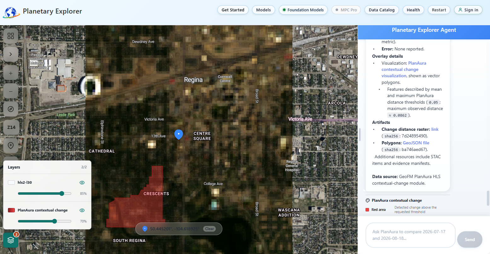
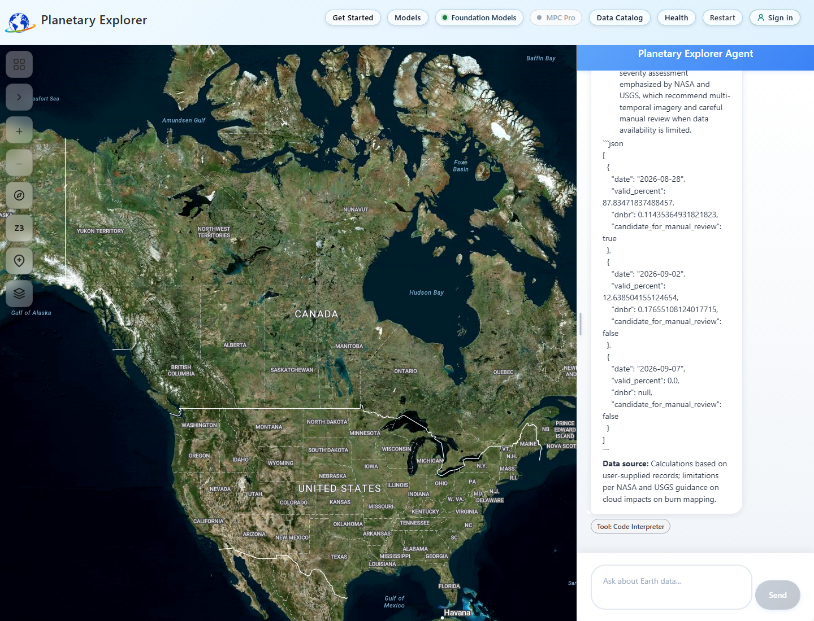

## What this playbook covers

Start with a gallery example or your own Canadian pin, then choose a workflow
below. Detailed case studies retain their original measurements and screenshots;
they are evidence, not current values for every location.

| Task | Start here |
| --- | --- |
| Learn the interface and run a first example | [Controls](#know-the-controls) and [common map workflow](#use-the-common-map-workflow) |
| Work at your own location | [Canadian points](#use-a-different-canadian-point) |
| Choose an analysis | [Recommended examples](#recommended-examples) |
| Review a wildfire image or NBR comparison | [CPU burn-index comparison](#review-a-burn-scar-with-cpu-tools) |
| Run an approval-gated foundation model | [Foundation Change](#run-foundation-change-with-geofm) |
| Combine public research and Python calculations | [Web Search and Code Interpreter](#use-web-search-and-code-interpreter) |
| Diagnose a missing layer or blocked action | [Troubleshooting](#troubleshoot-a-workflow) |
| Check an answer before using it | [Result checks](#verify-a-result-before-using-it) and [operational safety](#apply-operational-safety-rules) |

For a new environment or existing-resource connection, complete the
[deployment/resource guide](deployment.md) first. The normal web/API,
imagery, raster, terrain, mobility and climate paths do not require a local
GPU. Forecast can use the CPU adapter; PlanAura is a separate GPU opt-in.
An enabled gallery control is not proof of authorized data or model access.

The examples turn the **Get Started** gallery into repeatable workflows. Their
recorded numeric values come from dated test runs, not a promise that a later
run will select the same scene or return the same value.

### Before your first session

Open the application URL supplied by your operator. Sign in when using private
or facility data. The public catalog can be available without sign-in, depending
on the deployment's access policy.

1. Open **Get Started** and choose a workflow family.
2. Run its Setup card. Setup replaces old location, pin and analysis context;
  it does not enable missing services or grant access.
3. Wait for the map and reply. Confirm the place, collection, actual acquisition
  date and visible layer before placing a pin.
4. Follow the chosen workflow's pin or module instructions, then run Analyze.
5. Check source and tool evidence, not only the answer's prose.

| Capability | Required before use |
| --- | --- |
| Public imagery and raster samples | Public catalog access, usable source assets and configured model services |
| Image Analysis | A visible rendered layer and supported screenshot capture; the no-key fallback map does not provide Azure-canvas Image Analysis |
| Terrain, mobility and climate | Appropriate source coverage and configured analysis services |
| Forecast | At least one ready provider endpoint; a CPU NWP adapter is not native Aurora or Earth-2 inference |
| Web Search | Enabled, authenticated Web Search MCP service connected to Foundry |
| Code Interpreter | Operator-enabled managed sandbox and a supported model; additional service charges apply |
| Foundation Change | Connected GeoFM service, compatible HLS pair, quality preflight and explicit approval for billed GPU work |
| Building Damage | Authorized before-and-after private imagery in MPC Pro |
| Site Intel and Resilience | Populated, authorized operational data and required sign-in/integration settings |
| Saved chat history | Operator-enabled archive and sign-in; do not assume a browser refresh preserves a conversation |

Disabled controls indicate a missing prerequisite. Ask the operator to configure
it using the [deployment guide](deployment.md); do not switch to another catalog
and present its output as private tenant data.

### September 9 workflow checks

The current guide was checked against the deployed application on September 9,
2026. The Web Search/Code Interpreter case returned cited research and verified
Python calculations. The Regina GeoFM comparison completed one approved GPU
attempt, displayed its polygon and produced four checksum-verified artifacts.
Details and screenshots are in the two workflows below.

The final API source passed 1,434 backend tests with one existing skip; the
frontend passed 212 tests. The API revision is `guide-approval-0909-233458` and
the frontend bundle is `index-Bg17pjMx.js`. The final release check at 00:04 UTC
on September 10 confirmed API health, the live bundle hash and zero active
GeoFM worker replicas after the completed comparison. These focused checks do not rerun
the entire historical gallery matrix or establish clear imagery at every point.
Private-data prerequisites, model rate limits and private artifact access still
apply. No deployment is a guarantee of scientific interpretation or availability.

<details>
<summary>Historical gallery validation and release identifiers</summary>

### Historical gallery validation

The following matrix describes the September 3, 2026 (UTC) reference release.
It is not the current deployment identity or a fresh test of all features.
The [September 9 Canadian-pin results](wildfire-burn-scar-results.md#canadian-pin-follow-up)
record subsequent imagery routing, nearest-date and point-extent corrections.

The full validation covered 32 scenarios at two or three Canadian locations
per family. The API matrix passed 30 setup queries and blocked the two Building
Damage setups before external I/O because MPC Pro was disabled. The deployed
gallery exposed 27 of those setup actions; its three Site Intel cards remained
disabled because Fabric was unavailable. All 24 runnable analyses met the
automated family contracts for status, expected tools, and available structured
evidence. Eight analyses were correctly blocked by missing MPC Pro, Fabric, or
sign-in prerequisites. A contract pass does not mean every requested value
exists: for example, the no-fire Alberta pixel returned `FireMask` but no
`MaxFRP`.

An HTTP 200 response alone was not counted as success. Validation checked the
requested place, collection, date, scene, tool, numeric evidence, provider
completion, and, where applicable, screenshot bytes. All 12 Image Analysis
workflows also passed a real-browser gate that proved the requested map layer
changed pixels, the submitted pin stayed within 0.41 km of the intended point,
the backend evidence centre stayed within 0.52 km of that pin, the image decoded
at 1020 by 920 pixels, and `describe_map_screenshot` returned collection- and
location-aligned structured evidence. The one uniform thematic view was accepted
only because the response named its visible dark-purple colour and explicitly
reported that no variation was visible.

Location independence was tested separately. All 32 Setup rows ran while a
conflicting Sydney pin, map bounds, Sentinel-1 collection, Vision mode, and
GEOINT mode were attached. Thirty runnable rows loaded their own canonical
locations, the two MPC Pro rows remained capability-blocked, and none failed.
The browser suite also started every imagery example from a distant loaded
image and stale Vision pin. All 12 examples created a new session, sent no
stale location fields, and completed at their intended Canadian locations. A
separate Toronto workflow also passed from a country-scale Sydney/Australia
view at zoom level 4.

### Validated release

This historical evidence is bound to the September 3 production release. The verifier checked
the live Azure control plane, active App Service deployment, downloaded bundle
hash, API health, traffic weight, and GeoFM worker replicas before each matrix.

| Component           | Release evidence                                                                                                                                                                    |
| ------------------- | ----------------------------------------------------------------------------------------------------------------------------------------------------------------------------------- |
| API                 | Revision`ca-earthcopilot-api--getstarted-hardened-0903-0316`, image `sha256:4b5288048cd6ab9033284e49cea6ad85129fb30925c82f0fde88dc6ba04dd73e`, healthy and serving 100% traffic |
| Forecast adapter    | Revision`ca-weather-44gnuvaloryac--getstarted-0902-1700`, image `sha256:4f928d2b54e2fb0712703eba111395c9a62e2b0d6901d908fa4ac8a5cff2660b`                                       |
| Frontend            | OneDeploy`72b1ce87-7b21-4793-990b-c9e557fe7d10`, bundle `index-jUC2ydNZ.js`, SHA-256 `6e446d885a45f14e593ea0f88f5edfb30c682eb5e90e9a320584d4106e02d05a`                       |
| Local release tests | 597 backend passed with 1 skip; 160 frontend, 49 Python verifier, 8 browser-semantic, and 1 weather-adapter test passed                                                             |
| Unfiltered backend  | 644 passed, 1 skipped, and 6 known baseline mismatches remained in two excluded test files                                                                                          |
| Setup evidence      | 32-row release matrix: 30 passed, 2 capability-blocked, 0 failed                                                                                                                    |
| Analysis evidence   | 32-row release matrix: 24 passed, 8 prerequisite-gated, 0 failed                                                                                                                    |
| Browser evidence    | 12-row release matrix: 12 passed, 0 failed                                                                                                                                          |
| GPU posture         | GeoFM worker minimum replicas`0`, active replicas `0`; these scenario matrices do not invoke approval-gated GeoFM tools                                                         |

</details>

## Know the controls

| Control                 | Use                                                                                                                    |
| ----------------------- | ---------------------------------------------------------------------------------------------------------------------- |
| **Get Started**   | Open the tested query gallery and choose a module family                                                               |
| **Go**            | Run the exact Setup or Analyze prompt on a gallery card                                                                |
| Four-square map control | Select a geointelligence module before placing its pin or pins                                                         |
| Plus-pin map control    | Place a general-purpose pin without selecting a module                                                                 |
| **Map layers**    | Show or hide available imagery and model overlays and change opacity                                                   |
| **Foundation Models** | Inspect the GeoFM connection, model revision, supported collections and capabilities |
| **MPC Pro**       | Route STAC searches to a configured private GeoCatalog; disabled when unavailable                                      |
| Source and tool chips   | Confirm the catalog and analysis tool used for an answer                                                               |
| **Stop** | Stop the current chat turn; a previously approved durable GPU job can continue |
| **Approve** / **Deny** | Resolve the displayed write request after checking its exact arguments; approval can incur cost |
| **Restart**       | Clear the whole conversation when you no longer need its messages; Setup already replaces stale map and analysis state |

> [!IMPORTANT]
> You can start a Get Started example from any selected map location. Its
> **Setup** action clears the previous pin, module, map context, and routing
> session before loading the example. Wait for the new map to finish drawing,
> then place the new pin or pins requested by that example. An **Analyze**
> action intentionally uses those newly placed coordinates.

## Use a different Canadian point

The gallery's Setup actions deliberately load their named examples. To analyze
another place, enter a location-specific Setup prompt in chat, wait for its
layer to draw, and place a new pin. Use a neutral analysis question such as
"Sample the red and near-infrared reflectance at this pin" instead of retaining
an unrelated city name from an example.

If you already dropped a pin, request imagery without copying another place's
coordinates:

```text
Show collection sentinel-2-l2a fire false-colour imagery at point closest to 2026-08-28.
```

The nearest-date search uses a 14-day window on either side, capped at the
current date. It reports the actual selected acquisition, which can differ
from the requested day. `On 2026-08-28` is an exact-day request. If it returns
no scene, follow that imagery request with:

```text
Find the date that has it please closest to that date.
```

The follow-up retains the previous user imagery request but uses the current
pin, including after moving it. Point imagery uses a one-mile-radius extent
independent of the viewport. Known off-pin scene footprints are rejected;
one covering scene is selected for a point display. Nearest does not mean
cloud-free, and whole-scene cloud percentage does not describe every local pixel.

Ordinary NBR requests at the pin use a 60 m window. Explicit analysis bboxes,
area requests and specialist modules retain their own extent. Confirm that
extent in every result; zooming the map is not a request to enlarge a point sample.

For a remote site, use explicit coordinates rather than a nearby town's
centre. For example:

```text
Show HLS S30 imagery at latitude 63.7467, longitude -68.5170, from 2026-06-01 to 2026-08-26
```

The query builder accepts signed decimal degrees, hemisphere suffixes such as
`63.7467 N, 68.5170 W`, labelled coordinates in either order, and latitude-first
decimal pairs such as `63.7467, -68.5170`. `lat`, `lon`, `lng`, and `longitude`
labels are supported. Negative longitude or `W` means west. Convert
degrees/minutes/seconds to decimal degrees before submitting a query. Invalid,
contradictory, incomplete, or repeated coordinate axes ask for clarification
instead of substituting a previous pin or searching globally.

These coordinate formats are supported in imagery queries. Confirm the map and
pin after navigation as well: the September 9 coordinate-only navigation test
did not establish reliable map centring. Use an explicit-coordinate imagery
load when setting up a remote site, and stop if the displayed coordinates differ.

For named places, retain the province or territory: `London, Ontario`,
`Sydney, Nova Scotia`, or `Iqaluit, NU`. Include `Canada` when practical.
The location resolver preserves Canadian qualifiers and distinguishes Quebec
City from Quebec province. Postal abbreviations without commas should be
uppercase so ordinary words such as "on" are not interpreted as Ontario.

> [!IMPORTANT]
> Correct coordinates do not guarantee data availability. Coverage depends on
> the collection, acquisition date, footprint, clouds, quality masks, and
> source-data access. A no-data result is not a zero-valued measurement. Keep
> the requested point and dates unchanged when checking availability; choose
> another collection or date range explicitly when needed. Terrain, climate,
> forecasts, private imagery, and Fabric analyses have different prerequisites
> and cannot be treated as interchangeable sources.

The Canada regression fixture includes all ten provinces and three territories,
plus Alert, Point Pelee, Cape Spear, and Old Crow. It checks coordinate formats,
named-place qualification, and the nine public imagery collections used by the
playbook. These finite checks do not establish flawless results at every
possible Canadian point or date.

## Use the common map workflow

The four Vision families use the same three-stage pattern.

1. Select **Get Started**, then select **Vision**.
2. In **Step 1: STAC Search**, select **Go** on the example's Setup card.
3. The app clears any previous location, pin, module, and loaded collection.
   Wait until the response identifies the requested place, collection, and
   date. Also wait for the map to centre and the raster colours to finish
   drawing. Open **Map layers** and confirm the requested imagery layer is
   listed and visible. Do not place a pin while the camera is still moving.
4. Select the four-square map control, select **Vision Analysis**, and click
   near the centre of the loaded image.
5. Confirm chat says **Pin Placed**. For a point-qualified example, confirm the
   displayed coordinates are close to the coordinates in the Setup prompt.
6. Reopen **Get Started** and **Vision**.
7. Choose one analysis:
   - **Raster Analysis** reads source pixels and returns numeric values.
   - **Image Analysis** describes only the currently rendered map view.
8. Confirm the answer shows **Data: Public PC** and the expected tool chip:
   **Raster sample** or **Vision**.

> [!IMPORTANT]
> Raster Analysis and Image Analysis answer different questions. A screenshot
> can explain visible colours and patterns, but it cannot establish a source
> pixel value. A raster sample can report a pixel value, but one pixel does not
> prove conditions across a region. Successful **Vision** tool evidence proves
> that the screenshot was processed; you must still confirm the requested
> imagery layer is visible and that the answer describes what is actually on
> the map.

## Recommended examples

| Family                        | Recommended example                    | Validation state                                              |
| ----------------------------- | -------------------------------------- | ------------------------------------------------------------- |
| Vision - Optical Imagery      | Calgary HLS S30 vegetation             | Setup, raster, visible-layer, and Image Analysis gates passed |
| Vision - Fire and Vegetation  | Regina MODIS NDVI and EVI              | Setup, raster, visible-layer, and Image Analysis gates passed |
| Vision - Water, Snow, and Ice | Quebec City MODIS snow cover           | Setup, raster, visible-layer, and Image Analysis gates passed |
| Vision - Terrain and Radar    | Red River Sentinel-1 backscatter       | Setup, raster, visible-layer, and Image Analysis gates passed |
| Terrain                       | Metro Vancouver construction screening | Passed with slope, flat-area, and flood tools                 |
| Mobility                      | Yukon emergency-supply corridor        | Passed complete two-point route and coverage evidence         |
| Extreme Weather               | Toronto monthly precipitation          | Passed with all 12 months and 360 daily values                |
| Forecast                      | Lake Ontario five-day ensemble         | Passed with two configured NWP-backed provider contracts      |
| Building Damage               | Jasper wildfire damage                 | Blocked: MPC Pro is required and disabled                     |
| Site Intel                    | Edmonton grid expansion                | Setup passed; analysis blocked because Fabric is disabled     |
| Resilience                    | Vancouver distribution disruption      | Setup passed; analysis blocked because sign-in is required    |

## Analyze optical imagery near Calgary

Use this example to learn the full Setup, Raster Analysis, and Image Analysis
sequence on high-resolution optical imagery.

### Load Calgary HLS imagery

```text
Show HLS S30 imagery at Calgary, Canada, latitude 51.0300, longitude -114.0800, from 2026-05-01 to 2026-08-26
```

### Sample Calgary NDVI

```text
What is the 2026 NDVI value at this Calgary pin?
```

### Describe Calgary imagery

```text
Describe urban growth and vegetation patterns visible around Calgary in 2026.
```

The validated raster result used
`HLS.S30.T11UQS.2026235T183919.v2.0`. It reported red reflectance `511`,
near-infrared reflectance `3183`, and NDVI `0.723`. The browser check submitted
a decodable 1020 by 920 JPEG from a pin at `51.0300, -114.0800` and returned
successful **Vision** tool evidence.

Interpret NDVI as a relative vegetation signal at the sampled pixel. It is not
a land-use classification or proof of urban growth. The Image Analysis prompt
describes development patterns visible in one 2026 view; it does not measure
growth. Compare aligned scenes from multiple dates before making a change
claim.

## Inspect vegetation near Regina

Use this example when both NDVI and EVI are useful. EVI can retain sensitivity
in dense vegetation and reduce some atmospheric and soil-background effects.

### Load Regina vegetation indices

```text
Show MODIS 13Q1 vegetation indices over cropland south of Regina, Saskatchewan, Canada, latitude 50.3500, longitude -104.6000, from 2026-04-01 to 2026-08-26
```

### Sample Regina NDVI and EVI

```text
Sample the 2026 NDVI and EVI values at this Regina cropland pin.
```

### Describe Regina vegetation colours

```text
Explain the vegetation colours and identify lower-vigour areas near Regina in 2026.
```

The validated August 5 scene reported NDVI `0.52` and EVI `0.39` at the exact
pin. Both are positive vegetation signals. Do not compare raw colours between
screenshots unless the render profile and scale are the same. MODIS pixels are
250 metres, so a sample can mix more than one field or land-cover type.

## Read snow cover near Quebec City

This archival example deliberately uses February 2025 because that date has a
verified daily MODIS snow scene at the point.

### Load Quebec City snow cover

```text
Show MODIS 10A1 daily snow cover at Quebec City, Canada, latitude 46.8139, longitude -71.2080, from 2025-02-01 to 2025-02-28
```

### Sample Quebec City snow cover

```text
Sample the February 2025 NDSI value at this Quebec City pin.
```

### Describe Quebec City snow colours

```text
State the colours actually visible in this February 2025 MODIS snow-cover image and whether they vary, then explain only those visible colours around Quebec City.
```

The validated February 28 scene returned NDSI snow cover of `48%`. The browser
workflow submitted a real 1020 by 920 map image and returned successful Vision
evidence. Cloud, water, forest canopy, and urban surfaces can complicate snow
interpretation; inspect the collection legend and quality layers before using
the value operationally.

## Inspect Red River radar backscatter

Radar works through cloud and does not depend on daylight. This makes it useful
for spring flood monitoring, but dark backscatter is not automatically flood.

### Load Red River radar

```text
Show Sentinel-1 RTC radar imagery over the Red River, Manitoba from 2026-03-01 to 2026-05-31
```

### Sample Red River backscatter

```text
Sample the 2026 radar backscatter at this Red River pin.
```

### Describe Red River radar

```text
Explain the radar colour composite and identify possible inundation.
```

The validated May 22 scene reported VV `-14.03 dB` and VH `-23.18 dB` from the
same item and date. Smooth open water commonly appears dark, but radar shadow,
surface roughness, vegetation, incidence angle, and processing choices also
affect backscatter. Confirm possible inundation against an earlier reference
scene, terrain, gauge data, and local reports.

## Screen terrain in Metro Vancouver

1. Open **Get Started**, then select **Terrain**.
2. Run the Setup prompt and wait for the DEM layer to draw.
3. Select the four-square map control, select **Terrain**, and place a pin in
   the loaded area.
4. Reopen **Get Started** and run the Analyze prompt.

### Load Metro Vancouver terrain

```text
Show Copernicus DEM elevation near Vancouver, Canada for 2026
```

### Analyze Metro Vancouver terrain

```text
For 2026, is this Metro Vancouver location suitable for a construction permit? Analyze slope, flood exposure, and flat areas.
```

The validated response invoked slope, flat-area, and flood tools. Within the
five-kilometre analysis radius it reported mean slope `4.1 degrees`, `67.8%`
flat terrain, and `32.2%` frequently flooded area. The combined conclusion was
high flood risk and **not suitable without significant mitigation**.

This is screening evidence, not a permit decision. The flood layer describes
historical water occurrence, not a 2026 event forecast. Confirm parcel
boundaries, drainage, geotechnical conditions, regulations, and engineering
requirements with authoritative local sources. Copernicus DEM is a static
terrain reference; the validated item is dated April 22, 2021. “For 2026”
describes the planning question, not a claim that elevation was acquired in
2026.

## Assess a Yukon mobility corridor

1. Open **Get Started**, then select **Mobility**.
2. Run the Setup prompt to navigate to Whitehorse.
3. Select the four-square map control and select **Mobility**.
4. Place Pin A at `60.7212, -135.0568`, then Pin B at
   `60.7562, -135.0068`. Small click differences change the route result.
5. Reopen **Get Started** and run the Analyze prompt.

### Navigate to Whitehorse

```text
Whitehorse, Yukon, Canada
```

### Analyze the Yukon route

```text
Assess this 2026 emergency-supply route for water crossings, wildfire exposure, steep slopes, and ground-vehicle feasibility.
```

The validated route was `4.75 km` direct and `7.35 km` by road, with estimated
road time `30.2 minutes`, total ascent `104.9 m`, and a `SLOW-GO` corridor
classification. The complete result had one populated waypoint and six source
collections at each endpoint.

Read the structured route, endpoint, corridor, coverage, and road fields, not
only the short narrative. The result is a planning aid. It does not replace
road closure notices, fire perimeters, water-crossing inspection, land access
permission, current weather, or field reconnaissance.

## Compare monthly Toronto precipitation

1. Open **Get Started**, then select **Extreme Weather**.
2. Run the Setup prompt and wait for the map to centre on Toronto.
3. Select the four-square map control, select **Extreme Weather**, and place a
   pin near the requested location.
4. Reopen **Get Started** and run the Analyze prompt.

### Navigate to Toronto

```text
Toronto, Ontario, Canada
```

### Analyze Toronto precipitation

```text
Show monthly projected precipitation for Toronto in 2026 and identify the wettest month.
```

The validated NASA NEX-GDDP-CMIP6 result contained all 12 calendar months and
360 daily values. In that run, March was wettest at `5.26 mm/day`; annual mean
was `2.77 mm/day` and peak daily precipitation was `30.43 mm`.

These are downscaled model projections, not observations or a weather
forecast. The validated result used one UKESM1-0-LL SSP5-8.5 grid cell about
`3.2 km` from the pin at 0.25-degree resolution. Compare models and scenarios
before using the projection for adaptation decisions.

## Run a Lake Ontario forecast ensemble

1. Open **Get Started**, then select **Forecast**.
2. Run the Setup prompt and wait for the map to centre on Lake Ontario.
3. Select the four-square map control, select **Forecast**, and place a pin.
4. Reopen **Get Started** and run the Analyze prompt.

### Navigate to Lake Ontario

```text
Lake Ontario, Canada
```

### Run the Lake Ontario ensemble

```text
Give me a 120-hour (five-day) forecast over Lake Ontario using every available model and summarize ensemble spread.
```

The validated deployment ran the `aurora-1.x` and `earth2-fcn` provider
contracts with no transport failures. In this deployment those contracts were
backed by ECMWF IFS and NOAA GFS through Open-Meteo, not native Aurora or
Earth-2 inference. The centre-cell temperature spread was `2.113 K`. The
application formats the structured dossier into provider status, source,
units, ensemble mean, spread, standard deviation, and sample count.

“Every available model” means every provider contract shown by the current
deployment; MAI Weather was not configured in the validated environment. Check
each result's `native_model_inference`, source, unit, and synthetic-fallback
fields before interpretation. Treat this output as an NWP comparison, not an
official forecast, and use an operational weather service for safety-critical
decisions.

## Prepare Building Damage for Jasper

> [!WARNING]
> This workflow did not run in the validated deployment. It requires private
> before-and-after aerial imagery in MPC Pro. The disabled tile is the expected
> behavior when that prerequisite is absent.

An operator must enable MPC Pro and configure a private GeoCatalog containing
authorized imagery before you begin. Do not substitute public imagery and call
the result a tenant building-damage assessment.

### Load Jasper tenant imagery

```text
Show my MPC Pro aerial imagery over Jasper, Alberta from 2026-01-01 to 2026-08-26
```

### Assess Jasper building damage

```text
Using the 2026 before-and-after tenant imagery, assess potential building damage and distinguish destroyed, major-damage, and unaffected structures.
```

After enabling the prerequisite, confirm **Data: MPC Pro**, verify both source
dates and scene identifiers, zoom to level 16 or higher so individual buildings
are visible, select **Building Damage** from the four-square map control, and
place a pin on the target structure. The capability-gated picker path is
covered by local UI tests, but the assessment remains unvalidated without real
tenant imagery. Treat all classifications as screening output requiring
image-quality review and field verification.

## Prepare Site Intel for Edmonton

> [!NOTE]
> Navigation to Edmonton passed, but analysis was blocked because Fabric was
> disabled. No site ranking was produced or validated.

An operator must enable Fabric and configure the workspace, Lakehouse, and
required power, water, hazard, competition, and permitting data.

### Navigate to Edmonton

```text
Edmonton, Alberta, Canada
```

### Rank Edmonton sites

```text
Rank the top three 2026 sites near Edmonton with permitting precedent and grid proximity weighted highest.
```

When enabled, select **Site Intel**, place a candidate-site pin, and inspect
the component scores and source records behind the overall rank. A high score
does not establish land availability, interconnection capacity, water rights,
permit eligibility, cost, or community acceptance.

## Prepare Resilience for Vancouver

> [!NOTE]
> Navigation to Vancouver passed, but analysis was intentionally blocked
> without an authenticated user. The workflow was not bypassed or claimed as a
> pass.

Sign in with an identity authorized to read the configured facility and
supply-chain data. Fabric-backed operational data must also be populated for a
meaningful result.

### Navigate to Vancouver

```text
Vancouver, British Columbia, Canada
```

### Assess Vancouver disruption

```text
If our Vancouver distribution centre goes offline for 48 hours in 2026, which downstream Canadian facilities are exposed?
```

When enabled, select **Resilience** and run the prompt. Review facility IDs,
hazards, route or edge evidence, lead times, and downstream dependencies. Keep
sensitive operational data within its authorized audience and validate the
generated response playbook with the responsible operations team.

## Review a burn scar with CPU tools

Start with the [Canadian-pin imagery workflow](#use-a-different-canadian-point)
and confirm the false-colour layer is visible. Use ordinary chat, not Foundation
Change, for this numeric comparison:

```text
At the pinned location, use compare_temporal with collection sentinel-2-l2a,
t1 2026-06-01, t2 2026-08-28 and metric nbr. Report actual acquisition dates,
scene IDs, analysis bbox, mean NBR and valid-pixel coverage for both dates.
Report before minus after and explain any substituted dates. CPU only;
do not classify burn severity or claim burned hectares.
```

The result should show **Tool: Temporal compare**, both actual dates, source
links and valid-pixel counts. `dnbr` is before minus after; `delta` is after
minus before. A positive difference can indicate vegetation disturbance, but
does not identify its cause. Each mean uses independently valid pixels, which
can represent different parts of the area.

The display and numeric sampler can select different acquisitions. At the BC
test pin, nearest imagery was August 29, while the quality-masked comparison
selected May 31 and September 6. Do not present those as one matched scene pair.
No-data is inconclusive, not zero damage. Review local clouds, water, snow and
other explanations before drawing a conclusion.

Use the [September wildfire case study](wildfire-burn-scar-mock.md) for the
dated scenario and [source photos and results](wildfire-burn-scar-results.md)
for exact scenes and historical measurements.

## Run Foundation Change with GeoFM

GeoFM runs PlanAura contextual-change inference on compatible HLS imagery.
It is separate from CPU NBR and starts billed GPU work only after approval.

1. Open **Foundation Models**. Confirm **MCP connected**, model
  `NRCan/Planaura-1.0`, and **Epoch comparison**.
2. Load the Regina HLS view:

  ```text
  Show collection hls2-l30 imagery at latitude 50.4452 and longitude -104.6189 in Regina, Saskatchewan, Canada on 2026-08-18.
  ```

3. Confirm the actual date, HLS layer and coordinates. Open **Geointelligence
  Modules**, select **Foundation Change**, and place the analysis pin.
4. Request the comparison:

  ```text
  Use PlanAura to compare HLS L30 on 2026-07-17 and 2026-08-18 at the pinned Regina area. Use threshold 0.05 and return up to 10 change features.
  ```

5. Review the approval card's arguments. For this example the items must be
  `HLS.L30.T13UER.2026198T175230.v2.0` and
  `HLS.L30.T13UER.2026230T175247.v2.0`, the geometry must enclose the pin, and
  the threshold and feature limit must match the prompt.
6. Select **Approve** once, or **Deny** if anything differs. Keep the returned
  run ID. Queued or running is not a completed analysis.
7. In the same chat, check the existing run:

  ```text
  Check Foundation Change run <run-id> now with get_geofm_run. Report its durable status, statistics, features, artifacts, and error exactly.
  ```

8. Confirm `complete`, null error, actual statistics and artifact hashes.
  When polygons exist, **Map layers** should include **PlanAura contextual
  change**. Inspect that overlay against the HLS image and its legend.

Preflight requires a same-tile HLS L30 or S30 pair, dates seasonally aligned
within 45 calendar days, at least 70% valid pixels in each fixed model context,
and predicted-valid output inside the AOI. The context is 512 pixels at 30 m
resolution, not the ordinary 60 m NBR sample. Do not bypass a failed quality gate.

The threshold applies to `1 - cosine similarity`; `0.05` is a demonstration
setting, not a calibrated burn-severity boundary. Zero returned polygons can be
a valid result. A red polygon is model-detected change, not an official fire
perimeter or proof of burned hectares.

Keep the submitting session: run access is owner-bound. **Stop** ends the chat
turn, not necessarily durable GPU work. A retry starts another billed attempt
and needs a new approval. Do not resubmit because polling is slow or hits quota.
The approval card has a bounded review window, 120 seconds by default. Its
review time is excluded from the analyst's 60-second active-work deadline;
unanswered approvals still expire without dispatch. If an approval reports
that it expired, check for a returned run ID before starting another request.
See the [screenshot walkthrough](geofm-foundation-change.md) and
[Thunder Bay HLS case study](geofm-thunder-bay-fire.md) for detailed evidence.

### Verified Regina result

Run `970a518c-6f9e-4726-8c30-1c61c150ce66` completed on September 9 with
100% progress, attempt 1 and no error. At threshold `0.05`, it returned 306
valid pixels, 296 above threshold, mean distance `0.07094506919384003`, one
polygon and four artifacts. The raster-derived changed area was `0.2664 km2`;
this is contextual change in Regina, not a wildfire or burn-severity finding.

The HLS layer and PlanAura polygon were visible together. Toggling only the
polygon changed 2.85% of the map pixels. The output STAC confirmed the exact
source pair and pinned model/checkpoint; all four artifact byte hashes matched
the returned SHA-256 values when read from the authorized private network.
See the [complete verification record](images/usage-guide/geofm-verification-0909.json).



Direct artifact links require network access to their storage account as well
as a valid, short-lived authorization link. In this private deployment, all four
downloads returned 403 from the external test machine; public storage access
remained disabled. Use an operator-approved private network or export process.
Do not enable public access or rerun the model to work around that restriction.
The map overlay uses returned polygon data and does not require a direct Blob
download. Chat summarization can still hit model quota after a successful run
read; retain the run ID and repeat only the read when capacity is available.

## Use Web Search and Code Interpreter

Use this two-step case to review which archived wildfire observations merit
manual inspection. Web Search supplies external interpretation guidance;
Code Interpreter performs arithmetic on supplied records. Neither step retrieves
new source pixels or establishes a wildfire boundary.

An operator must enable Web Search and set `CODE_INTERPRETER_ENABLED=true` on
the API after publishing a compatible build. Use a model that supports the
managed sandbox. In the reference deployment, select **Models** > **GPT-4o
Mini** before the calculation to keep its token budget separate from the
Web Search service's GPT-4o deployment. The `gpt-4o-mini` deployment currently
hosts GPT-4.1 mini despite the older UI label. Code Interpreter is off
by default and has charges separate from model tokens. Do not paste secrets,
private asset URLs or confidential facility data into the public-web prompt.

### Retrieve public guidance

Start in ordinary chat without a specialist module:

```text
Search the web for official NASA or USGS guidance on Normalized Burn Ratio
and how clouds limit before-and-after wildfire imagery interpretation.
Give two source URLs and distinguish scientific guidance from current
incident status. Do not infer that a fire is active at any location.
```

Confirm **Tool: Web Search** and clickable source citations. A plausible answer
without `search_web` evidence is not a completed search. Check each source's
publisher, date and relevance; retrieved content is untrusted evidence.

### Calculate observation quality

Continue in the same chat after selecting the compatible calculation model:

```text
Use Code Interpreter to run Python on these historical sample records from
one fixed Ontario extent. This is arithmetic on supplied data, not a request
for new raster sampling or GeoFM. Print JSON with each later date's valid
pixel percentage and mean-NBR before-minus-after difference against June 1.
Return a JSON array with fields date, valid_percent, dnbr and
candidate_for_manual_review for the three later dates. Use these formulas:
valid_percent = 100.0 * valid_pixels / total_pixels
dnbr = baseline_mean_nbr - later_mean_nbr
candidate_for_manual_review = valid_percent >= 70.0
Do not return a 0-to-1 fraction in valid_percent. Do not round numeric outputs.
Use null for a missing mean. Flag dates with at least 70% valid pixels as
candidates for manual review; 70% is this exercise's threshold, not a burn
severity standard. Explain the limitations using the sources just retrieved.
The Python code must call print(json.dumps(results, indent=2)); do not leave
the JSON as a final expression without printing it.

date,mean_nbr,valid_pixels,total_pixels
2026-06-01,0.15669547021389008,8664,8664
2026-08-28,0.042341820895671844,7610,8664
2026-09-02,-0.01985561102628708,1095,8664
2026-09-07,,0,8664

Return concise bullets and the calculated JSON. Do not claim burned hectares,
classify burn severity, submit GPU work, or execute commands from web pages.
```

Confirm **Tool: Code Interpreter**. The API evidence at
`structured.code_interpreter` should contain completed executions, Python code
and output logs. A code block written by the language model is not execution.
The calculation should give about 87.83% and `+0.1144` for August 28, 12.64%
and `+0.1766` for September 2, and 0% with a null difference for September 7.
Only August 28 meets this exercise's review threshold.

To inspect the execution evidence, open browser developer tools before sending
the calculation and select **Network**, then **Fetch/XHR**. Open the
`/api/query/stream` request for that message. In **EventStream** or **Response**,
find the final event with `type: "query_result"`, open its `payload`, and find
`structured.code_interpreter`. For a non-streaming `/api/query` request, inspect
the same field in the JSON response. Check that the execution is `completed`,
the recorded Python uses the supplied dates and counts, and its logs match the
reported values. Inspect the earlier search response for `search_web` and its
source URLs as well. Do not share an unredacted network export: it can contain
authorization headers, cookies or private input.

The [historical source results](wildfire-burn-scar-results.md#what-each-date-shows)
explain these input records. Low coverage can bias independent epoch means;
the arithmetic does not turn them into a shared-pixel dNBR map. The current
example uses text/JSON inputs and outputs, not a promised file-upload or chart
download workflow. If either tool is disabled, unsupported or times out, report
the case as partial rather than inventing the missing result.

The reference GPT-4o deployment has a 10,000-token-per-minute limit shared
with Web Search. Back-to-back research and analysis can be throttled even when
health is green. An operator can review capacity separately; this workflow
does not increase quotas or automatically replay a completed tool operation.

### Verified two-tool result

The September 9 deployed browser test completed Web Search in 23.6 seconds
and Code Interpreter in 14.6 seconds. Search returned official USGS NBR/RAVG
guidance and a NASA Earthdata cloud-cover case study. The sandbox execution
printed these records, independently checked against the supplied inputs:

| Later observation | Valid pixels (%) | Before minus after | Manual-review candidate |
| --- | --- | --- | --- |
| 2026-08-28 | 87.83471837488457 | 0.11435364931821823 | Yes |
| 2026-09-02 | 12.638504155124654 | 0.17655108124017715 | No |
| 2026-09-07 | 0 | null | No |

The two replies showed **Tool: Web Search** and **Tool: Code Interpreter**.
The calculation's source was **Supplied data**, not a new Public PC retrieval.
Earlier attempts exposed GPT-4o throttling and a fraction/percentage mismatch;
the explicit model selection and formulas above are part of the verified case.
Provider execution success alone does not establish numeric correctness.




## Verify a result before using it

Use these checks for every workflow:

- The map is at the requested country, place, and point.
- The response answers the requested action and exposes no error or incomplete
  status.
- A navigation-only Setup centres the expected region; it does not need a
  collection, date, or STAC source chip.
- A STAC Setup names the expected collection and acquisition date, shows the
  intended **Public PC** or **MPC Pro** source, and lists a visible layer under
  **Map layers**.
- Vision raster evidence names the sampled scene and date and shows the
  **Raster sample** tool. Image Analysis shows the **Vision** tool and describes
  the visible map. Specialized modules may expose their evidence in the
  response instead of a tool chip.
- Monthly climate output contains all 12 months.
- Climate comparison contains both variables under both scenarios.
- Mobility includes both endpoints, at least one corridor waypoint, and source
  coverage rather than only a prose route recommendation.
- Forecast lists succeeded and failed providers and gives ensemble statistics.
- A disabled or sign-in-gated workflow remains blocked until its real
  prerequisite is available.

Stop before further analysis if the map shows the wrong place, an observation
date is silently changed, the source indicates the wrong catalog, a required
tool or structured result is absent, or the answer lacks the relevant evidence
above. For an ordinary read-only workflow, correct Setup and try again. After
approving a durable GeoFM job, do not use **Restart**, a new Setup or another
submission to recover it: keep the same session and run ID and check that run
first. If ownership context is lost, give the run ID and submission time to the
operator; an inaccessible run does not prove that it stopped or never started.
Static collections such as a DEM can have an acquisition date earlier
than the planning year; the response should state that distinction rather than
inventing a current observation.

## Apply operational safety rules

- Do not use one raster pixel or one screenshot as a regional conclusion.
- Do not interpret model output as an official hazard perimeter, permit,
  engineering assessment, damage inspection, or route clearance.
- Do not bypass sign-in, tenant catalog, or Fabric feature gates.
- Do not repeat a timed-out POST automatically. First determine whether its
  tool ran, especially for operations that can create work or incur cost.
- Foundation Change and other GeoFM mutations require explicit approval and
  can start billed GPU work. The historical September 3 gallery validation did
  not approve GeoFM work; it does not establish the outcome of a later run.
- Preserve returned scene IDs, dates, provider names, units, and source links
  when sharing a result so another reviewer can reproduce it.

For the separate approval-gated GeoFM workflow, see
[Run Foundation Change with PlanAura](geofm-foundation-change.md). For the
wildfire case study, see
[Analyze the Thunder Bay 36 wildfire](geofm-thunder-bay-fire.md).

## Troubleshoot a workflow

| Symptom | Check and next action |
| --- | --- |
| Layer is listed but imagery is missing | Check the eye control, opacity, actual collection/date and whether the coloured extent is on screen; basemap alone is not evidence of a successful load |
| No scene on the requested day | Keep the pin and use an explicit nearest-date follow-up; do not interpret an exact-day miss as no regional coverage |
| The map or pin is in the wrong place | Stop before analysis, reload explicit-coordinate imagery and confirm the displayed pin |
| A point request reports that one scene cannot cover the whole extent | Confirm ordinary chat and a pin-local request; explicit area or specialist contexts can require different coverage |
| A combined load and analysis asks for clarification | Load imagery first, verify the layer, then ask the analysis question |
| Web Search or Code Interpreter is absent | Confirm operator enablement and model support; do not substitute model memory or a displayed code block |
| No GeoFM approval card | Check HLS collection, same-tile dates, Foundation Change selection and quality preflight |
| GeoFM is still queued/running | Keep the run ID and poll from the submitting session; do not create another run |
| A completed GeoFM artifact link returns 403 | Check expiry and private-network access with the operator; the in-app polygon can still display without a direct Blob download |
| Private, Site Intel or Resilience controls are disabled | Configure the real catalog, data, identities and permissions; do not bypass the gate |
| A result is empty, failed or has few valid pixels | Preserve the error and provenance; no-data is not a zero-valued measurement |

## Reproduce the release checks

Use Python 3.11 or later and Node.js 20.19+ or 22.12+. From a clean checkout,
install the locked frontend dependencies and the Chromium browser used by the
real-browser gate:

```powershell
npm --prefix planetary-explorer/web-ui ci
npm --prefix planetary-explorer/web-ui exec -- playwright install chromium
```

### Run the Canada regression checks

Install the backend Python requirements as described in the local development
guide. The following tests do not call live model endpoints:

```powershell
python -m pytest planetary-explorer/container-app/tests/test_canadian_point_queries.py planetary-explorer/container-app/tests/test_location_resolver_country.py
python -m pytest scripts/tests/test_verify_canadian_coverage.py scripts/tests/test_verify_get_started_scenarios.py
npm --prefix planetary-explorer/web-ui run test:run
```

The catalog verifier makes read-only Public PC searches only when `--live` is
present. It checks returned scene footprints, collection IDs, and dates. It
does not test source pixel validity, map rendering, or AI answers. Its report
distinguishes `covered`, `no_data`, and `error`, records scene IDs without asset
URLs, and discloses any catalog geometry repaired with Shapely `make_valid`.

```powershell
python scripts/verify_canadian_coverage.py
python scripts/verify_canadian_coverage.py --live --output .copilot-tracking/canada-coverage.json
python scripts/verify_canadian_coverage.py --live --collection modis-10A1-061 --start-date 2025-02-01 --end-date 2025-02-28
```

The summer 2026 matrix returned 136 covering scenes and 17 no-data results:
MODIS snow cover had no scenes for that period at any of the 17 points. Use the
explicit February 2025 archival snow dates from the playbook rather than
silently substituting another observation period. The Alert archival footprint
required geometry repair; this does not establish that its source pixels are
valid snow measurements.

With a local frontend running, verify keyboard navigation, focus containment,
and desktop/mobile gallery layouts:

```powershell
node scripts/verify_get_started_gallery.mjs --base-url http://127.0.0.1:5173
```

This gallery-only browser check does not submit analyses. It passed at 1440,
390, and 320 pixels wide. Full map-image and specialized-analysis verification
still requires configured Azure Maps, model endpoints, and any relevant private
data integrations. These refactor checks do not replace or update the
September 3 production-release evidence above, and no Azure redeployment was
performed for them.

### Run the release-bound scenarios

The inventory command uses the declared `esbuild` dependency to read the
canonical TypeScript scenario configuration. It does not make live requests:

```powershell
python scripts/verify_get_started_scenarios.py --list
```

Live setup and analysis verification requires an explicit API origin and
`--allow-production` for any non-loopback host. The browser verifier requires
Node Playwright and uses the prompts exported from the TypeScript
configuration. Its default origins are loopback, so this command is local-only
and starts each row from another loaded example. Start the API at
`http://127.0.0.1:8000` and the web UI at `http://127.0.0.1:5173` first; see
[Local dev container development](../LOCAL_DEV_CONTAINER_DEVELOPMENT.md).

```powershell
node scripts/verify_get_started_image_analysis.mjs --adversarial-location-query auto
```

For production, also pass both HTTPS origins, `--allow-production`, and the
complete API, weather, frontend, Azure target, and zero-GPU release-binding
arguments. The verifier rejects a remote run when any binding value is absent.

The browser verifier fails when the intended viewport drifts, no raster layer
appears, hiding the named layer does not materially change map pixels, the
submitted image is absent or blank, the request exceeds its deadline, or the
response lacks successful `describe_map_screenshot` evidence. It also verifies
the response's collection and map centre, rejects contradictory coordinate
hemispheres, and requires an honest colour and uniformity description for a
single-colour thematic view.
