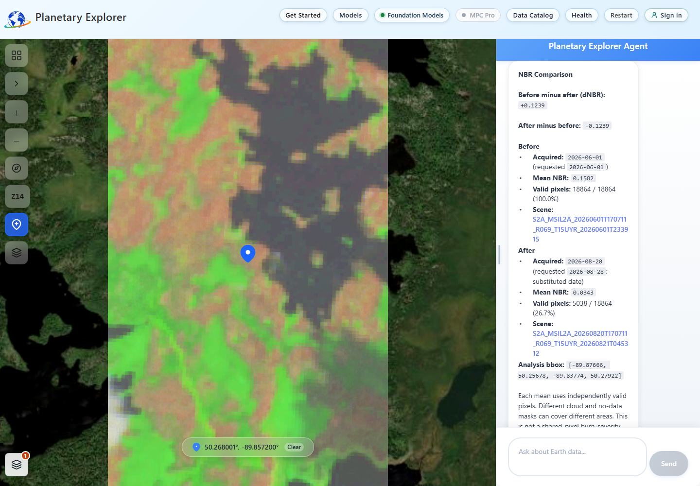
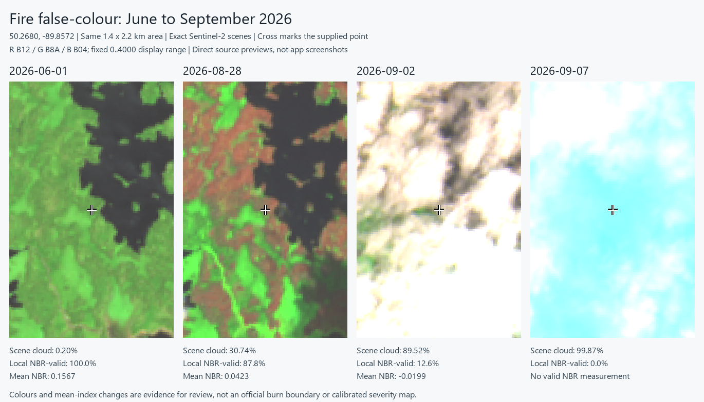
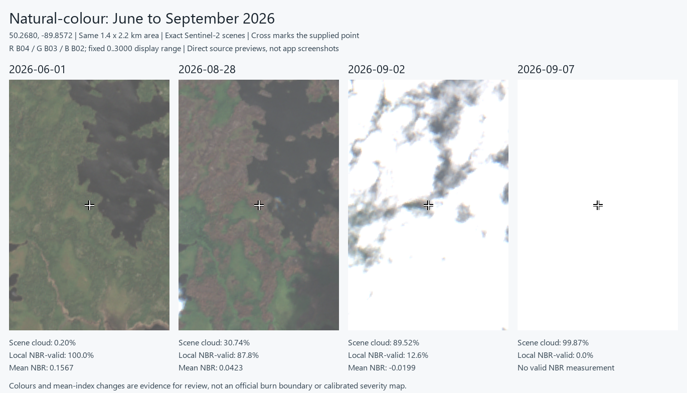
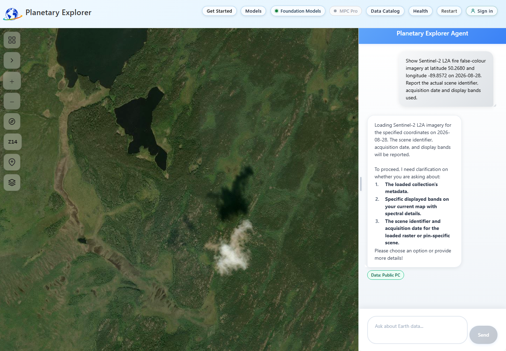

## Result

The [September wildfire mock](wildfire-burn-scar-mock.md) was exercised on
September 9, 2026 at latitude `50.2680`, longitude `-89.8572` in Ontario.
Real source imagery and the CPU NBR calculation were available. The deployed
app initially failed to display the requested dated fire-colour layer. A
frontend-only correction was subsequently deployed and verified with real
tiles and correctly signed NBR data in chat. The rendering and data-display
checks now pass; the scientific assessment remains limited by cloud coverage,
date substitution and unverified incident context.

June 1 and August 28 provide the clearest visual comparison of the four dates.
September 2 is mostly obscured locally; September 7 has no valid NBR pixels in
the tested area. No GPU job, infrastructure change or application deployment
was performed during the original trial. The later frontend publication did
not change the API, sampling algorithm, infrastructure or GPU services.

> [!IMPORTANT]
> The satellite panels below are exact-item previews downloaded directly from
> Public Planetary Computer, not successful screenshots of the app's map.
> They are real Sentinel-2 band composites, not generated mock imagery. The
> failed app display and the later successful app capture are shown separately.
> No official burn boundary, calibrated
> severity class, burned-hectare total or current incident status is established.

## Deployed Layer And Data Fix

The September 9 follow-up used the normally deployed frontend, with no browser
interception. Its single-scene response now uses the exact item tile URL instead
of the empty mosaic. All eight recorded scene tiles returned HTTP 200. Toggling
the overlay changed 57.8% of sampled map pixels, and the layer was left visible.
The legend identifies Sentinel-2 fire false colour, B12/B8A/B04.



The coloured rectangle is the loaded satellite extent; the surrounding imagery
is the basemap. Zooming in enlarges the source pixels, not their resolution.
The displayed scene is August 28, but the independent CPU sampling request
selected August 20 for its later epoch. Those are different observations.

| Field                          | Verified App Result                         |
| ------------------------------ | ------------------------------------------- |
| Pin                            | 50.2680, -89.8572                           |
| Display                        | August 28, B12/B8A/B04, Sentinel-2 Level-2A |
| Requested comparison           | June 1 to August 28                         |
| Actual comparison              | June 1 to August 20; later date substituted |
| Mean NBR before / after        | 0.1582 / 0.0343                             |
| Before minus after (`dnbr`)  | +0.1239                                     |
| After minus before (`delta`) | -0.1239                                     |
| Valid pixels before            | 18,864 / 18,864, 100.0%                     |
| Valid pixels after             | 5,038 / 18,864, 26.7%                       |
| Analysis bbox                  | [-89.87666, 50.25678, -89.83774, 50.27922]  |

This viewport is larger than the fixed extent used for the source-preview
table below, so its pixel counts and means should not be treated as the same
measurement. August 20 also falls outside the mock's recent-observation cutoff.
The result is not a September burn assessment or an estimate of burned hectares.

The generated answer initially mislabeled the negative `delta` as before minus
after, although the tool's positive `dnbr` was correct. Successful standalone
NBR comparisons now render directly from numeric evidence, with actual dates,
coverage and source links. Other and mixed-tool answers retain their existing
handling. Both ordinary and sequential chat paths have regression tests.

The final frontend passed 211 tests and a production build. Its active deployment
is `f18e8ceb-241b-405b-830d-bbfa16761eae`; bundle `index-QJWxO2p1.js` matched SHA256
`aae60c210e6548900116ce9c93bb7b9ddf94b5f0b9f5650f9ab899d33d9da057`.
Authentication, site settings and API/search/weather releases were unchanged.
GPU minimum and active replicas remained zero.

## Canadian Pin Follow-Up

A later BC trial exposed a different failure at pins `49.5508, -122.9015`
and `49.432296, -122.482823`. The router prompt incorrectly required analysis
whenever a query referred to a dropped pin. A request to show fire-colour
imagery therefore invoked `compare_temporal`. The request builder also treated
the zoom-9 viewport as the sampling extent, so the NBR sampler required one
scene to cover that large area. Its extent error was then misreported as no
nearby satellite coverage.

The public catalog contained August 27 and August 29 scenes covering the
second pin. An API correction deployed on September 9 now routes explicit
point-display requests to imagery loading, keeps the current pin authoritative,
and resolves nearest-date follow-ups from the last user imagery request.
Ordinary point-scoped analysis no longer inherits passive map bounds. Explicit
bbox, area and specialist requests retain their spatial extent.

At a dropped pin, use:

```text
Show collection sentinel-2-l2a fire false-colour imagery at point closest to 2026-08-28.
```

An exact request for August 28 stays exact. If there is no observation that
day, a follow-up such as `find the date that has it please closest to that date`
searches within 14 days either side, ending no later than the current date.
Nearest-date selection uses date proximity before general quality scoring and
keeps one scene covering the pin. Default cloud filters do not erase availability
results; explicitly requested cloud restrictions remain in force. Imagery uses
a one-mile-radius pin extent independent of zoom, while ordinary point NBR
retains its existing 60 m sampling window.

The live two-turn BC request returned no exact August 28 scene, then displayed
`S2A_MSIL2A_20260829T191831_R056_T10UEV_20260830T051611` at the moved pin, with
the actual August 29 acquisition disclosed. Native-browser verification recorded
42 tile responses with HTTP 200, B12/B8A/B04 assets, and a 93.8% map-pixel change
when toggling the layer. Its 69.57% whole-scene cloud cover does not establish
local visibility or a burn finding.

The explicit CPU comparison also succeeded with a 60 m extent despite a wide
viewport: May 31 and September 6 were selected for the June 1 / August 28
request, with 9/9 and 7/9 valid pixels and `dnbr +0.0042`. These are independently
masked point-window means, not the August 29 display or a wildfire assessment.

The final backend suite passed 1,410 tests with one existing skip. Real selector
checks passed at 19 locations: the 17 Canadian fixtures across all provinces and
territories plus both BC pins. These checks verify returned footprints and band
assets, not clear pixels at every Canadian point or on every date. Cloud, snow,
acquisition schedules and actual data gaps still constrain interpretation.

API revision `ca-earthcopilot-api--pin-canada-0909-211029` is healthy with 100%
traffic, using image digest
`sha256:8792cd356fe9826de9188c6ed1a6103df8da75489559c13a7811d80c6768de0d`.
The frontend and other services were unchanged, as were API protected settings.
No GPU job or Git publication was performed for this correction.

## See The Photos

All panels show the same approximately 1.4 km by 2.2 km area. The cross marks
the supplied point. North is at the top. The WGS84 bbox is
`[-89.8672, 50.2580, -89.8472, 50.2780]` in west, south, east, north order.
Preview enlargement does not add spatial detail to the source imagery.

### Fire False Colour

Red uses shortwave infrared B12, green uses near infrared B8A, and blue uses
visible red B04. Every date uses the same display range of 0 to 4000 per band.
This makes vegetation changes easier to see without changing the stretch
between dates. Rust-coloured areas are candidates for review, not classified
burn pixels. Water remains dark; clouds can dominate the composite.



### Natural Colour

Red, green and blue use B04, B03 and B02, with a fixed 0 to 3000 display range.
The same lakes and vegetation patterns provide landmarks. Cloud obstruction
is especially apparent in the September panels.



Satellite imagery: Copernicus Sentinel-2 data from 2026, served by Microsoft
Planetary Computer. The comparison sheets add labels and a point marker to
the source previews; they do not add a burn mask.

## What Each Date Shows

The NBR values below are outputs of the repository's existing sampler applied
to each exact catalog item. They were not all returned by the live API's
automatic date-selection run.

| Acquisition | Scene Cloud | Local NBR-Valid Pixels | Mean NBR | Interpretation For This Demo                      |
| ----------- | ----------- | ---------------------- | -------- | ------------------------------------------------- |
| June 1      | 0.20%       | 8,664 / 8,664, 100.0%  | 0.1567   | Usable baseline; green vegetation around lakes    |
| August 28   | 30.74%      | 7,610 / 8,664, 87.8%   | 0.0423   | Best recent candidate here; rust/brown patches    |
| September 2 | 89.52%      | 1,095 / 8,664, 12.6%   | -0.0199  | Sparse valid coverage; whole-area conclusion weak |
| September 7 | 99.87%      | No valid NBR pixels    | None     | Inconclusive; cannot inspect the local surface    |

### June 1 Baseline

The exact June 1 acquisition exists. The sampled extent passed the current
quality mask throughout. Use the lakes as landmarks when comparing the
surrounding vegetation with August; water is not a burn scar.

Open the [natural-colour image](images/wildfire-september/2026-06-01-natural-source.png),
[fire-colour image](images/wildfire-september/2026-06-01-fire-source.png), or
[catalog item](https://planetarycomputer.microsoft.com/api/stac/v1/collections/sentinel-2-l2a/items/S2A_MSIL2A_20260601T170711_R069_T15UYR_20260601T233915).

### August 28 Recent Candidate

More rust-coloured patches appear where June showed greener vegetation.
This visual change and lower mean NBR support reviewing the area for
disturbance in the wildfire context. They do not establish its cause alone.
The difference between these independently calculated June and August means
is approximately `+0.1144` before minus after.

Open the [natural-colour image](images/wildfire-september/2026-08-28-natural-source.png),
[fire-colour image](images/wildfire-september/2026-08-28-fire-source.png), or
[catalog item](https://planetarycomputer.microsoft.com/api/stac/v1/collections/sentinel-2-l2a/items/S2C_MSIL2A_20260828T165841_R069_T15UYR_20260828T215915).

### September 2 Cloudy Candidate

Clouds obscure most of the extent. The sampler can calculate a number from
the remaining 12.6% of valid pixels, but that subset should not represent the
whole area. Do not interpret the lower mean as proof of a larger or more
severe burn than August.

Open the [natural-colour image](images/wildfire-september/2026-09-02-natural-source.png),
[fire-colour image](images/wildfire-september/2026-09-02-fire-source.png), or
[catalog item](https://planetarycomputer.microsoft.com/api/stac/v1/collections/sentinel-2-l2a/items/S2B_MSIL2A_20260902T165849_R069_T15UYR_20260902T222832).

### September 7 Latest Requested Observation

The scene exists, but this local extent has no valid cloud-free NBR pixels
under the current sampler's mask. The correct result is inconclusive, not
zero damage. A newer date is not necessarily a better observation.

Open the [natural-colour image](images/wildfire-september/2026-09-07-natural-source.png),
[fire-colour image](images/wildfire-september/2026-09-07-fire-source.png), or
[catalog item](https://planetarycomputer.microsoft.com/api/stac/v1/collections/sentinel-2-l2a/items/S2C_MSIL2A_20260907T165841_R069_T15UYR_20260907T215814).

## How Each Workflow Step Performed

These observations describe the original trial, before the frontend correction
above. They are retained to distinguish source data from failed app output.

### 1. Public Incident Context

The deployed API called `search_web` and returned citations, including Ontario's
fire map and NRCan's Canadian Wildland Fire Information System. It also used
third-party sources and made incident-specific claims that were not verified
against an official dated incident record. Retrieval worked; the official-only
status interpretation did not pass this check.

The [Ontario forest-fire page](https://www.ontario.ca/page/forest-fires), checked
separately, carried a September 8 update and warned that not all perimeters are
mapped or updated daily. The [CWFIS map](https://cwfis.cfs.nrcan.gc.ca/en/interactive-map)
warns that its data may not reflect the latest fire situation. Neither page's
general update establishes when the particular pixels in this patch burned.

### 2. Imagery In The App

The combined prompt asking to load the August scene and report its metadata
was not reliable. One response contained the correct item; subsequent runs
returned `LOAD_AND_ANALYZE` with a clarification and no imagery evidence.

A separate, load-only request with collection `sentinel-2-l2a` found the right
item. Its item tile URL requested B12/B8A/B04, but the map requested the
natural-colour B04/B03/B02 mosaic instead. All 21 recorded mosaic tile responses
returned HTTP 204. Toggling the imagery changed only 0.13% of sampled screen
pixels, below the test's 1% threshold. The apparent image was mostly basemap;
it must not be labelled as the August satellite observation.



The four exact-date source previews above were obtained independently after
this failure. They demonstrate available data, not a repair of the app's
rendering path. The other three dates were checked as source previews, not
claimed as successful in-app map captures.

### 3. CPU NBR Through The Deployed API

An ordinary `POST /api/query` request supplied the exact pin, bbox, collection
and `gpt-4o` model, with GEOINT mode off. The analysis prompt was:

```text
At latitude 50.2680, longitude -89.8572, use compare_temporal with
collection sentinel-2-l2a, t1 2026-06-01, t2 2026-09-07 and metric nbr.
Report the actual acquisition dates, scene IDs, analysis bbox, valid-pixel
coverage, mean NBR for each epoch and dNBR. Explain any substituted dates.
This is a CPU spectral-index comparison only. Do not classify burn severity
or claim burned hectares.
```

The live request returned HTTP 200 with `tools_used: ["compare_temporal"]` and
numeric evidence in about 21.3 seconds. It selected June 1 and September 2,
not September 7. The returned `dnbr` was `+0.1766`, using the means `0.1567`
and `-0.0199`. Its provenance disclosed the substituted date and 12.6% later
coverage. The search window extended through the September 9 execution date.

This is a successful tool execution, not a reliable whole-area burn finding.
The current implementation accepts a scene with any valid pixels and compares
independently masked epoch means. It does not enforce sufficient common clear
coverage between dates. Its allowed classes also include water and unclassified
pixels, so these are not forest-only averages. Percent change in NBR is not a
percentage of land burned and is not used as a severity measure here.

### 4. Assessment And Optional GPU Step

For this run, use June versus August as a visual candidate for field or expert
review. Mark the September assessment limited by cloud coverage. Do not infer
fire control, safe access, burned hectares or severity from these panels.

PlanAura was not invoked. It requires compatible HLS inputs and separate
approval for billed GPU work; Sentinel-2 source previews are not a substitute
for that preflight. No older model polygons were reused.

## Reproducible Evidence

- [Source manifest](images/wildfire-september/source-manifest.json): exact
  scene IDs, acquisition times, bbox, preview URLs, bands and PNG hashes
- [Exact-date NBR results](images/wildfire-september/exact-date-nbr.json):
  existing sampler output for all four dates, including September 7's failure
- [Sampler implementation](../planetary-explorer/container-app/agents/raster_sampling_agent/spectral_indices.py)
  and [temporal comparison tool](../planetary-explorer/container-app/agents/analyst_agent/tools.py)

Natural-colour previews use B04/B03/B02 with range 0 to 3000. Fire-colour
previews use B12/B8A/B04 with range 0 to 4000. Both are 512 by 800 pixels with
bilinear display resampling and the same bbox. NBR uses B08 and B12 with the
SCL quality mask; it is calculated from raster values, not these rendered PNGs.

The original trial did not edit or deploy application code. The follow-up fixed
single-scene item selection and standalone NBR formatting in the frontend.
Reliable combined load-plus-metadata routing, sufficient common-area validity
checks, mixed-tool narrative consistency and incident-source verification remain
outside that correction.
